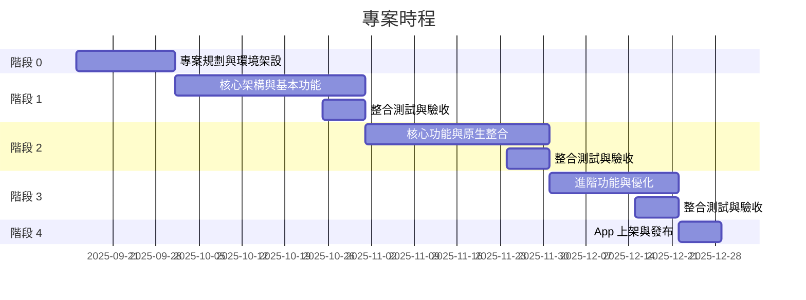

# 專案計畫書

## 基本資料

- 版本：v0.1
- 代號： SN-RN-2025Q4
- 文件更新日期：2025/10/05
- 專案期間：2025/10/01 – 2025/12/31
- 負責單位：
- 專案經理：
- 文件撰寫：

## 專案背景

SouNova 少女星目前主要透過 RWD (Responsive Web Design) 提供行動端使用者服務。然而，RWD 方式在行動裝置上存在多項限制，包括效能瓶頸、互動延遲以及無法充分利用行動裝置原生功能（如推播通知、相機、定位服務等）。使用者在行動端的操作流暢度不足，影響用戶留存率與整體使用體驗。

## 目標概要

- 提升行動裝置操作效能與互動流暢度。
- 優化用戶體驗，充分利用行動裝置原生功能。
- 強化用戶留存率與活躍度。
- 支援 iOS 與 Android 雙平台快速迭代。

## 方案分析

為了因應市場需求及提升用戶體驗，本次專案將以 React Native 重構行動端版本，提供跨平台原生應用。

| 技術方案                  | 優點                                       | 缺點                                          | 適用性                             |
| ------------------------- | ------------------------------------------ | --------------------------------------------- | ---------------------------------- |
| RWD Web                   | 開發成本低、跨平台一致                     | 效能受限、互動延遲、無法使用原生功能          | 適合資訊型內容展示                 |
| PWA (Progressive Web App) | 可離線使用、低開發成本、跨平台、免上架審核 | 部分原生功能限制、效能略低於原生/React Native | 適合資訊型或中低互動需求的行動應用 |
| 原生開發 (iOS/Android)    | 高效能、完整原生功能                       | 開發成本高、維護難度大                        | 適合重互動應用                     |
| React Native              | 跨平台、接近原生效能、可調用原生 API       | 需掌握 JS 與原生橋接                          | 適合快速迭代及雙平台需求           |

## 核心策略

- 採用 React Native 作為核心開發框架，減少平台差異化開發成本。
- 採用 **漸進式重構策略**，保留現有 API，逐步將前端功能轉換為 React Native。
- 設計模組化組件，提升開發效率與維護性。
- 核心功能拆分，確保每階段均有可運行、可測試版本。
- 里程碑以業務可理解的功能交付為主。
- 建立持續整合 (CI/CD) 流程，加快測試與上架週期。

## 範圍限制

- **包含項目**

  - 前端頁面 React Native 重構與架構設計。
  - API 串接與資料同步。
  - 主要功能模組開發。
  - UI/UX 設計優化。
  - 測試、上架及審核文件產出。

- **不包含項目**
  - 新增非既有業務功能。
  - 後端 API 大規模改寫。
  - 外部金流或第三方整合。

## 主要利害關係人

| 角色          | 單位 / 姓名 | 職責說明                     |
| ------------- | ----------- | ---------------------------- |
| 專案贊助人    |             | 負責專案決策與資源核定       |
| 專案經理      |             | 負責專案時程、進度與溝通協調 |
| UI/UX 設計師  |             | 設計介面、互動與上架素材     |
| 系統架構師    |             | 技術架構決策與開發規範制定   |
| 後端工程師    |             | API 串接、資料處理           |
| 前端工程師    |             | 負責整體前端功能實作         |
| 測試工程師    |             | 測試計畫執行與品質驗收       |
| DevOps 工程師 |             | 打包、自動化部署與上架支援   |

## 預期成效

| 成效項目       | 具體指標或描述                                                        |
| -------------- | --------------------------------------------------------------------- |
| 操作效能提升   | App 啟動時間 ≤ 3 秒；頁面切換流暢，平均動畫幀率 ≥ 50 fps              |
| 原生功能整合   | 成功整合相機、定位、推播通知等功能，並可於 iOS/Android 雙平台正常運作 |
| 用戶留存率提升 | 7 天留存率提高 10% 以上；30 天留存率維持穩定                          |
| 活躍度提升     | 日活躍用戶數（DAU）提高 15% 以上                                      |
| 開發與上架效率 | 每個階段按計畫交付可運行版本，CI/CD 流程運行正常，平均發布週期 ≤ 5 天 |
| 品質保障       | 測試通過率 ≥ 95%；Crash 率 < 2%；重大 Bug 數量 ≤ 1                    |

## 實施計畫

每個階段皆為 **4 週（約 20 個工作日）**，產出 **可運行、可測試的版本**，並以核心功能拆分，確保每階段都有可觀察成果。每階段開發後，留有 **Buffer 時間約 30%**，處理預期外的問題或跨專案需求。

**計畫期間**：2025/10/01 – 2025/12/31（共 13 週）

**固定休假**：每週六、週日

**國定連假**：

- 中秋節：2025/10/04（六）～ 10/06（一）
- 國慶日：2025/10/10（五）～ 10/12（日）
- 光復節：2025/10/24（五）～ 10/26（日）

**總工作日數（含假期調整後）**

- 十月：17 天
- 十一月：22 天
- 十二月：22 天

**合計：61 天（實際可用約 43 天，含預留 30% Buffer）**

## 里程碑

| 里程碑項目 | 判定標準                                               | 預計完成日期 |
| ---------- | ------------------------------------------------------ | ------------ |
| 基礎功能   | App 能正常運行，頁面操作流暢，內部測試可完成基本操作   | 2025-10-25   |
| 核心功能   | 核心功能完整可用，操作流程無重大 Bug，後端數據正常呈現 | 2025-11-24   |
| 進階功能   | 進階功能完整可用，功能穩定，無重大缺陷                 | 2025-12-22   |
| 上架準備   | 已完成上架所有準備工作                                 | 2025-12-31   |

## 風險管理

| 風險項目               | 影響範圍                 | 應對策略                                                       |
| ---------------------- | ------------------------ | -------------------------------------------------------------- |
| 開發進度延遲           | 專案時程延誤             | 定期進度檢查，調整人力與優先順序，使用 Buffer 時間應對突發問題 |
| 技術整合困難           | 部分原生功能無法正常使用 | 事前技術調研，採用可行替代方案，必要時尋求外部專家支援         |
| 人員變動或缺席         | 專案資源不足             | 關鍵職務預留替補人員，建立知識共享與文檔化流程                 |
| 上架審核延遲或拒絕     | App 上架延誤             | 提前準備完整審核資料，符合各平台規範，預留審核緩衝期           |
| 使用者體驗不佳         | 留存率下降               | 進行階段性內部測試與用戶問卷調查，快速修正 UX 問題             |
| 外部依賴（API/第三方） | 功能受阻                 | 對外部依賴設計容錯與重試機制，減少單點失效對專案的影響         |

## 成功指標

| 指標項目       | 成功標準 / 目標                         |
| -------------- | --------------------------------------- |
| 上架狀態       | 通過 Apple App Store / Google Play 審核 |
| App 啟動時間   | ≤ 3 秒                                  |
| Crash 率       | < 2%                                    |
| 開發進度       | 每階段延遲不超過 5%                     |
| 使用者滿意度   | 內部測試問卷平均滿意度 ≥ 80%            |
| 功能覆蓋率     | 核心功能測試覆蓋率 ≥ 95%                |
| 性能表現       | 頁面切換平均幀率 ≥ 50 fps               |
| 留存率與活躍度 | 7 天留存率提升 ≥ 10%；DAU 提升 ≥ 15%    |

## 成本估算

**人力成本：**

| 職位         | 估算人力投入（人月） | 單價（NTD/人月） | 小計（NTD） |
| ------------ | -------------------- | ---------------- | ----------- |
| 前端工程師   | 3                    | 120,000          | 360,000     |
| 後端工程師   | 1.5                  | 110,000          | 165,000     |
| UI/UX 設計師 | 1                    | 100,000          | 100,000     |
| 測試工程師   | 1                    | 80,000           | 80,000      |
| DevOps 支援  | 0.5                  | 90,000           | 45,000      |
| **總計**     | 7                    |                  | 750,000     |

**額外成本：**

| 項目               | 預估費用 (NTD) |
| ------------------ | -------------- |
| App Store 上架費用 | 1,200 / 年     |
| 測試設備與工具     | 20,000         |
| 其他雜項           | 10,000         |
| **總計**           | 31,200         |

**整體成本：**

| 項目     | 費用 (NTD) |
| -------- | ---------- |
| 人力成本 | 750,000    |
| 額外成本 | 31,200     |
| **總計** | 781,200    |
