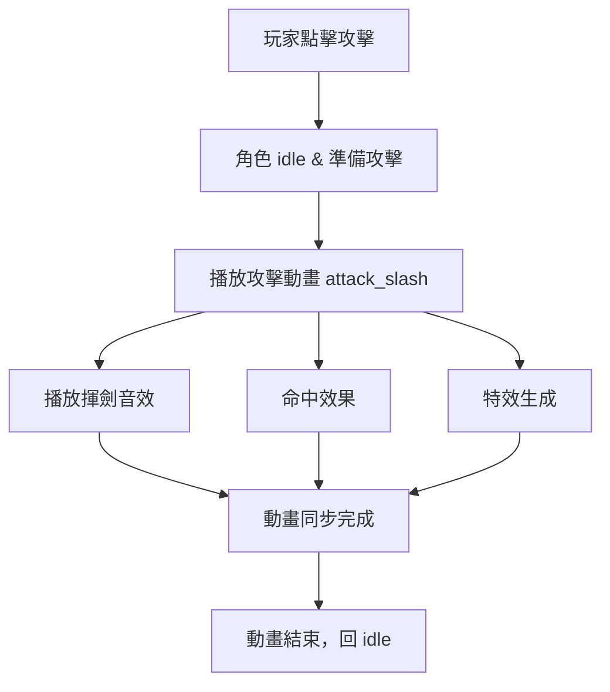
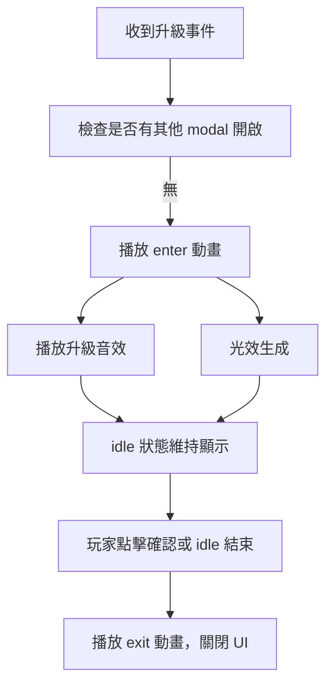

# 動畫開發規範 - 美術

本文件將產品互動意圖（UX/Game intent）轉化為 Spine 動畫規範，僅供美術使用，不包含程式或工程細節。
文件適用於 Spine Editor 4.2.x，支援角色與 UI 動畫製作，並提供 Timeline 對齊示意，方便特效與音效同步。


## 文件用途

- 將玩家互動或系統事件映射至 Spine 動畫
- 規範動畫名稱、長度、骨骼/Slot 與特效對齊
- 提供 Timeline 對齊示意


## 角色攻擊動畫（Warrior Attack）

玩家操作角色攻擊敵人，點擊「攻擊」按鈕觸發動畫。攻擊動畫根據武器類型（劍、弓、魔法）切換，需同步觸發音效、傷害判定及特效。動畫播放完畢後角色回到 idle 狀態。



| 欄位 | 說明 | 美術提示 / 視覺參考 |
| ---- | ---- | ------------------ |
| 角色 / 動作 | Warrior — 攻擊 | Spine 角色骨骼組件名稱 |
| 觸發方式 | 玩家點擊攻擊或自動攻擊 | 只需知道動畫何時播放 |
| 前置姿勢 | 角色站立 idle，準備攻擊 | 可附 idle 姿勢示意圖 |
| 動畫意圖 | 揮劍動作與衝擊特效，表現力量感與命中節奏 | 可用箭頭示意揮劍弧線、前衝距離與 VFX 位置 |
| 動畫檔名 | attack_slash、attack_crit | Spine JSON 對應動畫名稱 |
| 長度 | attack_slash: 0.80 秒；attack_crit: 1.10 秒 | 控制動作快慢及節奏感 |
| 是否循環 | 否 | 動畫播放一次後回 idle |
| 關鍵骨骼 / 插槽 | root（角色前衝）、weapon_sword（揮劍）、fx_trail（特效） | 附骨骼結構示意圖，標示用途 |
| 附加素材 / Mesh | fx_trail（特效軌跡）、hit_flash（命中特效） | Spine Editor 直接使用 |
| 事件標記 | 音效：揮劍；命中效果；特效生成 | 在 Timeline 上標註小旗幟對齊特效與音效 |
| 時間軸示意 | 0.45s 音效；0.50s 命中；0.52s 特效生成 | Timeline 可拖拉對齊動畫與特效 |
| 動畫過渡 | 前一動作 → 攻擊：短暫過渡；攻擊 → idle：短暫過渡 | Spine Editor 可調整混合滑桿 |
| 圖層 / 顯示順序 | 主動作在底層；VFX 在上層 | VFX 高亮放上層，避免遮擋角色 |
| 驗收重點 | 動畫流暢、揮劍弧線自然、特效與音效節奏正確 | 美術確認動作是否符合設計即可 |

### Timeline 

```
0.00s | idle
0.45s | 音效揮劍
0.50s | 命中效果
0.52s | 特效生成
0.80s | 動畫結束，回 idle
```

## 角色升級彈窗（Warrior Level Up Modal）

角色升級時，系統彈出「升級成功」UI，顯示光效、文字和音效，同時顯示「確認」按鈕。UI 動畫需平滑播放並同步特效與音效，idle 動畫停留時間由 Timeline 控制。



| 欄位 | 說明 | 美術提示 / 視覺參考 |
| ---- | ---- | ------------------ |
| UI 元件 / 動作 | LevelUpModal — enter / idle / exit | Spine UI 骨骼組件 |
| 觸發方式 | 系統升級事件 | 動畫播放時機，無需程式背景 |
| 前置姿勢 | 無其他高優先 modal 開啟 | 可附 UI 初始位置圖示 |
| 動畫意圖 | 彈出特效 + 光暈 + 文字浮現，營造成就感 | 示意光效旋轉方向、文字上升距離與 alpha 淡入 |
| 動畫檔名 | enter、idle、exit | Spine JSON 對應動畫名稱 |
| 長度 | enter: 0.45 秒；idle: 1.8 秒；exit: 0.4 秒 | 控制節奏感與停留時間 |
| 是否循環 | idle: 否 | Timeline 控制停留 |
| 關鍵骨骼 / 插槽 | bg（背景淡入）、frame（縮放彈出）、text_level（文字上升）、fx_glow（光效旋轉） | 附骨骼示意圖 |
| 附加素材 / Mesh | fx_glow mesh；文字 attachment 可替換 | Spine Editor 直接使用 |
| 事件標記 | 音效：升級音效；特效生成 | Timeline 標註對齊音效與光效 |
| 時間軸示意 | 0.20s 音效；0.28s 光效生成 | Timeline 可拖拉對齊 |
| 動畫過渡 | enter → idle：短暫過渡；idle → exit：短暫過渡 | Spine Editor 調整混合滑桿 |
| 圖層 / 顯示順序 | 主 UI 底層；光效、文字在上層 | 光效 / 文字高亮放上層，避免遮擋 |
| 驗收重點 | 動畫平滑、光效旋轉自然、文字上升節奏感 | 美術確認視覺效果是否符合設計即可 |

### Timeline 

```
0.00s | enter 開始
0.20s | 升級音效
0.28s | 光效生成
0.45s | enter 完成，進入 idle
2.25s | idle 結束，播放 exit
2.65s | exit 完成，UI 關閉
```


## 資源命名與結構

```sh
assets/
├─ spine/
│  ├─ char_warrior/
│  │  ├─ char_warrior.json
│  │  ├─ char_warrior.atlas
│  │  └─ textures/
│  └─ ui_levelup/
│     ├─ ui_levelup.json
│     ├─ ui_levelup.atlas
│     └─ textures/
```

命名規則：```<component>_<action>_<variant>.json```，JSON 與 Atlas 對應資料夾名稱一致。

