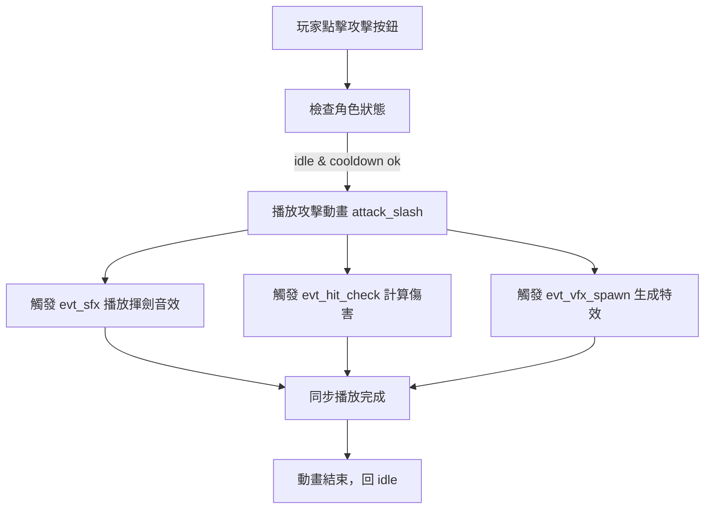
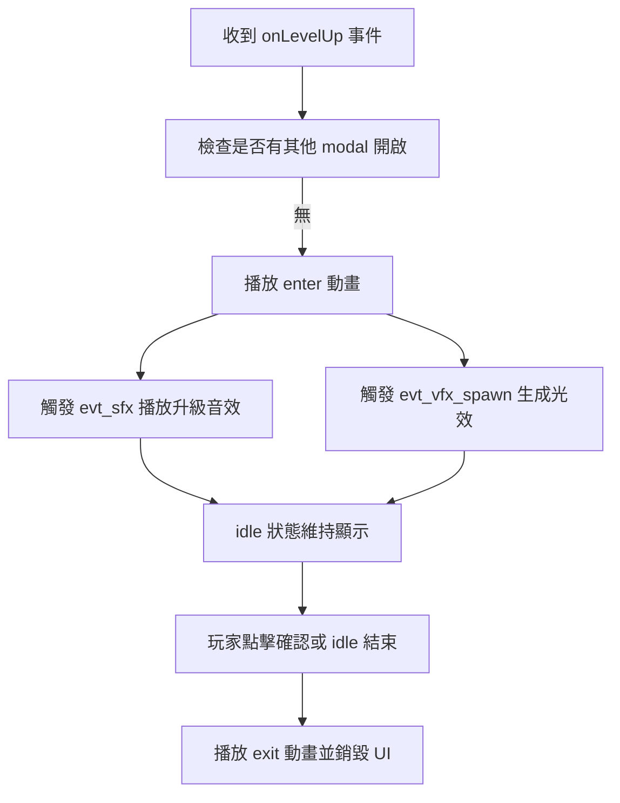

# 動畫開發規範 - 工程

本文件將產品互動意圖（UX/Game intent）轉化為 Spine 動畫規範，僅供工程使用，不包含美術細節。
文件適用於 Spine Editor 4.2.x、Spine Runtime Web/JS v4.2，並建議在 Chrome、Firefox、Edge 及 Mobile Web 測試。


## 文件用途

- 將玩家互動與遊戲事件映射至 Spine 動畫  
- 規範動畫命名、事件綁定、Mix 時間與 Track 使用  
- 提供完整前端整合範例，包括事件監聽、動畫播放、錯誤 fallback  

## 角色攻擊動畫（Warrior_Attack）

玩家操作角色攻擊敵人，點擊「攻擊」按鈕觸發動畫。攻擊動畫根據武器類型（劍、弓、魔法）切換，需同步觸發音效、傷害判定及特效。動畫播放完畢後角色回到 idle 狀態。



| 欄位 | 說明 |
| ---- | ---- |
| **Component** | Character — Warrior Attack |
| **Trigger** | 玩家點擊「攻擊」按鈕或 AI 自動攻擊事件 |
| **Preconditions** | 角色狀態為 idle，攻擊冷卻完成 |
| **Visual Intent** | 揮劍動作與衝擊特效，表現力量感與命中節奏 |
| **Spine Animation Name** | ```char_warrior/attack_slash```、```char_warrior/attack_crit``` |
| **Duration** | slash: 0.80 秒；crit: 1.10 秒 |
| **Loop** | 否 |
| **Key Bones / Slots** | ```root```、```weapon_sword```、```fx_trail``` |
| **Attachments / Mesh** | ```fx_trail``` mesh；```hit_flash``` region attachment |
| **Events emitted (Spine)** | ```evt_hit_check``` (float: 0.5)、```evt_sfx``` (string:`sfx_sword_01`)、```evt_vfx_spawn``` (string:`vfx_slash_01`) |
| **Mix in / out** | idle → attack: 0.06 秒；attack → idle: 0.08 秒 |
| **Track index** | 0（主動作）、1（VFX overlay） |
| **Engine Notes** | 監聽事件計算傷害，動畫結束回 idle。受擊中斷時呼叫 ```setEmptyAnimation(0,0.1)``` |
| **Acceptance Criteria** | 命中特效與音效同步 ±0.03 秒；動畫全長 < 1.2 秒；FPS ≥ 55；重播無錯位 |

### 事件時間軸

| 時間（秒） | Event Name | Payload | 說明 |
| -------- | ---------- | ------- | ---- |
| 0.45 | evt_sfx | string: `sfx_sword_01` | 播放揮劍音效 |
| 0.50 | evt_hit_check | float: 0.5 | 計算傷害倍率 |
| 0.52 | evt_vfx_spawn | string: `vfx_slash_01` | 生成特效 |


## 角色升級彈窗（Warrior Level Up Modal）

角色升級時，系統彈出「升級成功」UI，顯示光效、文字和音效，同時顯示「確認」按鈕。UI 動畫需平滑播放並同步特效與音效，idle 動畫停留時間由 Timeline 控制。



| 欄位 | 說明 |
| ---- | ---- |
| **Component** | UI — LevelUpModal |
| **Trigger** | 系統事件：```onLevelUp(newLevel)``` |
| **Preconditions** | 無其他高優先 modal 開啟 |
| **Visual Intent** | 彈出特效 + 光暈 + 文字浮現，營造成就感 |
| **Spine Animation Name** | ```ui_levelup/enter```、```ui_levelup/idle```、```ui_levelup/exit``` |
| **Duration** | enter: 0.45 秒；idle: 1.8 秒；exit: 0.4 秒 |
| **Loop** | idle: 否 |
| **Key Bones / Slots** | ```bg```、```frame```、```text_level```、```fx_glow``` |
| **Attachments / Mesh** | ```fx_glow``` mesh；文字 attachment 可替換 |
| **Events emitted (Spine)** | ```evt_sfx(sfx_levelup)```、```evt_vfx_spawn(vfx_starburst)``` |
| **Mix in / out** | any → enter: 0.12 秒；enter → idle: 0.06 秒；exit → none: 0.08 秒 |
| **Track index** | 0（UI base） |
| **Engine Notes** | 監聽事件生成粒子，idle 結束後播放 exit 並銷毀 Spine node |
| **Acceptance Criteria** | enter→idle→exit 平滑，音效同步誤差 < ±0.05 秒；FPS ≥ 60 |

### 事件時間軸

| 時間（秒） | Event Name | Payload | 說明 |
| -------- | ---------- | ------- | ---- |
| 0.20 | evt_sfx | string: `sfx_levelup` | 播放升級音效 |
| 0.28 | evt_vfx_spawn | string: `vfx_starburst` | 生成光效 |


## 資源命名與結構

```sh
assets/
├─ spine/
│  ├─ char_warrior/
│  │  ├─ char_warrior.json
│  │  ├─ char_warrior.atlas
│  │  └─ textures/
│  └─ ui_levelup/
│     ├─ ui_levelup.json
│     ├─ ui_levelup.atlas
│     └─ textures/
```

命名規則：```<component>_<action>_<variant>.json```，JSON 與 Atlas 對應資料夾名稱一致。


## 工程整合範例（JS/Web）


### HTML 範例

```html
<canvas id="spineCanvas"></canvas>
<canvas id="uiCanvas"></canvas>
```


### JavaScript 範例

```js
// 角色攻擊動畫整合
const spinePlayer = new spine.SpinePlayer(
  canvas,
  "char_warrior.json",
  "char_warrior.atlas",
  1.0
);

// 設定動畫混合
spinePlayer.stateData.setMix("idle", "attack_slash", 0.06);
spinePlayer.stateData.setMix("attack_slash", "idle", 0.08);

// 播放攻擊動畫
function playAttackAnimation() {
  spinePlayer.state.setAnimation(0, "attack_slash", false);
}

// 監聽事件
spinePlayer.state.addListener({
  event: (trackIndex, event) => {
    switch(event.data.name){
      case "evt_sfx": playSound(event.stringValue); break;
      case "evt_hit_check": calculateDamage(actor, target, event.floatValue); break;
      case "evt_vfx_spawn": spawnVFX(event.stringValue, actor.position); break;
    }
  },
  complete: (trackIndex, loopCount) => {
    spinePlayer.state.setAnimation(0, "idle", true);
  }
});

// 資源加載錯誤 fallback
spinePlayer.onError = (err) => {
  console.warn("Spine 加載失敗", err);
  showStaticSprite("char_warrior_idle.png");
};

// 角色升級彈窗動畫整合
const uiPlayer = new spine.SpinePlayer(
  uiCanvas,
  "ui_levelup.json",
  "ui_levelup.atlas",
  1.0
);

// 設定 Mix 時間
uiPlayer.stateData.setMix("any", "enter", 0.12);
uiPlayer.stateData.setMix("enter", "idle", 0.06);
uiPlayer.stateData.setMix("idle", "exit", 0.08);

// 播放 enter 動畫
function playLevelUpUI() {
  uiPlayer.state.setAnimation(0, "enter", false);
}

// 監聽事件
uiPlayer.state.addListener({
  event: (trackIndex, event) => {
    switch(event.data.name) {
      case "evt_sfx": playSound(event.stringValue); break;
      case "evt_vfx_spawn": spawnVFX(event.stringValue, ui.position); break;
    }
  },
  complete: (trackIndex, loopCount) => {
    const currentAnim = uiPlayer.state.getCurrent(0).animation.name;
    if (currentAnim === "enter") {
      // enter 完成後播放 idle
      uiPlayer.state.setAnimation(0, "idle", false);
    } else if (currentAnim === "idle") {
      // idle 結束後播放 exit
      uiPlayer.state.setAnimation(0, "exit", false);
    }
  }
});

// 資源加載錯誤 fallback
uiPlayer.onError = (err) => {
  console.warn("UI Spine 加載失敗", err);
  showStaticSprite("ui_levelup_idle.png");
};

// 可擴充接口
function playSound(name) {
  // 播放音效
  console.log("播放音效:", name);
}

function spawnVFX(name, position) {
  // 生成特效
  console.log("生成特效:", name, "位置:", position);
}

function calculateDamage(actor, target, multiplier) {
  // 計算傷害
  console.log("計算傷害:", actor, target, multiplier);
}
```


## 多動畫與 Track 處理

| Track | 用途 | 備註 |
| ----- | ---- | ---- |
| 0 | 主動畫 | 角色或 UI 基本動作 |
| 1 | Overlay | VFX、光效或粒子，可與主動畫混合 |
| 2 | UI 補充 | 彈窗文字或特效，可與 Track 0 混合 |

Mix 建議介於 0.04–0.15 秒，高 Track index 覆蓋低 Track。

