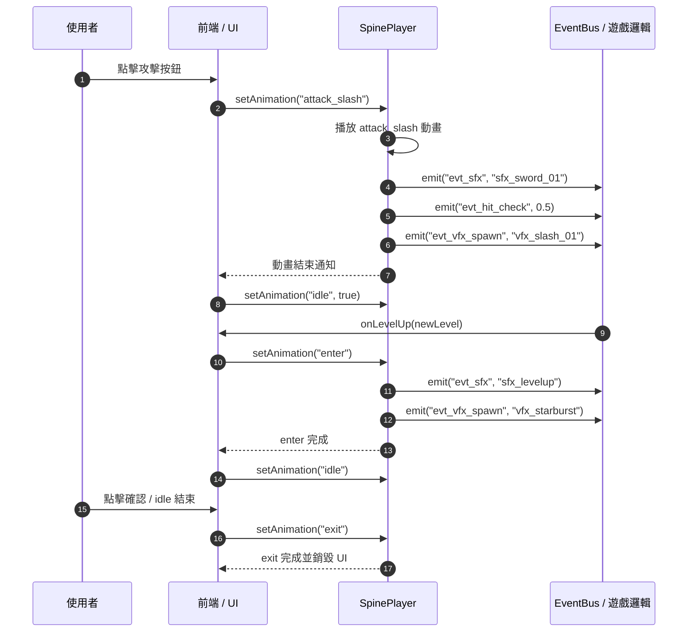

# 動畫開發規範 - 工程

本文件將產品互動意圖（UX/Game intent）轉化為 Spine 動畫規範，僅供工程使用，不包含美術細節。
文件適用於 Spine Editor 4.2.x、Spine Runtime Web/JS v4.2，並建議在 Chrome、Firefox、Edge 及 Mobile Web 測試。

## 文件用途

- 將玩家互動與遊戲事件映射至 Spine 動畫
- 規範動畫命名、事件綁定、Mix 時間與 Track 使用
- 提供完整前端整合範例，包括事件監聽、動畫播放、錯誤 fallback

## 系統架構



## 互動事件層

| 事件代碼             | 觸發來源   | 條件           | 系統回應                |
| -------------------- | ---------- | -------------- | ----------------------- |
| EVT_RULES_VIEW       | 開場       | 狀態 idle      | 顯示教學提示            |
| EVT_COLLISION_ITEM   | 系統判斷   | 與道具重疊     | 分數+10，移除道具       |
| EVT_COLLISION_ENEMY  | 系統判斷   | 與敵人重疊     | 扣分、暈眩              |
| EVT_PLAYER_HIT       | 系統判斷   | 遭受傷害       | 扣血、更新分數          |
| EVT_STATE_RECOVER    | 系統判斷   | 回復事件       | 回復血量或狀態          |
| EVT_SCORE_UPDATE     | 系統事件   | 分數變化       | 更新分數、觸發特效      |
| EVT_PAUSE_GAME       | 點擊暫停   | 遊戲進行中     | 停止遊戲更新、保存狀態  |
| EVT_MUTE_AUDIO       | 點擊靜音   | 遊戲進行中     | 靜音音效                |
| EVT_REPLAY_GAME      | 點擊重玩   | 遊戲結束或暫停 | 重置遊戲狀態（分數/HP） |
| EVT_VIEW_LEADERBOARD | 點擊排行榜 | 無             | 顯示排行榜              |

## 互動動畫層

| 事件代碼               | Spine Animation Name      | Track | Duration (s) | Mix in / out | Loop | Engine Notes                                 |
| ---------------------- | ------------------------- | ----- | ------------ | ------------ | ---- | -------------------------------------------- |
| EVT_PLAYER_ATTACK      | char_warrior/attack_slash | 0     | 0.80         | 0.06 / 0.08  | 否   | 觸發 evt_sfx / evt_hit_check / evt_vfx_spawn |
| EVT_PLAYER_ATTACK_CRIT | char_warrior/attack_crit  | 0     | 1.10         | 0.06 / 0.08  | 否   | 觸發高傷害音效和特效                         |
| EVT_PLAYER_IDLE        | char_warrior/idle         | 0     | Loop         | —            | 是   | 基本待機動畫                                 |
| EVT_LEVELUP_ENTER      | ui_levelup/enter          | 0     | 0.45         | 0.12 / 0.06  | 否   | 觸發 evt_sfx / evt_vfx_spawn                 |
| EVT_LEVELUP_IDLE       | ui_levelup/idle           | 0     | 1.80         | 0.06 / —     | 否   | UI idle 狀態                                 |
| EVT_LEVELUP_EXIT       | ui_levelup/exit           | 0     | 0.40         | — / 0.08     | 否   | 播放完銷毀 UI                                |
| EVT_UI_BUTTON_HOVER    | ui/button_hover           | 1     | 0.20         | 0.05 / 0.05  | 否   | 叠加播放於 UI base                           |
| EVT_UI_BUTTON_CLICK    | ui/button_click           | 1     | 0.15         | 0.04 / 0.04  | 否   | 叠加播放於 UI base                           |
| EVT_VFX_HIT            | fx/hit_flash              | 1     | 0.10         | 0.03 / 0.03  | 否   | Overlay 特效                                 |
| EVT_VFX_ITEM_COLLECT   | fx/item_collect           | 1     | 0.25         | 0.05 / 0.05  | 否   | Overlay 特效                                 |

## 資料結構層

```sh
assets/
├─ spine/
│  ├─ char_warrior/
│  │  ├─ char_warrior.json
│  │  ├─ char_warrior.atlas
│  │  └─ textures/
│  └─ ui_levelup/
│     ├─ ui_levelup.json
│     ├─ ui_levelup.atlas
│     └─ textures/
```

命名規則：`<component>_<action>_<variant>.json`，JSON 與 Atlas 對應資料夾名稱一致。

## 邏輯層

### 互動邏輯

```js
// 建立角色 Spine Player
const spinePlayer = new spine.SpinePlayer(
  canvas,
  "char_warrior.json",
  "char_warrior.atlas",
  1.0
);
spinePlayer.stateData.setMix("idle", "attack_slash", 0.06);
spinePlayer.stateData.setMix("attack_slash", "idle", 0.08);

// 播放攻擊動畫並監聽事件
function playAttackAnimation() {
  spinePlayer.state.setAnimation(0, "attack_slash", false);
}

spinePlayer.state.addListener({
  event: (trackIndex, event) => {
    switch (event.data.name) {
      case "evt_sfx":
        playSound(event.stringValue);
        break;
      case "evt_hit_check":
        calculateDamage(actor, target, event.floatValue);
        break;
      case "evt_vfx_spawn":
        spawnVFX(event.stringValue, actor.position);
        break;
    }
  },
  complete: (trackIndex) => {
    spinePlayer.state.setAnimation(0, "idle", true);
  },
});
```

## 多動畫與 Track 處理

| Track | 用途    | 備註                              |
| ----- | ------- | --------------------------------- |
| 0     | 主動畫  | 角色或 UI 基本動作                |
| 1     | Overlay | VFX、光效或粒子，可與主動畫混合   |
| 2     | UI 補充 | 彈窗文字或特效，可與 Track 0 混合 |

Mix 建議介於 0.04–0.15 秒，高 Track index 覆蓋低 Track。
