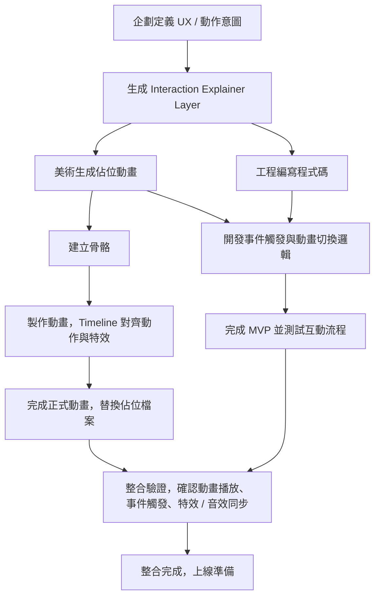

# 動畫開發流程

## 企劃階段

1. **定義遊戲互動意圖**

   - 角色/UI 動作目的（攻擊、技能、升級、彈窗等）
   - 玩家操作或系統事件觸發條件
   - 動作節奏、感受與視覺重點

2. **製作 UX Prototype 或概念圖**

   - 動作流程示意
   - 特效、光效、文字浮現位置
   - 可利用 AI 提供初步時間概念（秒數或比例）

3. **生成 Interaction Explainer Layer**

   - 表格化動畫需求
   - 這份表格將作為美術與工程共同語言

## 美術階段

0. **生成佔位動畫（Stub）**

   - 先利用 AI 提供簡單動作或靜態動畫作為佔位
   - 確保事件名稱、Track、Mix 與 Timeline 標記完整

1. **建立骨骼**

   - 新建 JSON/Atlas，設定骨骼結構、Slot、Attachment
   - 根據 Interaction Explainer Layer 指定骨骼與插槽用途

2. **製作基本動畫**

   - 按照 Timeline 對齊動作、特效與音效
   - 每個動作控制骨骼位置、旋轉與透明度

3. **設置 Mix / Track**

   - 主動作 Track（角色或 UI）
   - Overlay Track（特效、光效、文字）
   - 設定前後動作過渡時間（建議 0.04~0.15 秒）

4. **測試動畫流暢度**

   - 確認骨骼無錯位
   - 特效、文字、光效正確顯示
   - Timeline 對齊音效與 VFX

## 工程階段

1. **使用佔位動畫開發遊戲邏輯**

   - 事件觸發
   - 動作切換與 Mix 過渡
   - 測試流程是否符合 UX Prototype 預期

2. **接口與事件保留**

   - Timeline 標註的事件名稱與觸發秒數，工程師依此建立事件接口
   - 後續替換正式動畫檔案時，事件仍然有效

## 整合階段

1. **美術提供正式 JSON/Atlas**

   - 將佔位檔案替換為正式動畫檔案
   - 名稱與資料夾結構保持一致

2. **測試整合**

   - 確認角色 / UI 動作、特效、光效、文字、音效同步
   - Timeline 對齊與 Mix / Track 過渡正常
