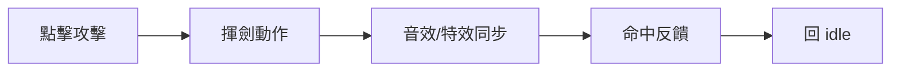
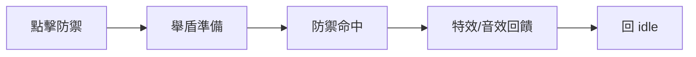
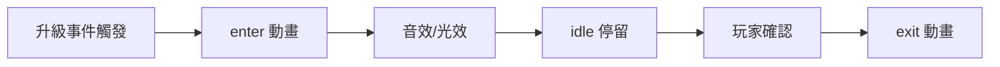
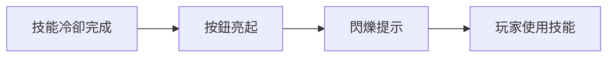
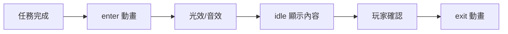

# 互動意圖規範 - 企劃

本文件將遊戲企劃意圖轉化為互動意圖規範，方便企劃驗收與跨部門溝通。

## 文件用途

- 整理玩家操作、動作意圖、節奏、特效與音效

## 遊戲核心理念

- **目標**：玩家操控角色收集道具並避開敵人，累積分數，挑戰排行榜。
- **核心行為**：
  1. 查看簡單規則 → 理解操作
  2. 開始遊戲 → 角色互動與分數累計
  3. 分數即時更新 → 提供即時回饋
  4. 暫停 / 靜音 / 重玩 → 控制遊戲節奏
  5. 排行榜 → 提升重玩動機

## 角色（Player）

### 角色攻擊（Warrior Attack）

| 項目     | 規格                                                                                        |
| -------- | ------------------------------------------------------------------------------------------- |
| 事件     | EVT_WARRIOR_ATTACK                                                                          |
| 動作目的 | 玩家操作角色攻擊敵人，提供力量感與反饋                                                      |
| Trigger  | 玩家點擊「攻擊」按鈕，角色 idle 且攻擊冷卻完成                          |
| 動作意圖 | 揮劍展現力量感；命中瞬間呈現衝擊特效與音效；動作結束回 idle，自然流暢                       |
| 動作長度 | 總時長 0.8s 0.0–0.45s 揮劍前衝 0.45–0.52s 命中特效生成、音效播放 0.52–0.8s 回 idle |
| Timeline | 0.45s 音效播放（揮劍音效） 0.50s 特效生成（命中特效） 0.52s 傷害反饋（顯示數值）      |

### 角色防禦動作（Warrior Block）

| 項目     | 規格                                                                                     |
| -------- | ---------------------------------------------------------------------------------------- |
| 事件     | EVT_WARRIOR_BLOCK                                                                        |
| 動作目的 | 提供防禦操作回饋，增加策略感                                                             |
| Trigger  | 玩家點擊「防禦」按鈕，角色 idle                                      |
| 動作意圖 | 盾牌舉起提供安全感；成功防禦時有衝擊回饋；動作結束回 idle 或維持防禦姿態                 |
| 動作長度 | 總時長 0.8s 0.0–0.3s 舉盾準備 0.3–0.5s 防禦命中反饋 0.5–0.8s 回 idle 或維持防禦 |
| Timeline | 0.3s 特效（命中防禦光效） 0.35s 音效（防禦成功提示）                                  |

## 介面

### 角色升級彈窗（Warrior LevelUp Modal）

| 項目     | 規格                                                                    |
| -------- | ----------------------------------------------------------------------- |
| 事件     | EVT_WARRIOR_LEVELUP                                                     |
| 動作目的 | 告知玩家角色升級成功，營造成就感                                        |
| Trigger  | 系統事件 onLevelUp(newLevel)，無其他高優先 modal 開啟                   |
| 動作意圖 | 彈出特效 + 光暈 + 文字浮現；idle 動畫停留時間由系統控制，玩家可點擊確認 |
| 動作長度 | enter 0.45s / idle 1.8s / exit 0.4s                                     |
| Timeline | 0.20s 音效播放（升級音效） 0.28s 特效生成（光效或星爆特效）          |

### 技能冷卻提示（Skill Cooldown UI）

| 項目     | 規格                                                      |
| -------- | --------------------------------------------------------- |
| 事件     | EVT_SKILL_COOLDOWN_UI                                     |
| 動作目的 | 提醒玩家技能冷卻完成，提高操作直覺                        |
| Trigger  | 系統判斷技能冷卻結束，無其他 UI 干擾                      |
| 動作意圖 | 按鈕亮起並閃爍提示；動作輕快，強化玩家操作感              |
| 動作長度 | 總時長 0.5s 0.0–0.2s 按鈕漸亮 0.2–0.5s 閃爍提示完成 |
| Timeline | 0.2s 音效提示（技能可用音效）                             |

### 任務完成彈窗（Quest Complete Modal）

| 項目     | 規格                                                              |
| -------- | ----------------------------------------------------------------- |
| 事件     | EVT_QUEST_COMPLETE_MODAL                                          |
| 動作目的 | 提示玩家任務完成，展示獎勵                                        |
| Trigger  | 系統事件：任務達成，無其他高優先 modal 開啟                       |
| 動作意圖 | 彈窗升起，展示任務內容與獎勵；動作流暢，成就感明確                |
| 動作長度 | enter 0.4s / idle 1.6s / exit 0.3s                                |
| Timeline | 0.2s 光效生成（彈窗光效或星爆） 0.25s 音效播放（成就提示音效） |
