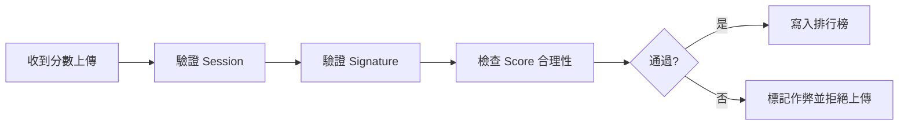

# 安全驗證規範 - 後端

本文件定義遊戲後端在接收與驗證玩家上傳分數時的邏輯與安全規範，僅供工程使用，不包含設計或美術內容。

## 文件用途

- 提供後端統一的分數驗證流程與 API 邏輯參考  
- 確保前端上傳的分數、時間、等級皆符合遊戲邏輯  
- 防止封包重放、分數竄改與異常數值  
- 支援排行榜與資料分析系統安全寫入  
- 提供異常資料留存與後續 AI 作弊檢測依據  

## 驗證原則

- 後端不信任前端上傳的任何分數
- 所有上傳需附帶 Session Token 與簽章（Signature）
- 伺服器可重算或驗證演算法結果
- 拒絕任何異常或不合邏輯的數據
- 一局遊戲只能上傳一次（防重放）

## 驗證流程



## 上傳資料格式

```json
{
  "playerId": "12345",
  "sessionId": "abc123",
  "score": 12450,
  "playTime": 97.5,
  "level": 18,
  "signature": "0x1a8c7ef2...",
  "metadata": {
    "kills": 45,
    "itemsCollected": 32
  }
}
```

## 分數簽章驗證（Signature Validation）

伺服器利用 `session.secretKey` 重新生成簽章，與上傳值比對。

```js
import crypto from "crypto";

function verifySignature(scorePayload, secretKey) {
  const { score, playTime, level } = scorePayload;
  const data = `${score}|${playTime}|${level}`;
  const hash = crypto
    .createHmac("sha256", secretKey)
    .update(data)
    .digest("hex");
  return hash === scorePayload.signature;
}
```

## 分數合理性檢查

```js
function validateScoreLogic(payload) {
  const errors = [];

  const rate = payload.score / payload.playTime;
  if (rate > 1000) errors.push("分數成長速率異常");

  if (payload.score > 999999) errors.push("分數超過上限");

  const expectedLevel = Math.floor(payload.score / 100) + 1;
  if (Math.abs(expectedLevel - payload.level) > 3)
    errors.push("Level 與分數不符");

  return errors.length ? { valid: false, errors } : { valid: true };
}
```

## 封包防重放（Anti-Replay）

伺服器驗證：

- `sessionId` 是否已使用
- `timestamp` 是否超過有效期（例如 5 分鐘）
- `signature` 是否匹配伺服器重算結果

```js
function verifyReplayProtection(sessionId, timestamp, usedSessions) {
  if (usedSessions.has(sessionId)) return false;
  const now = Date.now();
  const delta = now - new Date(timestamp).getTime();
  if (delta > 5 * 60 * 1000) return false;
  usedSessions.add(sessionId);
  return true;
}
```

## 資料庫結構

| 欄位       | 型態     | 說明           |
| ---------- | -------- | -------------- |
| playerId   | string   | 玩家唯一識別碼 |
| sessionId  | string   | 遊戲局 ID      |
| score      | int      | 最終分數       |
| playTime   | float    | 遊玩時間       |
| level      | int      | 結束等級       |
| signature  | string   | 加密簽章       |
| valid      | boolean  | 驗證是否通過   |
| suspicious | boolean  | 是否標記為可疑 |
| timestamp  | datetime | 上傳時間       |

## 驗證層級比較表

| 驗證層級 | 實作方式                    | 成本 | 效果           |
| -------- | --------------------------- | ---- | -------------- |
| 基本     | Score 上限 / Level 對應檢查 | 低   | 防爆分         |
| 中級     | Signature + Session 驗證    | 中   | 防封包竄改     |
| 高級     | 行為曲線 / 後端重算         | 高   | 幾乎防所有作弊 |
