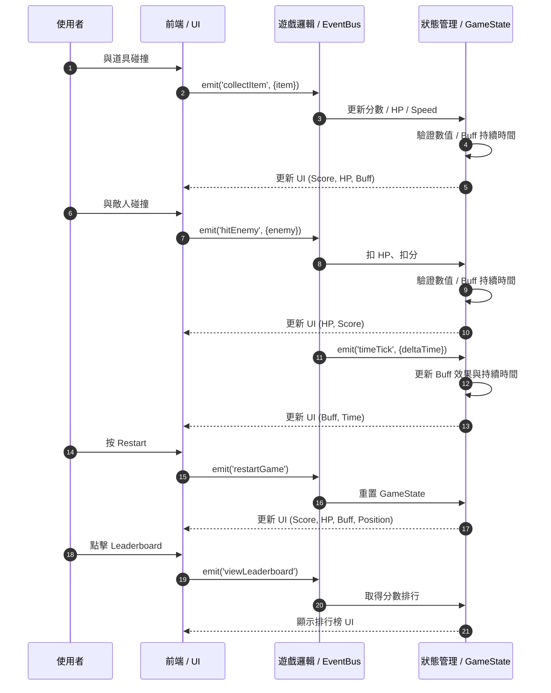
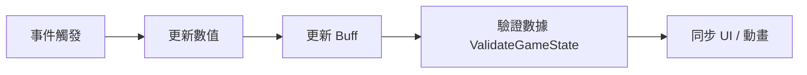

# 數值平衡規範 - 前端

本文件將遊戲設計意圖（UX/Game intent）轉化為數值與互動規範，僅供工程使用，不包含美術細節。

## 文件用途

- 將玩家行為與遊戲事件映射成數值公式與互動規範
- 提供前端/後端可直接引用的 JSON 配置與程式邏輯
- 包含單位、邊界值、臨時增益效果持續時間、事件優先順序

## 系統架構



## 優先順序



## 系統數值

| 項目             | 初始值 | 公式                                     | 類型  | 上限/下限 |
| ---------------- | ------ | ---------------------------------------- | ----- | --------- |
| Score            | 0      | `Score += CollectItemPoint - HitPenalty` | int   | 0~999999  |
| Level            | 1      | `Level = floor(Score / 100) + 1`         | int   | 1~99      |
| LeaderboardScore | 0      | 保存 Score，更新排行榜                   | int   | 0~999999  |
| Time             | 0      | `Time += deltaTime`                      | float | 0~∞       |

## 角色屬性

| 屬性         | 初始值 | 公式                                 | 類型  | 上限/下限 |
| ------------ | ------ | ------------------------------------ | ----- | --------- |
| HP           | 3      | `HP = min(3 + Level, MaxHP)`         | int   | 0~10      |
| Speed        | 1.0    | `Speed = BaseSpeed * (1 + Level/10)` | float | 0.5~3     |
| Strength     | 1      | `Strength = Level * 1`               | int   | 1~10      |
| Intelligence | 1      | `Intelligence = Level * 1`           | int   | 1~10      |

## 敵人屬性

| 類型 | HP                  | Speed                    | Damage                        | 生成數量 | 生成間隔                   |
| ---- | ------------------- | ------------------------ | ----------------------------- | -------- | -------------------------- |
| 小怪 | `HP = 1 + Level`    | `Speed = 0.8 + Level/20` | `Damage = 1 + floor(Level/3)` | 1~3      | `max(2 - Level*0.05, 0.5)` |
| 中怪 | `HP = 3 + Level*2`  | `Speed = 1.0 + Level/20` | `Damage = 2 + floor(Level/2)` | 1~2      | `max(5 - Level*0.1, 1)`    |
| BOSS | `HP = 10 + Level*5` | `Speed = 1.2 + Level/20` | `Damage = 5 + Level`          | 1        | 999 (唯一)                 |

## 道具規範

| 名稱   | 效果                    | 持續時間 | 優先級 | 疊加規則           |
| ------ | ----------------------- | -------- | ------ | ------------------ |
| 金幣   | `Score += 10`           | 即時     | 1      | 不疊加             |
| 紅心   | `HP = min(HP+1, MaxHP)` | 即時     | 1      | 不疊加             |
| 加速鞋 | `Speed += 0.5`          | 5 秒     | 2      | 疊加效果，刷新時間 |
| 星星   | `ScoreMultiplier = 2`   | 5 秒     | 2      | 疊加效果，刷新時間 |

## 互動行為

| 行為       | 觸發條件                   | 優先順序 | 效果                       |
| ---------- | -------------------------- | -------- | -------------------------- |
| 收集道具   | Player 與 Item 碰撞        | 1        | 更新 Score / HP / Speed    |
| 避開敵人   | Player 與 Enemy 碰撞       | 1        | 扣 HP、扣分                |
| 重玩遊戲   | 玩家按 Restart             | 0        | 重置 Score、HP、位置、道具 |
| 排行榜顯示 | 遊戲結束或點擊 Leaderboard | 0        | 顯示前 N 名分數            |

碰撞規則：

- 道具優先處理 → 玩家爽感先行
- 道具/敵人同時觸發 → 道具優先

## 資料結構

```json
{
  "game": {
    "score": {
      "type": "int",
      "initial": 0,
      "min": 0,
      "max": 999999,
      "formula": "Score += CollectItemPoint - HitPenalty"
    },
    "level": {
      "type": "int",
      "initial": 1,
      "min": 1,
      "max": 99,
      "formula": "Level = floor(Score / 100) + 1"
    },
    "time": {
      "type": "float",
      "initial": 0.0,
      "unit": "seconds",
      "formula": "Time += deltaTime"
    }
  },
  "player": {
    "HP": {
      "type": "int",
      "initial": 3,
      "min": 0,
      "max": 10,
      "formula": "HP = min(3 + Level, MaxHP)"
    },
    "Speed": {
      "type": "float",
      "initial": 1.0,
      "min": 0.5,
      "max": 10,
      "formula": "Speed = BaseSpeed * (1 + Level / 10)"
    },
    "Strength": {
      "type": "int",
      "initial": 1,
      "min": 1,
      "max": 10,
      "formula": "Strength = Level * 1"
    },
    "Intelligence": {
      "type": "int",
      "initial": 1,
      "min": 1,
      "max": 10,
      "formula": "Intelligence = Level * 1"
    }
  },
  "enemies": [
    {
      "type": "small",
      "HP": "1 + Level",
      "Speed": "0.8 + Level / 20",
      "Damage": "1 + floor(Level / 3)",
      "spawnAmount": "1~3",
      "spawnInterval": "max(2 - Level*0.05, 0.5)"
    },
    {
      "type": "medium",
      "HP": "3 + Level*2",
      "Speed": "1.0 + Level / 20",
      "Damage": "2 + floor(Level / 2)",
      "spawnAmount": "1~2",
      "spawnInterval": "max(5 - Level*0.1, 1)"
    },
    {
      "type": "boss",
      "HP": "10 + Level*5",
      "Speed": "1.2 + Level / 20",
      "Damage": "5 + Level",
      "spawnAmount": 1,
      "spawnInterval": "999 (唯一)"
    }
  ],
  "items": [
    {
      "name": "coin",
      "effect": "Score += 10",
      "duration": "instant",
      "priority": 1,
      "stackable": false
    },
    {
      "name": "heart",
      "effect": "HP = min(HP+1, MaxHP)",
      "duration": "instant",
      "priority": 1,
      "stackable": false
    },
    {
      "name": "speedBoots",
      "effect": "Speed += 0.5",
      "duration": 5,
      "priority": 2,
      "stackable": true,
      "stackRule": "疊加效果，刷新時間"
    },
    {
      "name": "star",
      "effect": "ScoreMultiplier = 2",
      "duration": 5,
      "priority": 2,
      "stackable": true,
      "stackRule": "疊加效果，刷新時間"
    }
  ],
  "eventOrder": [
    "collisionDetection",
    "valueUpdate",
    "temporaryEffect",
    "UIUpdate"
  ]
}
```

## 狀態更新邏輯

| UI 元素     | 綁定屬性                | 更新時機        |
| ----------- | ----------------------- | --------------- |
| Score 顯示  | `GameState.score`       | 收集道具 / 扣分 |
| HP 條       | `GameState.player.HP`   | 扣血 / 回血     |
| Level 顯示  | `GameState.level`       | Score 升級時    |
| 道具 Buff   | `GameState.activeBuffs` | 獲得 / 結束時   |
| Leaderboard | `GameState.score`       | 遊戲結束        |

```js
const clamp = (val: number, min: number, max: number) =>
  Math.min(max, Math.max(min, val));

function resetPlayerState(state: GameState, config: GameConfig) {
  state.player.HP = config.player.HP.initial;
  state.player.Speed = config.player.Speed.initial;
  state.player.Strength = config.player.Strength.initial;
  state.player.Intelligence = config.player.Intelligence.initial;
}

function updateGameState(
  event: GameEvent,
  state: GameState,
  config: GameConfig
) {
  switch (event.type) {
    case "collectItem":
      applyItemEffect(event.item, state, config);
      break;

    case "hitEnemy":
      state.player.HP -= event.enemy.damage;
      state.score -= event.enemy.damage * 5;
      break;

    case "timeTick":
      updateBuffs(state);
      state.time += event.deltaTime;
      break;
  }

  // 更新等級
  state.level = Math.floor(state.score / 100) + 1;

  // 新增：數值驗證
  validateGameState(state, config);

  // 最後更新 UI
  updateUI(state);
}

function validateGameState(state: GameState, config: GameConfig) {
  // 🩸 HP 驗證
  const HPConfig = config.player.HP;
  if (state.player.HP < HPConfig.min) {
    console.warn("HP < 最小值，自動修正");
    state.player.HP = HPConfig.min;
  }
  if (state.player.HP > HPConfig.max) {
    console.warn("HP 超過上限，自動修正");
    state.player.HP = HPConfig.max;
  }

  // 💨 Speed 驗證
  const SpeedConfig = config.player.Speed;
  if (state.player.Speed < SpeedConfig.min) {
    state.player.Speed = SpeedConfig.min;
  }
  if (state.player.Speed > SpeedConfig.max) {
    state.player.Speed = SpeedConfig.max;
  }

  // 🧮 分數與等級驗證
  state.score = clamp(
    state.score,
    config.game.score.min,
    config.game.score.max
  );
  state.level = clamp(
    state.level,
    config.game.level.min,
    config.game.level.max
  );

  // ⏱️ Buff 驗證
  state.activeBuffs = state.activeBuffs.filter(
    (buff) => buff.duration > 0 && !isNaN(buff.value)
  );

  // 🔍 NaN 防呆
  if (
    Object.values(state.player).some((v) => typeof v === "number" && isNaN(v))
  ) {
    console.error("偵測到 NaN 數值，重置玩家屬性");
    resetPlayerState(state, config);
  }

  return state;
}

function updateBuffs(state: GameState) {
  state.activeBuffs.forEach((buff) => {
    buff.duration -= 1 * deltaTime;
    if (buff.duration <= 0) {
      removeBuffEffect(buff, state);
    }
  });

  // ✅ Buff 驗證
  state.activeBuffs = state.activeBuffs.filter((buff) => buff.duration > 0);
}
```
