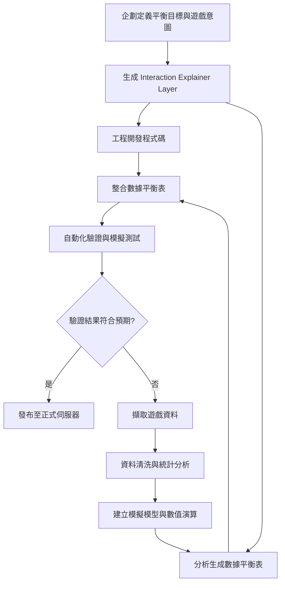

# 平衡設計流程

## 企劃階段

1. **定義遊戲平衡目標**

   - 確定核心玩法與玩家體驗
   - 設定經濟平衡
   - 標註關鍵數值指標

2. **生成佔位數據平衡表**

   - 填寫初步數值（Stub Values）  
   - 記錄初始值、增長公式、上下限  
   - 提供分析師與工程師可直接引用的 JSON 或表格模板  

3. **設計難度與經濟曲線**

   - 設計玩家升級、戰鬥、道具獲得的曲線
   - 設定小、中、大型敵人數值與生成規則
   - 預估玩家遊玩時間、通關率與分數成長曲線

## 分析階段

1. **收集與清洗資料**

   - 從現有數據或測試版本取得玩家行為資料
   - 計算平均值、標準差、極值，發現異常數據或潛在設計缺陷

2. **建立模擬模型**

   - 以隨機玩家模擬戰鬥、收集道具、升級過程
   - 測試不同數值組合對通關率、勝率、經濟曲線的影響

3. **數值驗證**

   - 確保所有數值在合理範圍內
   - 檢查道具、技能、敵人數值交互是否符合設計意圖

4. **更新平衡表**

   - 記錄初始值、增長公式、上下限
   - 標註可能受調整影響的指標
   - 提供可供分析師與工程師參考的 JSON 或表格模板

## 工程階段

1. **使用平衡表開發遊戲邏輯**

   - 事件觸發
   - 測試流程是否符合預期

2. **接口與事件保留**

   - 工程師依平衡表建立接口
   - 後續替換正式檔案時，仍然有效

## 整合階段

1. **整合平衡表**

   - 確認數值邏輯、模擬結果與企劃目標一致

2. **自動化驗證**

   - 測試玩家不同狀態下的數值演算
   - 驗證升級曲線、經濟曲線、戰鬥結果是否符合設計意圖

3. **生成報告與回饋**

   - 匯出模擬結果與統計圖表
   - 提供給企劃 / 設計師調整數值的依據

