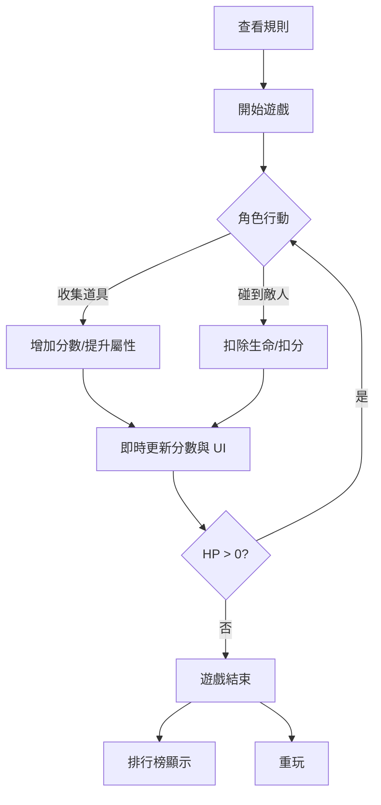
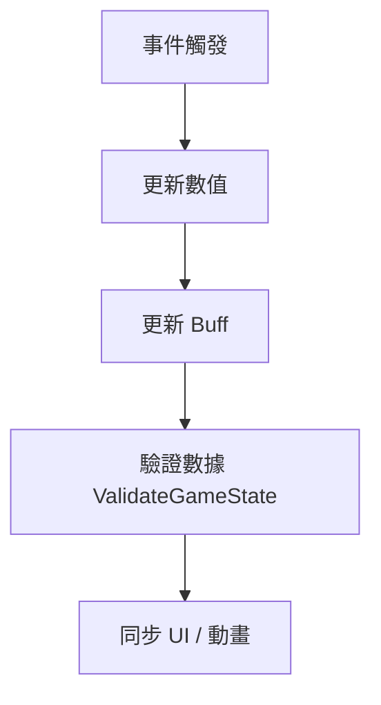
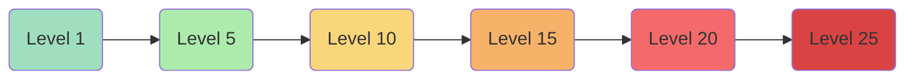
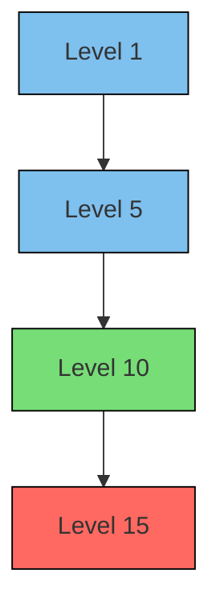
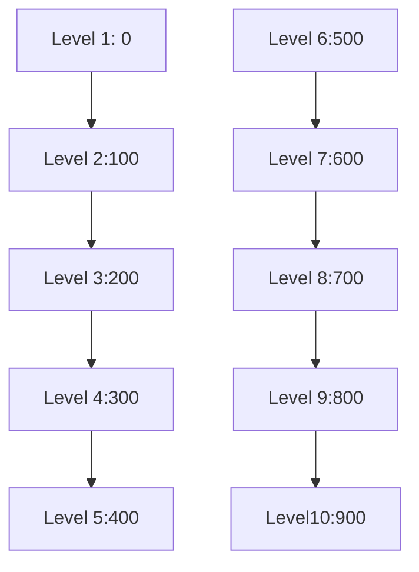

# 平衡設計規範 - 企劃

本文件將遊戲設計意圖（UX/Game intent）轉化為數值與互動規範，僅供企劃使用，不包含美術或工程細節。

## 文件用途

- 將玩家行為與遊戲事件映射至數值公式、屬性變化與互動規範
- 便於企劃調整遊戲平衡、設計道具組合與策略
- 提供前端開發所需公式與邏輯參考
- 提供完整流程圖，明確描述數值與遊戲事件的互動順序
- 增加玩家體驗提示與 KPI 參考

## 遊戲核心理念

- **目標**：玩家操控角色收集道具並避開敵人，累積分數，挑戰排行榜。
- **核心行為**：
  1. 查看簡單規則 → 理解操作
  2. 開始遊戲 → 角色互動與分數累計
  3. 分數即時更新 → 提供即時回饋
  4. 暫停 / 靜音 / 重玩 → 控制遊戲節奏
  5. 排行榜 → 提升重玩動機

## 遊戲核心流程



## 優先順序



## 系統數值

| 項目             | 初始值 | 公式 / 演算法                            | 單位 / 類型 | 上限 / 下限 | 玩家體驗 / KPI                 | 調整建議範圍 |
| ---------------- | ------ | ---------------------------------------- | ----------- | ----------- | ------------------------------ | ------------ |
| Score            | 0      | `Score += CollectItemPoint - HitPenalty` | 整數        | 0~999999    | 收集爽感，碰撞敵人挫敗感       | 10~1000000   |
| Level            | 1      | `Level = floor(Score / 100) + 1`         | 整數        | 1~99        | 等級提升帶來敵人增量與速度提升 | 1~50         |
| LeaderboardScore | 0      | 保存 Score，更新排行榜                   | 整數        | 0~999999    | 成就感、競爭感                 | 0~1000000    |
| Time             | 0      | `Time += deltaTime`                      | 秒 (浮點數) | 0~∞         | 臨時增益計算、節奏控制         | -            |

## 角色屬性

| 屬性         | 初始值 | 增長公式                             | 單位 / 類型 | 上限 / 下限 | 玩家體驗 / KPI              | 調整建議範圍 |
| ------------ | ------ | ------------------------------------ | ----------- | ----------- | --------------------------- | ------------ |
| HP           | 3      | `HP = min(3 + Level, MaxHP)`         | 整數        | 0~99        | 適度挑戰感，HP <=0 結束遊戲 | 3~10         |
| Speed        | 1.0    | `Speed = BaseSpeed * (1 + Level/10)` | 單位/秒     | 0.5~10      | 移動爽快感，隨等級增加      | 0.8~3        |
| Strength     | 1      | `Strength = Level * 1`               | 整數        | 1~99        | 攻擊能力，影響戰鬥爽感      | 1~10         |
| Intelligence | 1      | `Intelligence = Level * 1`           | 整數        | 1~99        | 技能效果影響玩家策略        | 1~10         |

重點：

- Level 1-5 → 玩家熟悉操作
- Level 6-15 → 敵人速度與數量增加，挑戰感上升
- Level 16+ → BOSS 出現，考驗玩家策略

## 敵人屬性

| 類型 | HP                 | Speed                  | Damage                      | 每次生成數量 | 生成間隔                 | 玩家體驗 / KPI           |
| ---- | ------------------ | ---------------------- | --------------------------- | ------------ | ------------------------ | ------------------------ |
| 小怪 | `HP = 1+Level`     | `Speed = 0.8+Level/20` | `Damage = 1+floor(Level/3)` | 1~3          | `max(2-Level\*0.05,0.5)` | 低威脅，增加節奏感       |
| 中怪 | `HP = 3+Level\*2`  | `Speed = 1.0+Level/20` | `Damage = 2+floor(Level/2)` | 1~2          | `max(5-Level\*0.1,1)`    | 中等挑戰感               |
| BOSS | `HP = 10+Level\*5` | `Speed = 1.2+Level/20` | `Damage = 5+Level`          | 1            | `999`                    | 高挑戰，需要策略，爽感高 |

重點：

- 小怪 → 熟悉操作
- 中怪 → 提升緊張感
- BOSS → 高刺激，需要策略

## 道具規範

| 道具名稱 | 效果公式                | 持續時間 | 優先級 | 玩家體驗 / KPI           | 互動提示               |
| -------- | ----------------------- | -------- | ------ | ------------------------ | ---------------------- |
| 金幣     | `Score += 10`           | 即時     | 1      | 收集爽感、分數累積       | 可與加速鞋同時生效     |
| 紅心     | `HP = min(HP+1, MaxHP)` | 即時     | 1      | 增加生存感，降低挫敗感   | 道具優先計算，先於扣血 |
| 加速鞋   | `Speed += 0.5`          | 5 秒     | 2      | 暫時爽快感，提升操控感   | 與星星可同時疊加       |
| 星星     | `ScoreMultiplier = 2`   | 5 秒     | 2      | 暫時加倍分數，增加刺激感 | 與加速鞋可同時疊加     |

## 互動行為

| 行為       | 觸發條件                   | 優先順序 | 效果                           | 玩家體驗 / KPI           |
| ---------- | -------------------------- | -------- | ------------------------------ | ------------------------ |
| 收集道具   | Player 與 Item 碰撞        | 1        | 更新 Score / HP / Speed        | 獲得即時反饋，爽感高     |
| 避開敵人   | Player 與 Enemy 碰撞       | 1        | 扣 HP、扣分，觸發碰撞動畫      | 挫敗感，提升挑戰性       |
| 重玩遊戲   | 玩家按下 Restart           | 0        | 清空 Score、HP、位置，重置道具 | 降低挫敗感，快速進入遊戲 |
| 排行榜顯示 | 遊戲結束或點擊 Leaderboard | 0        | 顯示前 N 名分數                | 提升競爭感與成就感       |

碰撞規則：

- 道具優先處理 → 玩家爽感先行
- 道具/敵人同時觸發 → 道具優先

## 遊戲節奏

### 難度曲線



### 敵人數量與生成間隔



```
Level:   1   5   10  15  20
小怪數量: ███ ███ ████ ████ █████
小怪生成: 2s 1.75s 1.5s 1.25s 0.5s
中怪數量: ░   ░   ██   ██   ██
中怪生成: 5s 4.5s 4s 3.5s 3s
BOSS數量: 0   0   0    1    1
BOSS生成: -   -   -    唯一  唯一
```

### 分數成長曲線



```
Level: 1  2  3  4  5  6  7  8  9 10
Score: 0 100 200 300 400 500 600 700 800 900
曲線: *   *   *   *   *   *   *   *   *   *
```
