# 後台系統規範 - 工程

本文件將遊戲營運需求轉化為可落地的系統行為、API 介面與權限規範，供前後端工程師實作與維運使用。  
包含 API Contract、WebSocket 事件定義、錯誤碼表與審計規範。

## 文件用途

- 將營運需求轉化為技術可執行邏輯。
- 提供開發團隊清楚的 API 與事件規格。
- 協助前後端對齊資料流、權限與狀態同步。

## 系統角色

| 角色     | 職責                         | 權限       |
| -------- | ---------------------------- | ---------- |
| 營運人員 | 調整設定、建立活動、封鎖玩家 | 有限存取   |
| 開發人員 | 維運系統、監控伺服器         | 完全存取   |
| 玩家     | 遊戲端使用者                 | 無後台權限 |

## 權限邏輯

| 模組     | 營運人員           | 開發人員            |
| -------- | ------------------ | ------------------- |
| 遊戲設定 | 編輯               | 編輯 + 系統參數管理 |
| 玩家資料 | 查詢 + 封鎖        | 全權操作            |
| 排行榜   | 查閱               | 查閱 + 重建快取     |
| 活動管理 | 建立 / 修改 / 刪除 | 修改 / 系統觸發     |
| 系統監控 | 無                 | 完全存取            |

## 系統架構

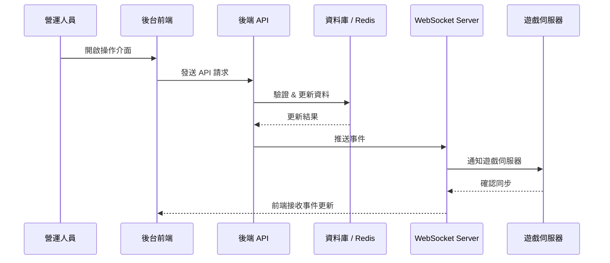

## 遊戲設定更新流程

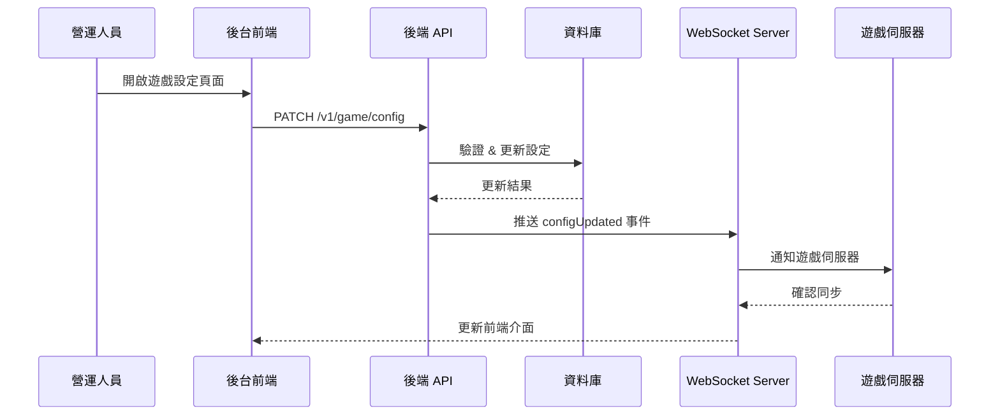

API：

```
PATCH /v1/game/config
Request Body:
{
  "scoreMultiplier": number,
  "enemySpawnRate": number
}
Response:
{
  "status": "success",
  "updatedAt": "2025-10-11T08:00:00Z"
}
Errors:
  400: INVALID_VALUE
  403: UNAUTHORIZED
  500: INTERNAL_ERROR
```

## 排行榜即時更新

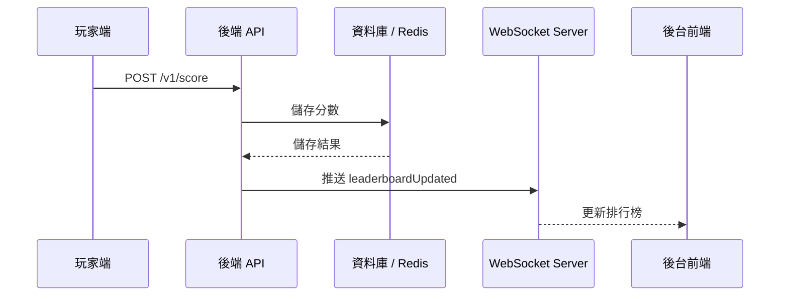

API：

```
POST /v1/score
Request:
{
  "playerId": string,
  "score": number
}
Response:
{
  "rank": number,
  "isNewHighScore": boolean
}
Errors:
  400: INVALID_SCORE
  500: DB_WRITE_FAILED
```

## 活動建立與啟用流程

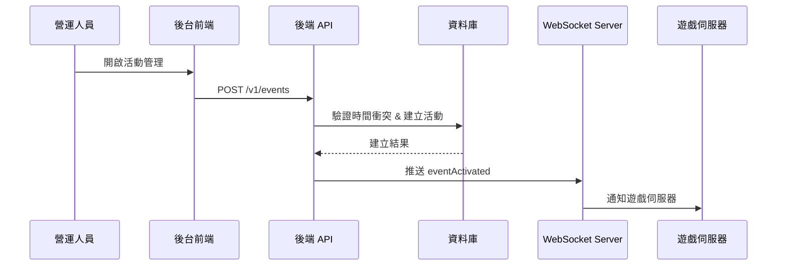

API：

```
POST /v1/events
Request:
{
  "name": "Double Score Week",
  "startTime": "2025-10-12T00:00:00Z",
  "endTime": "2025-10-19T00:00:00Z",
  "multiplier": 2.0
}
Response:
{
  "eventId": string,
  "status": "active"
}
Errors:
  409: EVENT_TIME_CONFLICT
  400: INVALID_PARAMETERS
```

## 玩家封鎖流程

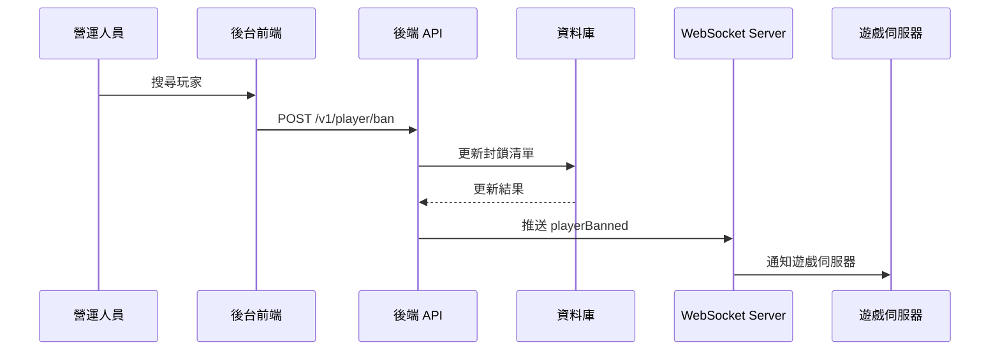

API：

```
POST /v1/player/ban
Request:
{
  "playerId": string,
  "reason": string
}
Response:
{
  "status": "banned",
  "bannedAt": "2025-10-11T10:00:00Z"
}
Errors:
  404: PLAYER_NOT_FOUND
  409: ALREADY_BANNED
```

## 系統監控與維運流程

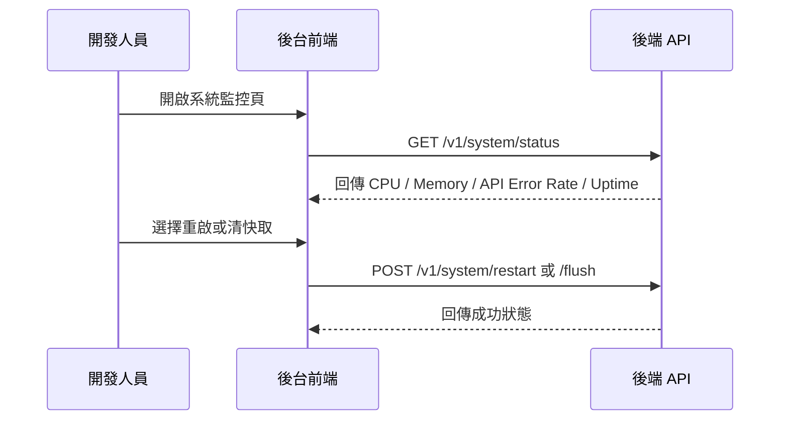

API：

```
GET /v1/system/status
Response:
{
  "cpuUsage": 35.2,
  "memoryUsage": 67.1,
  "apiErrorRate": 0.03,
  "uptime": "2d 5h 13m"
}

POST /v1/system/restart
Response:
{
  "status": "restarting"
}
```

## 系統設定更新

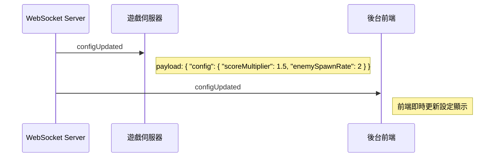

WebSocket：

| 事件名稱      | 來源    | 接收端                | Payload 範例                                                    |
| ------------- | ------- | --------------------- | --------------------------------------------------------------- |
| configUpdated | 後端 WS | 遊戲伺服器 / 後台前端 | `{ "config": { "scoreMultiplier": 1.5, "enemySpawnRate": 2 } }` |

## 排行榜更新

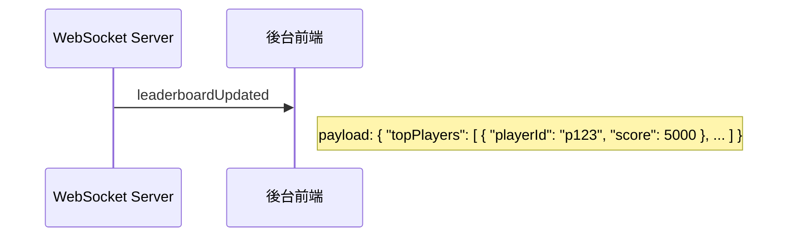

WebSocket：

| 事件名稱           | 來源    | 接收端   | Payload 範例                                                       |
| ------------------ | ------- | -------- | ------------------------------------------------------------------ |
| leaderboardUpdated | 後端 WS | 後台前端 | `{ "topPlayers": [ { "playerId": "p123", "score": 5000 }, ... ] }` |

## 活動管理

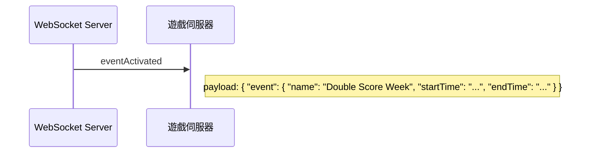

WebSocket：

| 事件名稱       | 來源    | 接收端     | Payload 範例                                                                         |
| -------------- | ------- | ---------- | ------------------------------------------------------------------------------------ |
| eventActivated | 後端 WS | 遊戲伺服器 | `{ "event": { "name": "Double Score Week", "startTime": "...", "endTime": "..." } }` |

## 玩家管理

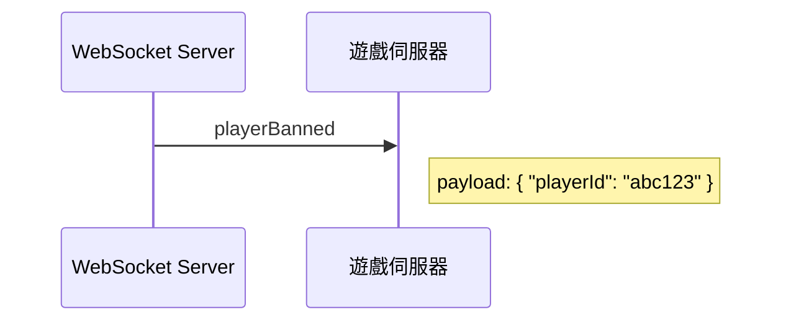

WebSocket：

| 事件名稱     | 來源    | 接收端     | Payload 範例               |
| ------------ | ------- | ---------- | -------------------------- |
| playerBanned | 後端 WS | 遊戲伺服器 | `{ "playerId": "abc123" }` |

## 系統監控與維運

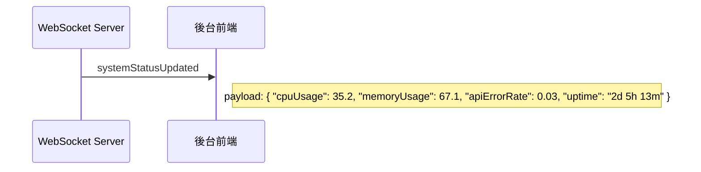

WebSocket：

| 事件名稱            | 來源    | 接收端   | Payload 範例                                                                             |
| ------------------- | ------- | -------- | ---------------------------------------------------------------------------------------- |
| systemStatusUpdated | 後端 WS | 後台前端 | `{ "cpuUsage": 35.2, "memoryUsage": 67.1, "apiErrorRate": 0.03, "uptime": "2d 5h 13m" }` |

## 錯誤碼定義

| 錯誤碼              | HTTP | 說明                   |
| ------------------- | ---- | ---------------------- |
| INVALID_PARAMETERS  | 400  | 參數不合法或缺少欄位   |
| INVALID_VALUE       | 400  | 數值範圍錯誤（如負數） |
| UNAUTHORIZED        | 403  | 權限不足               |
| PLAYER_NOT_FOUND    | 404  | 查無玩家資料           |
| EVENT_TIME_CONFLICT | 409  | 活動時間重疊           |
| DB_WRITE_FAILED     | 500  | 資料庫寫入失敗         |
| INTERNAL_ERROR      | 500  | 未預期的系統錯誤       |

## 審計與操作日誌規範

| 操作類型     | 記錄欄位                                  | 審計內容               |
| ------------ | ----------------------------------------- | ---------------------- |
| 遊戲設定修改 | operatorId, oldValue, newValue, timestamp | 誰改了哪個設定         |
| 活動建立     | operatorId, eventName, startTime, endTime | 建立與修改紀錄         |
| 玩家封鎖     | operatorId, playerId, reason              | 何人封鎖何玩家與原因   |
| 系統操作     | operatorId, actionType                    | 監控、重啟、清快取行為 |

所有操作記錄寫入 `audit_log` 表並每日匯出備份。
