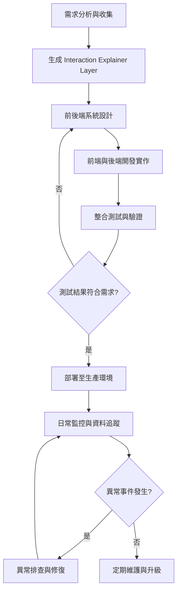

# 後台系統開發與維運流程

## 企劃階段

1. 需求分析與收集

    - 收集營運需求：遊戲設定、活動管理、排行榜更新、玩家管理
    - 確認技術可行性與資料結構設計

## 架構階段

1. 系統設計

    - 設計微服務化模組：遊戲設定、活動管理、排行榜、玩家資料、系統監控
    - 設計權限控制與資料驗證

2. 開發實作

    - 前端：
        - 建立管理頁面與表單
        - API 呼叫與 WebSocket 即時更新
        - 表單驗證與錯誤提示
    - 後端：
        - CRUD API 與事件推播邏輯
        - 資料庫模型與 Redis 快取
        - 權限與驗證機制
    - 單元測試與自動化測試

## 測試階段

1. 整合測試

    - 前後端功能連動測試
    - 模擬營運操作：
    - 修改遊戲規則
    - 建立活動
    - 封鎖玩家
    - 排行榜即時更新
    - 錯誤與邊界條件測試：非法參數、網路異常

2. 驗證與回饋

    - 驗證是否符合設計意圖
    - 記錄問題，回饋給開發與營運團隊

## 部署與上線階段

1. 部署

    - 後端服務部署至生產環境
    - 前端編譯與上傳 CDN
    - 資料庫遷移與快取初始化
    - 煙霧測試確認核心功能正常

2. 上線後檢查

    - 核心功能驗證
    - 啟動監控與警報系統

## 維運階段

1. 日常監控

    - 監控伺服器資源、API 成功率、WebSocket 連線、排行榜更新延遲
    - 追蹤操作日誌、活動狀態與玩家封鎖紀錄

2. 異常事件處理

    - 發現異常 → 查閱日誌與監控數據
    - 判斷是否重設伺服器參數或重新部署
    - 修復後驗證 → 更新狀態通知營運人員

3. 定期維護

    - 資料庫優化與備份
    - Redis 快取清理
    - 前端版本更新與功能優化
    - KPI 追蹤：排行榜延遲、活動使用率、系統錯誤率

4. 文件與知識管理

    - 更新文件
    - 保存運維手冊與操作指南
    - 記錄活動與版本變更歷史，提供營運與開發參考
