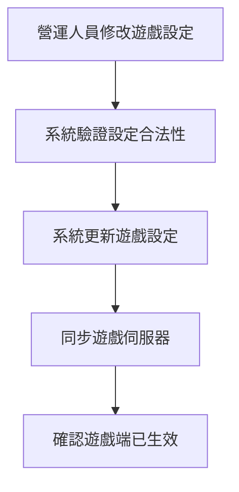
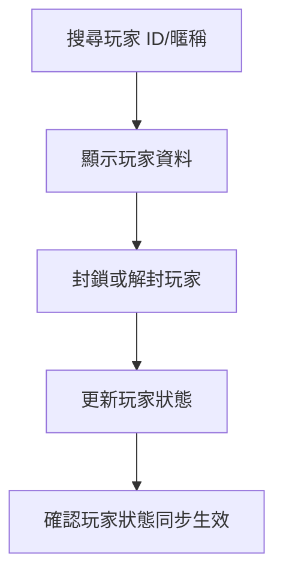
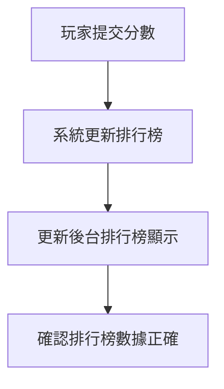
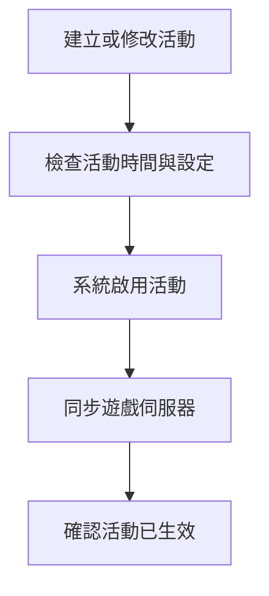
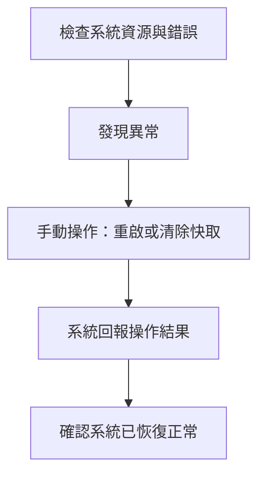

# 後台維運規範 - 維運

本文件將遊戲營運需求轉化為維運規範，僅供維運使用，不包含工程細節。

## 文件用途

- 提供維運 SOP、異常處理與警報稽核規範，方便日常操作與排查問題

## 系統角色與權限

| 角色     | 職責                         | 權限     |
| -------- | ---------------------------- | -------- |
| 營運人員 | 調整設定、建立活動、封鎖玩家 | 有限存取 |
| 開發人員 | 維運系統、監控伺服器         | 完全存取 |

## 遊戲設定模組

注意事項：

- 設定修改失敗 → 重試一次，仍失敗通知開發。
- 同步遊戲伺服器失敗 → 自動重試，持續失敗產生警報。
- 所有操作需稽核：操作人、時間、修改前後值。

## 玩家資料模組

注意事項：

- 查詢失敗 → 確認 ID/暱稱，仍失敗通知開發。
- 封鎖/解封操作失敗 → 重試一次，持續失敗產生警報。
- 所有操作需稽核：操作人、時間、玩家 ID、原狀態與結果。

## 排行榜模組

注意事項：

- 排行榜數據異常 → 手動重建排行榜。
- 更新失敗 → 自動重試，持續異常通知開發。
- 快速刷榜事件自動產生警報。
- 重建快取需稽核：操作人、時間、範圍。

## 活動管理模組

注意事項：

- 活動時間衝突 → 提示錯誤，需調整。
- 同步失敗 → 重試一次，仍失敗產生警報。
- 活動異常 → 停用並回滾資料。
- 所有操作需稽核：操作人、時間、活動設定。

## 系統監控模組

注意事項：

- 資源過高 → 排查進程或增加資源。
- 錯誤率過高 → 查日誌，必要時重啟服務。
- 連線異常 → 檢查網路，必要時重啟服務。
- 手動操作需稽核：操作人、時間、目標服務、結果。
- 異常指標達閾值 → 自動通知運維。
