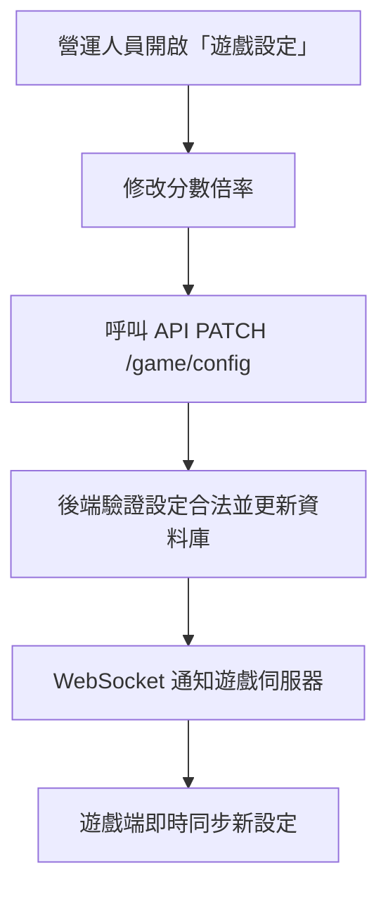
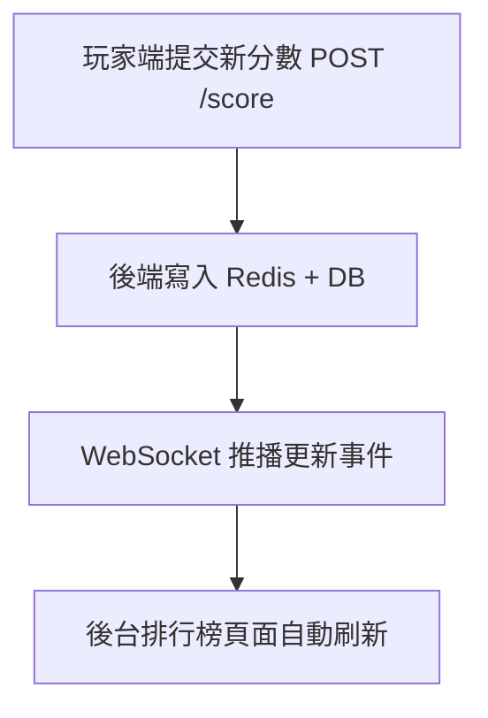
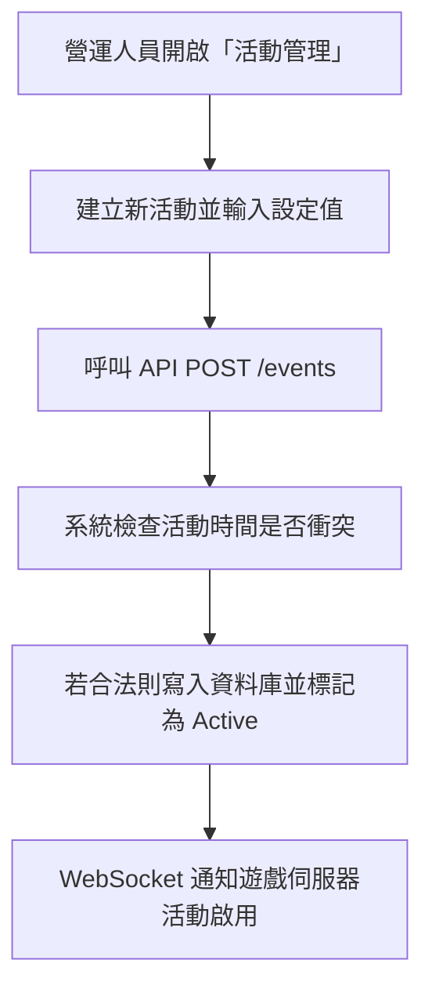
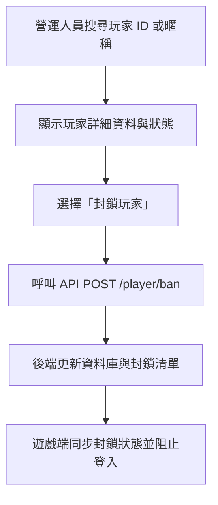
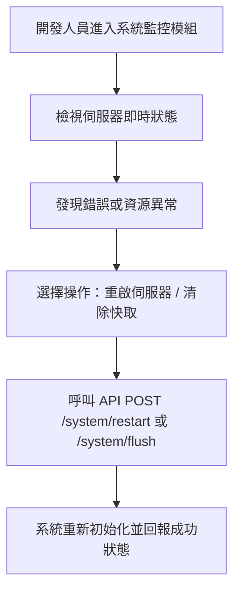

# 後台系統規範 - 企劃

本文件將遊戲維運需求轉化為互動行為與系統邏輯規範，僅供企劃使用，不包含維運或工程細節。

## 文件用途

- 將維運需求轉化為具體的系統模組與介面互動規範
- 作為遊戲維運、設定調整、排行榜與活動管理的核心參考依據

## 系統角色

| 角色     | 職責                         | 權限       |
| -------- | ---------------------------- | ---------- |
| 營運人員 | 調整設定、建立活動、封鎖玩家 | 有限存取   |
| 開發人員 | 維運系統、監控伺服器         | 完全存取   |
| 玩家     | 遊戲端使用者                 | 無後台權限 |

## 權限邏輯說明

| 模組     | 營運人員           | 開發人員            |
| -------- | ------------------ | ------------------- |
| 遊戲設定 | 編輯               | 編輯 + 系統參數管理 |
| 玩家資料 | 查詢 + 封鎖        | 全權操作            |
| 排行榜   | 查閱               | 查閱 + 重建快取     |
| 活動管理 | 建立 / 刪除 / 修改 | 修改 / 系統觸發     |
| 系統監控 | 無權限             | 完全存取            |

## 互動流程

### 營運人員更新遊戲設定

用途：

- 修改分數倍率、敵人生成速度或關卡難度。
- 儲存設定後即時同步至遊戲伺服器。
- 驗證設定值合法性（不得為負數或非數字）。

### 排行榜即時更新

用途：

- 即時檢視當前最高分與前 100 名玩家。
- 監控排行榜更新頻率，避免異常洗榜。
- 手動重建排行榜快取以校正資料。

### 活動建立與啟用流程

用途：

- 建立新活動（例如「雙倍積分週」或「限時挑戰」）。
- 設定開始與結束時間、獎勵倍數、可參與條件。
- 儲存後自動檢查活動時間衝突並通知遊戲端。

### 玩家封鎖與資料查詢流程

用途：

- 搜尋特定玩家的暱稱或 ID。
- 查看玩家的分數紀錄與登入次數。
- 一鍵封鎖可疑玩家並即時同步封鎖狀態。

### 系統監控與伺服器維運流程

用途：

- 查看伺服器 CPU / 記憶體使用率。
- 檢視 API 錯誤率與最近錯誤日誌。
- 於異常狀況下手動重啟伺服器或清除快取。

## 功能模組分層設計

### 遊戲設定模組

- **功能意圖**：允許營運人員調整遊戲邏輯（如分數倍率、敵人速度）。
- **互動邏輯**：
  1. 顯示目前設定（卡片或表格）
  2. 編輯設定 → 呼叫後端 API
  3. 更新成功後透過 WebSocket 同步至伺服器

### 玩家資料模組

- **用途**：查詢玩家紀錄、分數與封鎖狀態。
- **互動邏輯**：
  1. 搜尋玩家 ID 或暱稱
  2. 顯示詳細資料
  3. 操作封鎖 / 解封

### 排行榜模組

- **用途**：顯示全伺服器排行榜狀態。
- **互動邏輯**：
  - 後端提供排行榜快取 API
  - 前端以 WebSocket 即時更新
  - 支援「日榜 / 週榜 / 全時榜」

### 活動管理模組

- **用途**：建立與控制短期活動（例如「雙倍積分週」）
- **互動邏輯**：
  1. 建立活動 → 設定名稱、時間、加成類型
  2. 提交時呼叫 API
  3. 系統檢查時間衝突
  4. 活動生效後透過 Socket 通知遊戲端

### 系統監控模組

- **用途**：供開發人員監控伺服器狀態與除錯。
- **內容**：
  - 即時系統資源
  - API 錯誤率
  - 錯誤日誌
  - 可手動重啟伺服器
