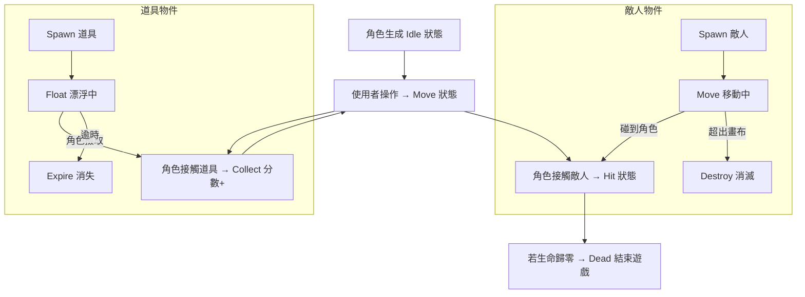

# 美術設計規範 - 美術

本文件將遊戲互動意圖（UX/Game intent）轉化為美術設計與動畫規範，僅供美術使用，不包含程式或工程細節。  
文件適用於角色、敵人、道具及 UI 元件的視覺設計與動畫製作，並提供各狀態對應的動畫、特效及光影建議，方便與程式開發保持一致的互動表現。

## 文件用途

- 將玩家互動或系統事件映射至角色、敵人、道具及 UI 元件的動畫/特效規範
- 規範各物件狀態的視覺表現、動畫節奏及特效層次
- 提供互動對應的視覺提示，增強玩家操作與反饋的可讀性
- 協助美術與程式團隊溝通，確保互動邏輯與視覺一致性

## 互動流程

### 物件



## 角色（Player）

### 玩家

```
　　　　／￣￣＼
　　　/　●　 ●  ヽ
　　　|　　▽　　|
　　　ヽ＿＿＿＿ノ
　　　／|　 　 |＼
　　（＿_|＿＿＿|＿）
　　　　|＿＿＿|
　　　／　　　　＼
```

- **設計**：Q 版 / 卡通風格，線條圓潤、表情誇張
- **配色**：主色調鮮明、對比強烈，Idle 時顏色柔和，Move 時稍微亮眼
- **光影**：簡單陰影和高光，突出角色立體感
- **動畫節奏**：Idle 慢速呼吸，Move 平滑加速，Hit 瞬間閃爍，Dead 緩慢倒地
- **特效**：Hit 紅閃 + 小型震動，Dead 融合淡出與遮罩漸暗

| 功能描述                       | 狀態           | 視覺表現                             | 觸發條件                 | 美術提示 / Layer                           |
| ------------------------------ | -------------- | ------------------------------------ | ------------------------ | ------------------------------------------ |
| 玩家可控制角色在遊戲畫布中移動 | Idle（待機）   | 角色靜止，呼吸式微動作               | 遊戲啟動後未操作時       | 主體動畫層 + 微動作層，保持生命感          |
| 玩家透過鍵盤／滑鼠操作角色移動 | Move（移動中） | 角色依方向鍵或滑鼠移動，出現位移動畫 | 使用者按方向鍵或滑鼠拖移 | 主體動畫 + 動態模糊/位移軌跡層，增加操控感 |
| 玩家被敵人碰撞                 | Hit（受擊）    | 角色閃爍紅色，短暫震動               | 與敵人接觸瞬間           | 特效層：紅閃 + 畫面震動，提示傷害          |
| 玩家失敗結束遊戲               | Dead（死亡）   | 角色消失或倒地動畫，畫面漸暗         | 受擊後生命歸零或判定失敗 | 特效層：倒地/消失動畫 + 遮罩層漸暗         |

重點：
- Hit/Dead 的視覺反饋應明顯且瞬間易讀。
- Move 動作方向需與玩家輸入同步，避免操控落差。
- Idle 微動作不可過於誇張，需保持「活體感」而非干擾玩家。

## 敵人（Enemy）

### 幽靈

```
    .-----.
   .' -   - '.
  /  .-. .-.  \
  |  | | | |  |
   \ \o/ \o/ /
  _/    ^    \_
 | \  '---'  / |
 / /`--. .--`\ \
/ /'---` `---'\ \
'.__.       .__.'
    `|     |`
     |     \
     \      '--.
      '.        `\
        `'---.   |
              ) /
              \/
```

- **設計**：稍微誇張、可辨識的威脅感，建議 Q 版 / 卡通風
- **配色**：與背景對比明顯，區分不同敵人類型
- **光影**：移動時尾影、碰撞時爆光，增加動態感
- **動畫節奏**：Spawn 緩入，Move 平滑，Collide 瞬間爆炸，Destroy 緩出或消散
- **特效**：碰撞時光暈 + 小爆炸，Destroy 可加粒子散開

| 功能描述                 | 狀態            | 視覺表現           | 觸發條件               | 美術提示 / Layer                       |
| ------------------------ | --------------- | ------------------ | ---------------------- | -------------------------------------- |
| 隨機生成於畫布上方或側邊 | Spawn（生成）   | 敵人淡入出現動畫   | 時間間隔生成           | 入場特效層：淡入 + 煙霧/光暈，吸引注意 |
| 敵人持續移動             | Move（移動中）  | 水平或斜線移動動畫 | 生成後自動執行         | 移動動畫層 + 運動軌跡特效，強化威脅感  |
| 敵人與角色發生碰撞       | Collide（碰撞） | 閃光特效與爆炸音效 | 與角色接觸瞬間         | 碰撞特效層 + 音效同步，明確提示傷害    |
| 敵人被判定移出畫面或消失 | Destroy（消滅） | 敵人淡出消失       | 超出畫布邊界或遊戲重置 | 消失動畫層，避免突兀，提示安全離開     |

重點：
- Move 與 Collide 特效應清楚表達危險來源。
- Destroy 動畫需有空間感，避免玩家誤判威脅仍在。
- 可以增加敵人顏色變化提示不同威脅等級。

## 道具（Item）

### 寶石貨幣

```
　　  ◇
　　／　＼
　 /　  　\
　 \　　　/
　　＼　／
　　　◇
```

- **設計**：可愛 / 卡通風格，形狀簡單易識別
- **配色**：高飽和色，與背景及敵人形成對比
- **光影**：漂浮時加光暈、旋轉高光，收集時閃光
- **動畫節奏**：Spawn 閃爍淡入，Float 緩慢上下漂浮，Collect 瞬間閃光，Expire 快速淡出
- **特效**：收集時粒子或光芒，Expire 可用碎片消散

| 功能描述           | 狀態              | 視覺表現               | 觸發條件         | 美術提示 / Layer                      |
| ------------------ | ----------------- | ---------------------- | ---------------- | ------------------------------------- |
| 道具於隨機位置生成 | Spawn（出現）     | 閃爍淡入效果           | 隨機時間觸發     | 生成特效層：閃爍淡入 + 光暈，吸引注意 |
| 道具可被玩家撿取   | Float（漂浮中）   | 緩慢上下漂浮動畫       | 存在於畫布中     | 漂浮動畫層 + 光暈層，提示可互動       |
| 道具被玩家接觸     | Collect（被撿取） | 閃光動畫＋分數上升音效 | 角色與道具重疊   | 收集特效層 + 音效同步，強化獎勵感     |
| 道具逾時未被撿取   | Expire（消失）    | 快速淡出動畫           | 超過存在時間上限 | 失效特效層，提示玩家錯過時機          |

重點：
- Collect 動畫要短而明確，與音效同步。
- Float 動畫可以增加可愛或吸引力，使玩家主動靠近。
- Expire 動畫需清楚提示「消失」，避免誤判仍可撿取。

## 介面元件

### 生命值條（Health Bar）

```
┌──────────────┐
│ ❤️ ❤️ ❤️    │
└──────────────┘
```

- **設計**：卡通 / 圓角矩形，與角色風格統一
- **配色**：生命值滿 → 綠色，低血量 → 紅色，背景半透明灰色
- **動畫節奏**：減少血量時緩慢縮短動畫，增加生命消耗感
- **特效**：低血量閃爍或顫動提示危險

| 功能描述         | 元件狀態 | 視覺表現           | 觸發條件       | 美術提示 / Layer        |
| ---------------- | -------- | ------------------ | -------------- | ----------------------- |
| 顯示玩家剩餘生命 | Normal   | 綠色格子或心形圖示 | 遊戲中持續顯示 | 主體層 + 漸變顏色層     |
| 生命減少         | Damage   | 格子消失或心形縮小 | 玩家受擊       | 動畫層：縮小 + 淡出     |
| 生命低於 25%     | Warning  | 閃爍或顫動         | 玩家生命低     | 特效層：閃爍 + 音效同步 |

### 分數顯示（Score Display）

```
┌──────────────┐
│ Score: 12345 │
└──────────────┘
```

- **設計**：大號字體，與遊戲卡通風格匹配
- **配色**：明亮色系，重要數字加上光暈或陰影
- **動畫節奏**：分數增加時短暫放大 + 閃光
- **特效**：Collect 道具時觸發閃光或粒子

| 功能描述       | 元件狀態  | 視覺表現        | 觸發條件       | 美術提示 / Layer        |
| -------------- | --------- | --------------- | -------------- | ----------------------- |
| 顯示當前分數   | Normal    | 數字固定位置    | 遊戲中持續顯示 | 主體層 + 陰影/光暈層    |
| 分數增加       | Increase  | 短暫放大 + 閃光 | 角色收集道具   | 動畫層：放大 + 光效粒子 |
| 分數達到里程碑 | Milestone | 額外閃光或動畫  | 達成特定分數   | 特效層：光圈 + 音效同步 |

### 按鈕（Button）

```
┌─────────┐
│ 開始遊戲 │
└─────────┘
```

- **設計**：圓角矩形或帶光暈的卡通風格
- **配色**：主色鮮明，Hover / 點擊時亮度變化
- **動畫節奏**：Hover 縮放 + 高亮，Click 按壓動畫
- **特效**：點擊時粒子或光暈，增加回饋感

| 功能描述          | 元件狀態 | 視覺表現        | 觸發條件       | 美術提示 / Layer        |
| ----------------- | -------- | --------------- | -------------- | ----------------------- |
| 可互動按鈕        | Normal   | 主色 + 標題文字 | 遊戲介面顯示   | 主體層 + 光暈層         |
| 滑鼠 / 手指 Hover | Hover    | 輕微放大 + 高亮 | 玩家滑過或觸碰 | 動畫層：縮放 + 顏色變化 |
| 按下              | Click    | 按壓凹陷效果    | 玩家點擊       | 動畫層：按壓 + 光效粒子 |
