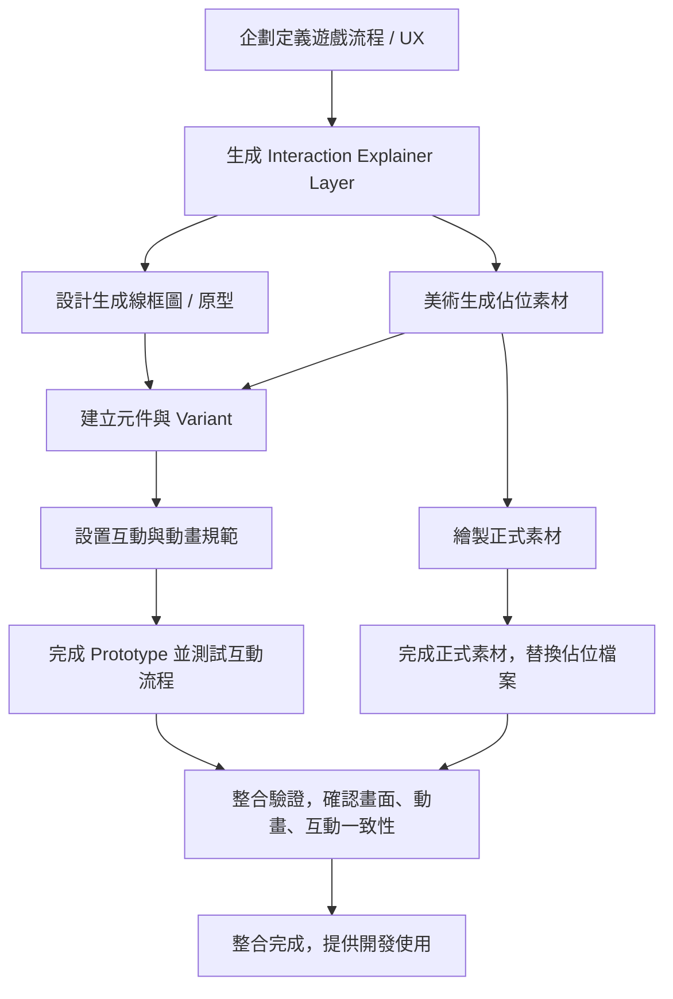

# 畫面設計流程

## 企劃階段

1. **定義遊戲流程與互動意圖**

    - 明確遊戲核心玩法、主要畫面及功能
    - 設計玩家操作流程
    - 確認使用者體驗原則

2. **生成互動流程與 UX 文檔**

    - Mermaid 流程圖示意操作流程
    - 功能列表與流程文字描述
    - UX 原則及建議

3. **生成 Interaction Explainer Layer**

   - 表格化畫面需求
   - 這份表格將作為美術與設計共同語言

## 設計階段

1. **畫面版面規劃與線框圖**

    - 根據企劃流程建立線框圖
    - 確定版面尺寸、間距、視覺層級
    - 輸出 Figma Frame

2. **元件設計與 Variant**

    - 將可重複元件抽象：
    - 設計 Variant 狀態：
    - 設定顏色、字型、尺寸
    - 輸出元件庫

3. **互動與動畫規範**

    - 設計按鈕、卡片、分數、畫布動畫
    - 設定動畫時間與緩動
    - 使用佔位素材輸出 Prototype 與 Motion Spec

## 美術階段

0. **生成佔位素材**

    - 快速繪製簡單形狀或低解析度角色、道具、背景
    - 用於 Prototype 互動測試
    - 標註素材用途、尺寸、顏色

1. **製作視覺素材**

    - 角色、道具、敵人、背景
    - 按鈕、卡片裝飾、圖示
    - 保持風格與遊戲主題一致

2. **整合元件庫**

    - 將素材套用到設計師元件庫
    - 確認尺寸、顏色、字型、動畫一致

## 整合階段

1. **美術提供正式素材**

   - 將佔位素材替換為正式素材檔案
   - 名稱與資料夾結構保持一致

2. **測試整合**

    - 確認流程順暢、操作明確
    - 動畫與互動符合 UX 預期
