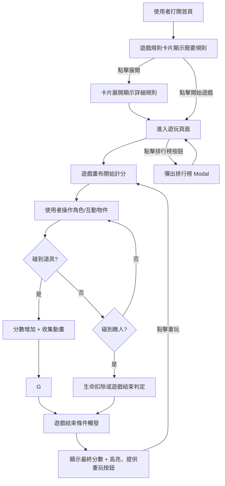

# 遊戲流程規範 - 企劃

本文件將遊戲核心玩法與玩家操作流程明確化，僅供企劃使用，不包含程式或美術細節。
文件適用於規劃遊戲目標、核心行為、互動流程及 UX 原則，作為設計、開發及測試的共用參考，方便後續版本迭代與跨部門協作。

## 文件用途

- 將遊戲目標、核心玩法與玩家互動流程明確化，提供團隊統一理解基礎
- 規劃操作流程與互動單元，確保各操作邏輯直覺且易於上手
- 提供 UX 設計原則及互動細節，協助設計師、程式及 QA 保持一致的玩家體驗
- 作為跨部門溝通工具，統一遊戲規則、操作邏輯與流程規範
- 支持版本迭代與後續更新，方便追蹤設計決策與修改歷程

## 遊戲核心理念

- **目標**：玩家透過操控角色收集道具並避開敵人，累積分數，挑戰排行榜
- **核心行為**：
  1. 查看簡單規則 → 理解操作
  2. 開始遊戲 → 角色互動與分數累計
  3. 分數即時更新 → 提供即時回饋
  4. 暫停 / 靜音 / 重玩 → 控制遊戲節奏
  5. 排行榜 → 提升重玩動機

## 操作流程

## 互動單元

### 首頁

| 元件           | 互動行為         | UX 目的                        | 動作 / 動畫                      | 玩家心理 / 期望                |
| -------------- | ---------------- | ------------------------------ | -------------------------------- | ------------------------------ |
| 規則卡片       | 點擊展開 / 收合  | 降低初次資訊負荷，提供新手學習 | 高度展開/收合 + Fade In/Out 0.3s | 希望快速理解玩法，不被資訊淹沒 |
| 開始遊戲按鈕   | 點擊進入遊玩頁面 | 直覺啟動遊戲                   | 顏色變化 + Light Shadow          | 期待立即開始遊戲，快速進入狀態 |
| 查看排行榜按鈕 | 點擊開啟 Modal   | 保持上下文，避免跳頁           | Modal Fade In/Out                | 想查看成績比較，增強競爭動機   |

### 遊玩頁面

| 元件       | 互動行為                 | UX 目的              | 動作 / 動畫          | 玩家心理 / 期望                |
| ---------- | ------------------------ | -------------------- | -------------------- | ------------------------------ |
| 遊戲畫布   | 角色移動、敵人與道具互動 | 即時回饋玩家操作     | 實時動畫 Linear      | 操作靈敏、即時反應，感受控制感 |
| 分數顯示區 | 分數更新                 | 讓玩家掌握進度感     | Fade In/Out 0.25s    | 想看到努力的即時回報           |
| 暫停按鈕   | 點擊暫停                 | 防止誤操作，暫停遊戲 | 畫面凍結，按鈕高亮   | 安全感，不怕誤觸或掉分         |
| 靜音按鈕   | 點擊切換                 | 玩家控制音效         | 圖示切換（音符變叉） | 可自主調整環境，降低干擾       |
| 重玩按鈕   | 點擊重啟遊戲             | 增加重玩誘因         | 按鈕閃爍 + 重置分數  | 期待快速重新挑戰，提升動機     |

### 排行榜

| 元件       | 互動行為       | UX 目的            | 動作 / 動畫                       | 玩家心理 / 期望            |
| ---------- | -------------- | ------------------ | --------------------------------- | -------------------------- |
| 排行榜按鈕 | 點擊開啟 Modal | 查看排名，增強競爭 | Modal Fade In/Out，不打斷遊戲流程 | 想知道自己表現，激發挑戰心 |
| Modal 關閉 | 點擊背景或 X   | 回到遊戲主畫面     | Fade Out                          | 迅速返回遊戲，不破壞沉浸感 |

## 設計原則

- **可發現性**：按鈕、卡片、圖示清楚可點擊，提供 Hover / Active 回饋；按鈕大小 ≥ 44px
- **即時回饋**：分數、動畫、角色互動提供立即反應（0.25~0.3s 動畫）
- **低認知負荷**：首頁規則卡片收合，初次進入不一次展示所有資訊；重要操作按鈕高對比
- **操作安全**：暫停與 Disabled 狀態避免誤觸，重玩提供快速重置
- **連續性**：Modal 彈出不打斷遊戲流程，保持玩家沉浸感
