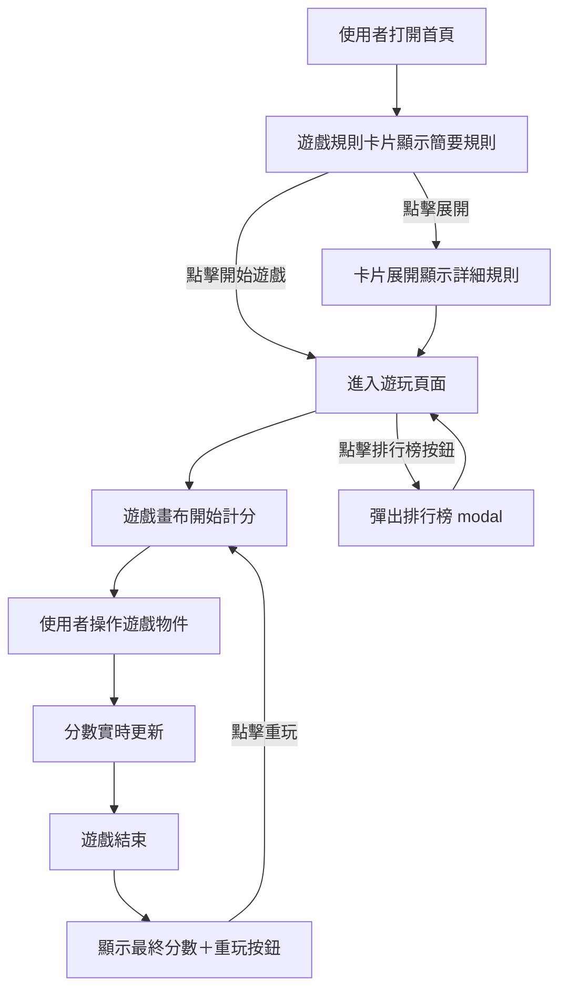

# 畫面設計規範 - 設計

本文件將產品互動意圖（UX/Game intent）轉化為畫面設計規範，僅供設計師使用，不包含程式或工程細節。  
文件適用於 Figma / Prototype 設計，支援畫布、按鈕、分數、卡片與 Modal 的互動設計，並提供動畫與狀態規範，方便設計師理解玩家操作流程與 UX 目的。

## 文件用途

- 將玩家互動或系統事件映射至 Figma Interaction Layer
- 規範元件互動觸發、動畫效果與狀態切換
- 提供流程圖與表格說明，方便設計師建立 Prototype
- 作為 UX / 遊戲企劃與美術 / 設計師溝通橋樑，避免理解偏差

## 畫面結構

### 首頁

```
+------------------------------------------------+
|                   小遊戲首頁                   |
+------------------------------------------------+
|  Logo / 標題                                   |
+------------------------------------------------+
|  遊戲規則卡片 [收合/展開]                     |
|  ┌───────────────────────────────┐           |
|  │  簡要遊戲規則                  │           |
|  │  [展開更多]                    │           |
|  └───────────────────────────────┘           |
+------------------------------------------------+
|  開始遊戲按鈕                                  |
|  [開始遊戲]                                    |
+------------------------------------------------+
|  排行榜按鈕                                    |
|  [查看排行榜]                                  |
+------------------------------------------------+
```

重點：

- Logo/標題置頂提供品牌識別。
- 遊戲規則卡片初始收合，降低認知負荷；展開按鈕明顯，方便新手理解規則。
- 開始遊戲按鈕綠色區分主要操作，Hover 提供互動回饋，Disabled 避免誤觸。
- 排行榜按鈕使用藍色區分次要操作，Modal 展示排行榜保持上下文。

### 遊玩頁面

```
+------------------------------------------------+
|                   遊玩頁面                     |
+------------------------------------------------+
|  分數顯示區                                    |
|  [分數: 0]                                     |
+------------------------------------------------+
|  遊戲畫布 (Canvas)                             |
|  ┌───────────────────────────────┐           |
|  │ 遊戲物件：敵人／道具／角色       │           |
|  │ 互動方式：滑鼠／鍵盤             │           |
|  └───────────────────────────────┘           |
+------------------------------------------------+
|  操作按鈕／功能按鈕                            |
|  [暫停] [靜音] [重玩]                          |
+------------------------------------------------+
|  排行榜按鈕                                    |
|  [查看排行榜]                                  |
+------------------------------------------------+
```

重點：

- 分數顯示區置頂，更新動畫淡入/高亮增強即時反饋。
- 遊戲畫布留白合理，避免道具或敵人遮擋角色。
- 操作按鈕顏色與狀態明確，Hover/Active 動畫提升可操作性。
- 排行榜 Modal 不打斷遊戲流程，保持連續性。

## 邏輯流程



## 互動單元

### 遊戲規則卡片

```
┌───────────────────────────────┐
│  簡要遊戲規則（收合狀態）       │
│  [展開更多]                    │
└───────────────────────────────┘
↓ 點擊展開
┌───────────────────────────────┐
│  詳細遊戲規則（展開狀態）       │
│  1. 使用滑鼠或鍵盤操作角色       │
│  2. 撿取道具可得分              │
│  3. 撞擊敵人即遊戲結束          │
│  [收合]                        │
└───────────────────────────────┘
```

| 功能描述           | 狀態 | 視覺表現                       | 觸發條件         |
| ------------------ | ---- | ------------------------------ | ---------------- |
| 展示簡要／詳細規則 | 收合 | 卡片縮小僅顯示標題與簡要文字   | 畫面初始         |
| 展示簡要／詳細規則 | 展開 | 卡片全高顯示完整文字內容與按鈕 | 點擊「展開更多」 |

| 元件類型           | 功能                   | 互動                                        | 美術指引                                                                      |
| ------------------ | ---------------------- | ------------------------------------------- | ----------------------------------------------------------------------------- |
| Card/Rules         | 顯示簡要或詳細遊戲規則 | 點擊「展開更多」→ 展開 / 點擊「收合」→ 收合 | 背景 #F8F9FA，圓角 8px，陰影 2px，字型 標題 16px Semibold / 內容 14px Regular |
| Button (展開/收合) | 控制卡片收合與展開     | 點擊觸發高度動畫 + Fade In/Out              | 主要色 #007bff，Hover 深藍 #0056b3，圓角 4px                                  |

重點：

- 收合/展開設計降低初次資訊量，減少認知負荷。
- 按鈕易點，符合可發現性原則。
- 可搭配圖示或動畫示例，提升新手理解效率。

### 開始遊戲按鈕

```
[ 開始遊戲 ]   ← Default 狀態（綠底白字）
[ 開始遊戲 ]   ← Hover 狀態（深綠底白字）
[ 開始遊戲 ]   ← Disabled 狀態（灰底灰字）
```

| 功能描述               | 狀態            | 視覺表現                   | 觸發條件   |
| ---------------------- | --------------- | -------------------------- | ---------- |
| 啟動遊戲並進入遊玩頁面 | 預設（Default） | 綠底白字，正常亮度         | 畫面初始   |
| 啟動遊戲並進入遊玩頁面 | Hover           | 深綠底白字，光暈或陰影強化 | 游標移入   |
| 遊戲中禁用操作         | Disabled        | 灰底灰字，按鈕無法點擊     | 遊戲進行中 |

| 元件類型       | 功能          | 互動                | 美術指引                                                                    |
| -------------- | ------------- | ------------------- | --------------------------------------------------------------------------- |
| Button/Primary | 啟動遊戲      | 點擊 → 進入遊玩頁面 | 綠底白字 Default，Hover 深綠，Disabled 灰底灰字，圓角 8px，文字 16px Medium |
| Button/Primary | Disabled 狀態 | 不可操作            | 灰底灰字，透明度 60%                                                        |

重點：

- 顏色與狀態明確區分操作性。
- Hover 高亮提供即時互動回饋。
- Disabled 狀態避免誤觸，提高可用性。

### 排行榜按鈕

```
[ 查看排行榜 ]   ← Default 狀態（藍底白字）
[ 查看排行榜 ]   ← Hover 狀態（深藍底白字）
[ 排行榜 Modal 開啟中 ]   ← 畫面疊加
```

| 功能描述         | 狀態            | 視覺表現             | 觸發條件 |
| ---------------- | --------------- | -------------------- | -------- |
| 開啟排行榜 Modal | 預設（Default） | 藍底白字             | 畫面初始 |
| 開啟排行榜 Modal | Hover           | 深藍底白字，亮度提升 | 游標移入 |

| 元件類型         | 功能             | 互動                            | 美術指引                                                        |
| ---------------- | ---------------- | ------------------------------- | --------------------------------------------------------------- |
| Button/Secondary | 開啟排行榜 Modal | 點擊 → 彈出排行榜 Modal         | 藍底白字 Default，Hover 深藍，圓角 8px，文字 16px Medium        |
| Modal            | 顯示排行榜       | 點擊遮罩或關閉按鈕 → 收合 Modal | 半透明背景 #000000 50% opacity，Modal 白底，圓角 12px，陰影 8px |

重點：

- Modal 彈出避免跳頁，保持上下文。
- Hover 動態提升可操作感，顏色差異區分操作優先級。

### 遊戲畫布

```
╔══════════════════════════════╗
║ 角色移動中（進行中）          ║
║ 敵人與道具持續生成            ║
╚══════════════════════════════╝
↓ 暫停
╔══════════════════════════════╗
║ 角色靜止、畫面凍結（暫停）    ║
╚══════════════════════════════╝
↓ 結束
╔══════════════════════════════╗
║ 遊戲結束！分數：1200         ║
║ [重玩]                       ║
╚══════════════════════════════╝
```

| 功能描述               | 狀態   | 視覺表現                     | 觸發條件         |
| ---------------------- | ------ | ---------------------------- | ---------------- |
| 顯示遊戲互動物件與狀態 | 進行中 | 角色、敵人與背景持續動畫更新 | 遊戲啟動後       |
| 顯示遊戲互動物件與狀態 | 暫停   | 畫面凍結、角色停止動作       | 按下暫停按鈕     |
| 顯示遊戲互動物件與狀態 | 結束   | 畫面顯示分數與「重玩」按鈕   | 遊戲結束條件觸發 |

| 元件類型    | 功能               | 互動                                      | 美術指引                                                                |
| ----------- | ------------------ | ----------------------------------------- | ----------------------------------------------------------------------- |
| Game/Canvas | 顯示角色/敵人/道具 | 角色滑鼠/鍵盤控制，碰撞觸發分數或遊戲結束 | 背景 #FFFFFF，角色 64x64px，道具亮色閃爍，敵人暗色移動，動畫持續 Linear |
| Game/Canvas | 暫停               | 點擊暫停按鈕 → 畫面凍結 + 按鈕高亮        | 背景不變，角色停止動畫，按鈕高亮 #28a745                                |
| Game/Canvas | 遊戲結束           | 遊戲結束 → 顯示分數 + 重玩按鈕動畫        | 分數高亮 #FF9800，按鈕藍色閃爍，突出操作                                |

重點：

- 動態畫布提供即時互動回饋，增強沉浸感。
- 暫停狀態明確，防止誤操作。
- 結束畫面突出分數與重玩按鈕，提升次次遊玩誘因。

### 分數顯示區

```
[ 分數：0 ]   → 初始
[ 分數：100 ] → 分數更新動畫（淡入）
[ 分數：1200 ] → 遊戲結束高亮顯示
```

| 功能描述     | 狀態   | 視覺表現                   | 觸發條件     |
| ------------ | ------ | -------------------------- | ------------ |
| 顯示當前分數 | 更新中 | 分數數字以淡入淡出動畫變化 | 使用者獲分時 |
| 顯示最終分數 | 結束   | 數字靜止並高亮顯示最終分數 | 遊戲結束後   |

| 元件類型 | 功能         | 互動                       | 美術指引                                                                 |
| -------- | ------------ | -------------------------- | ------------------------------------------------------------------------ |
| Score    | 顯示即時分數 | 分數更新 → 動畫淡入/淡出   | 字型 Inter Bold 18px，顏色 #28a745 (進行中)，#FF9800 (高亮)，Padding 8px |
| Score    | 顯示最終分數 | 遊戲結束 → 高亮 + Scale Up | 字型 Inter Bold 18px，顏色 #FF9800，高亮動畫 0.35s                       |

重點：

- 即時更新增強玩家掌握進度感。
- 高亮顯示最終分數給予成就感。
- 動畫速度適中，避免閃爍影響操作。

### 操作按鈕

```
[ 暫停 ] [ 靜音 ] [ 重玩 ]
↑ Default 狀態（正常亮度）

[ 暫停中 ] → 按鈕高亮
[ 🔇 靜音中 ] → 圖示變化
[ 重玩中 ] → 按鈕閃爍表示重啟
```

| 功能描述 | 狀態    | 視覺表現                       | 觸發條件       |
| -------- | ------- | ------------------------------ | -------------- |
| 暫停遊戲 | Default | 標準按鈕樣式                   | 遊戲中         |
| 靜音切換 | Active  | 按鈕顏色或圖示變化（音符變叉） | 點擊靜音切換   |
| 重玩遊戲 | Default | 藍底白字按鈕                   | 遊戲結束後顯示 |

| 元件類型      | 功能     | 互動                         | 美術指引                                       |
| ------------- | -------- | ---------------------------- | ---------------------------------------------- |
| Button/Action | 暫停遊戲 | 點擊 → 畫面暫停 + 按鈕高亮   | 綠底白字 Default，暫停中高亮 #28a745，圓角 8px |
| Button/Action | 靜音切換 | 點擊 → 圖示變化（音符 → 叉） | 藍底白字 Default，靜音中圖示變化，圓角 8px     |
| Button/Action | 重玩遊戲 | 點擊 → 遊戲重啟動畫          | 藍底白字 Default，按鈕閃爍表示重啟，圓角 8px   |

重點：

- 狀態清楚，動態回饋增強可操作性。
- 圖示變化幫助快速辨識功能。
- 避免過多動畫干擾核心遊戲操作。

## 樣式

### 尺寸

| 區塊             | 寬度  | 高度                        | Padding / Margin | Figma Frame 建議              |
| ---------------- | ----- | --------------------------- | ---------------- | ----------------------------- |
| 首頁 Logo / 標題 | 360px | 60px                        | Top: 16px        | Frame: `Header`               |
| 遊戲規則卡片     | 320px | 120px (收合) / 240px (展開) | Padding 16px     | Component: `Card/Rules`       |
| 開始遊戲按鈕     | 200px | 48px                        | Margin Top 24px  | Component: `Button/Primary`   |
| 排行榜按鈕       | 200px | 48px                        | Margin Top 12px  | Component: `Button/Secondary` |
| 分數顯示區       | 360px | 40px                        | Padding 8px      | Component: `Score/Current`    |
| 遊戲畫布         | 360px | 480px                       | Padding 0        | Frame: `Game/Canvas`          |
| 操作按鈕群       | 360px | 48px                        | Margin Top 12px  | Component: `Button/Action`    |

### 字型

| 元件        | 字型             | 大小 | 行高 | 顏色                              |
| ----------- | ---------------- | ---- | ---- | --------------------------------- |
| 標題 / Logo | Inter / Bold     | 24px | 32px | #111111                           |
| 卡片標題    | Inter / Semibold | 16px | 24px | #111111                           |
| 卡片內容    | Inter / Regular  | 14px | 20px | #333333                           |
| 按鈕文字    | Inter / Medium   | 16px | 24px | #FFFFFF                           |
| 分數文字    | Inter / Bold     | 18px | 24px | #28a745 (進行中) / #FF9800 (高亮) |

### 顏色（Color Token）

| 名稱                | HEX     | 用途                         |
| ------------------- | ------- | ---------------------------- |
| Primary Green       | #28a745 | 主要操作按鈕 Default         |
| Primary Green Dark  | #218838 | 主要操作 Hover               |
| Secondary Blue      | #007bff | 次要操作按鈕 Default         |
| Secondary Blue Dark | #0056b3 | 次要操作 Hover               |
| Disabled Gray       | #6c757d | Disabled 狀態按鈕 / 不可操作 |
| Background          | #FFFFFF | 背景色                       |
| Card Background     | #F8F9FA | 卡片底色                     |

### 動態互動（Motion Spec）

| 元件        | 狀態            | 動畫 / 觸發                | 時間    | 緩動          |
| ----------- | --------------- | -------------------------- | ------- | ------------- |
| Button      | Hover           | 顏色深化 + Light Shadow    | 0.2s    | Ease In Out   |
| Button      | Disabled        | 顏色變灰                   | 無      | -             |
| Card Rules  | Expand          | 高度展開 + Fade In         | 0.3s    | Ease In Out   |
| Card Rules  | Collapse        | 高度收合 + Fade Out        | 0.3s    | Ease In Out   |
| Score       | Update          | 數字淡入/淡出              | 0.25s   | Ease Out      |
| Score       | Final Highlight | 數字高亮 + Scale Up        | 0.35s   | Ease Out Back |
| Game Canvas | Playing         | 角色 / 道具 / 敵人動畫持續 | 實時    | Linear        |
| Game Canvas | Pause           | 畫面凍結 + 按鈕高亮        | Instant | -             |
| Game Canvas | GameOver        | 顯示分數 + 重玩按鈕動畫    | 0.3s    | Ease Out      |

### 響應式規範

| 裝置    | 寬度    | 尺寸縮放規則                              |
| ------- | ------- | ----------------------------------------- |
| Mobile  | 360px   | 元件寬度保持，Padding / Margin 按比例縮放 |
| Tablet  | 720px   | 元件寬度放大 2x，間距按比例放大           |
| Desktop | ≥1080px | 元件寬度可固定，居中顯示                  |

## 元件

### 按鈕 Button

| Component        | Variant  | 寬度  | 高度 | 顏色    | 字型              | 動態 / 狀態          |
| ---------------- | -------- | ----- | ---- | ------- | ----------------- | -------------------- |
| Button/Primary   | Default  | 200px | 48px | #28a745 | Inter Medium 16px | Default              |
| Button/Primary   | Hover    | 200px | 48px | #218838 | Inter Medium 16px | Hover + Light Shadow |
| Button/Primary   | Disabled | 200px | 48px | #6c757d | Inter Medium 16px | Disabled             |
| Button/Secondary | Default  | 200px | 48px | #007bff | Inter Medium 16px | Default              |
| Button/Secondary | Hover    | 200px | 48px | #0056b3 | Inter Medium 16px | Hover + Light Shadow |

### 遊戲規則卡片 Card/Rules

| Component  | Variant   | 寬度  | 高度  | 背景色  | 字型                                                | 動態 / 狀態         |
| ---------- | --------- | ----- | ----- | ------- | --------------------------------------------------- | ------------------- |
| Card/Rules | Collapsed | 320px | 120px | #F8F9FA | 標題: Inter Semibold 16px, 內容: Inter Regular 14px | 收合                |
| Card/Rules | Expanded  | 320px | 240px | #F8F9FA | 標題: Inter Semibold 16px, 內容: Inter Regular 14px | 展開 + Fade In 0.3s |

### 分數 Score

| Component     | Variant     | 寬度  | 高度 | 顏色    | 字型            | 動態 / 狀態                   |
| ------------- | ----------- | ----- | ---- | ------- | --------------- | ----------------------------- |
| Score/Current | Default     | 360px | 40px | #28a745 | Inter Bold 18px | 更新中 + Fade 0.25s           |
| Score/Final   | Highlighted | 360px | 40px | #FF9800 | Inter Bold 18px | 遊戲結束高亮 + Scale Up 0.35s |

### 遊戲畫布 Game/Canvas

| Component   | Variant  | 寬度  | 高度  | 背景色  | 動態 / 狀態                  |
| ----------- | -------- | ----- | ----- | ------- | ---------------------------- |
| Game/Canvas | Playing  | 360px | 480px | #FFFFFF | 角色 / 道具 / 敵人動畫持續   |
| Game/Canvas | Paused   | 360px | 480px | #FFFFFF | 畫面凍結 + 按鈕高亮          |
| Game/Canvas | GameOver | 360px | 480px | #FFFFFF | 顯示分數 + 重玩按鈕動畫 0.3s |

### 操作按鈕群 Button/Action

| Component     | Variant | 寬度 | 高度 | 顏色    | 字型              | 動態 / 狀態              |
| ------------- | ------- | ---- | ---- | ------- | ----------------- | ------------------------ |
| Button/Action | Pause   | 48px | 48px | #28a745 | Inter Medium 16px | Default / 高亮暫停中     |
| Button/Action | Mute    | 48px | 48px | #007bff | Inter Medium 16px | Default / 靜音中圖示變化 |
| Button/Action | Replay  | 48px | 48px | #007bff | Inter Medium 16px | Default / 閃爍重啟       |
