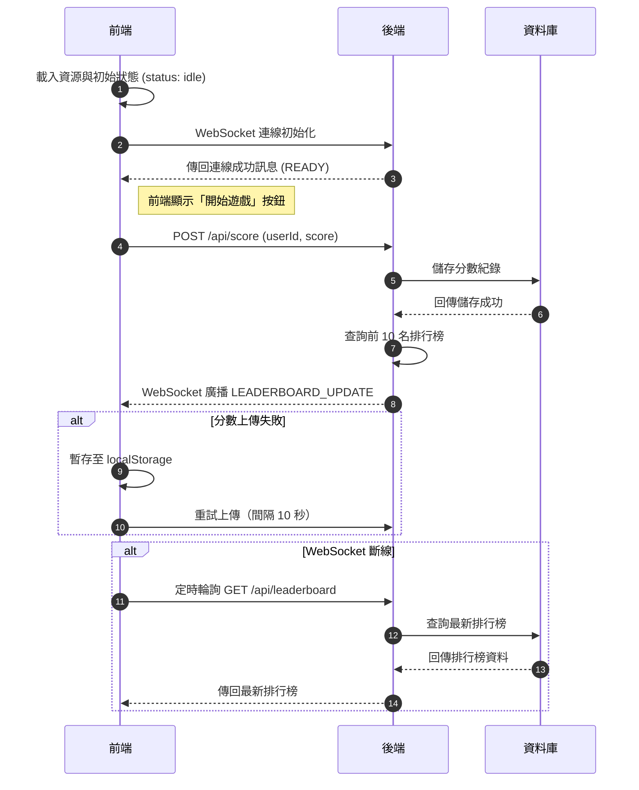
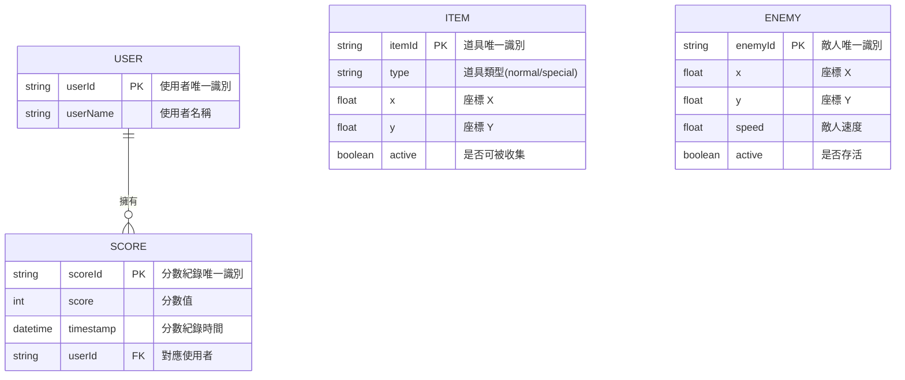

# 遊戲邏輯規範 - 後端

本文件將遊戲理念轉化為具體可執行的互動與邏輯架構，僅供工程使用，不包含美術細節。  
文件適用於 Node.js + Express + WebSocket + MongoDB 設計，支援後端的互動設計，並提供 API / Schema 規範，方便工程師理解架構。

## 文件用途

- 依 WebSocket / API 定義實作伺服器邏輯

## 系統架構



### 資料交換

| 層級          | 傳輸方式                            | 內容範例                            | 備註         |
| ------------- | ----------------------------------- | ----------------------------------- | ------------ |
| 前端 → 後端   | `POST /api/score`                   | `{ userId: "U123", score: 850 }`    | 結算上傳分數 |
| 後端 → 資料庫 | `insertOne()`                       | `{ userName: "Alice", score: 850 }` | MongoDB 儲存 |
| 資料庫 → 後端 | `find().sort({score:-1}).limit(10)` | 排行榜資料                          |              |
| 後端 → 前端   | WebSocket: `LEADERBOARD_UPDATE`     | `[{rank:1,name:"Bob",score:1200}]`  | 即時更新     |

### 非同步節點

| 節點                     | 描述       | 延遲處理       |
| ------------------------ | ---------- | -------------- |
| `fetch /api/score`       | 分數上傳   | Promise-based  |
| `broadcastLeaderboard()` | 排行榜同步 | 多 client 廣播 |

## 資料結構層（Data Structure Layer）

### 資料模型（DB Schema）



### API

- 上傳分數

```sh
POST /api/score
{
  "userId": "U123",
  "score": 850,
  "timestamp": 1739219990
}
```

- 取得排行榜資料

```sh
GET /api/leaderboard
[
  { "rank": 1, "name": "Alice", "score": 1200 },
  { "rank": 2, "name": "Bob", "score": 980 }
]
```

## 邏輯層（Logic Layer）

### 架構樹

```sh
src/
 ├── models/
 │     └── Score.js               // MongoDB 資料模型
 ├── routes/
 │     ├── score.js               // POST /api/score
 │     └── leaderboard.js         // GET /api/leaderboard
 ├── ws/
 │     └── leaderboard.js         // WebSocket 廣播與訂閱管理
 ├── utils/
 │     └── db.js                  // MongoDB 連線管理與共用函式
 ├── middlewares/
 │     ├── errorHandler.js        // 全域錯誤處理
 │     └── validateRequest.js     // API 請求欄位驗證
 └── server.js                    // 主入口，Express + WebSocket
```

### 路由

### POST `/api/score` - 上傳分數

```js
/**
 * Request Body:
 * {
 *   userId: "U123",
 *   userName: "Alice",
 *   score: 850
 * }
 *
 * Response:
 * {
 *   success: true,
 *   scoreId: "64f2e123abc..."
 * }
 */
app.post("/api/score", async (req, res) => {
  try {
    const { userId, userName, score } = req.body;

    // 驗證必填欄位
    if (!userId || !userName || score == null) {
      return res.status(400).json({ error: "Missing required fields" });
    }

    // 儲存分數至資料庫
    const newScore = await Score.create({ userId, userName, score });

    // 廣播最新排行榜給所有 WebSocket 連線玩家
    broadcastLeaderboard();

    // 回傳成功訊息與新分數 ID
    res.json({ success: true, scoreId: newScore._id });
  } catch (err) {
    console.error("Error posting score:", err);
    res.status(500).json({ error: "Internal server error" });
  }
});
```

### GET `/api/leaderboard` - 取得排行榜

```js
/**
 * 取得前 10 名排行榜
 * Response:
 * [
 *   { userName: "Alice", score: 1200 },
 *   { userName: "Bob", score: 980 }
 * ]
 */
app.get("/api/leaderboard", async (_, res) => {
  try {
    // 查詢前 10 名，依分數高低排序
    const topScores = await Score.find()
      .sort({ score: -1, timestamp: 1 }) // score 高到低，時間早到晚
      .limit(10)
      .select("userName score -_id"); // 選取必要欄位，排除 _id

    // 回傳排行榜資料
    res.json(topScores);
  } catch (err) {
    console.error("Error fetching leaderboard:", err);
    res.status(500).json({ error: "Internal server error" });
  }
});
```

### broadcastLeaderboard 即時同步排行榜

```js
/**
 * WebSocket 連線事件
 * - 接收前端 SUBMIT_SCORE 訊息
 * - 儲存分數
 * - 廣播最新排行榜給所有連線玩家
 */
wss.on("connection", (ws) => {
  console.log("Player connected");

  ws.on("message", async (msg) => {
    try {
      const data = JSON.parse(msg); // 將字串轉 JSON

      if (data.type === "SUBMIT_SCORE") {
        const { userId, userName, score } = data.payload;

        // 儲存分數到 MongoDB
        await Score.create({ userId, userName, score });

        // 廣播排行榜更新
        broadcastLeaderboard();
      }
    } catch (err) {
      console.error("WebSocket message error:", err);
      // 回傳錯誤訊息給 client
      ws.send(JSON.stringify({ type: "ERROR", message: err.message }));
    }
  });

  // 連線關閉事件
  ws.on("close", () => console.log("Player disconnected"));
});

/**
 * 廣播排行榜給所有 WebSocket 連線
 */
async function broadcastLeaderboard() {
  const top = await Score.find()
    .sort({ score: -1, timestamp: 1 })
    .limit(10)
    .select("userName score -_id");

  const payload = JSON.stringify({ type: "LEADERBOARD_UPDATE", payload: top });

  // 對每個已連線且狀態開啟的 client 發送排行榜
  wss.clients.forEach((client) => {
    if (client.readyState === WebSocket.OPEN) client.send(payload);
  });
}
```
