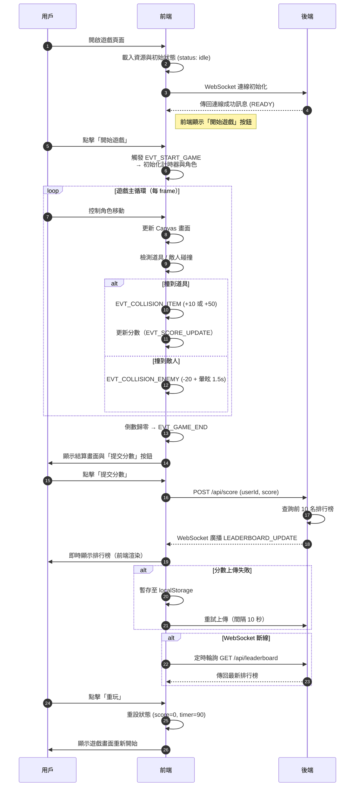

# 遊戲邏輯規範 - 前端

本文件將遊戲理念轉化為具體可執行的互動與邏輯架構，僅供工程使用，不包含美術細節。  
文件適用於 React + Zustand + Canvas + WebSocket 設計，支援前端的互動設計，並提供 API / State 規範，方便工程師理解架構。

## 文件用途

- 可依事件層與循環邏輯實作架構
- 確認互動節奏與視覺回饋符合核心理念

## 系統架構



### 資料交換

| 發送端 | 接收端 | 傳輸方式                        | 內容範例                           | 備註         |
| ------ | ------ | ------------------------------- | ---------------------------------- | ------------ |
| 前端   | 後端   | `POST /api/score`               | `{ userId: "U123", score: 850 }`   | 結算上傳分數 |
| 後端   | 前端   | WebSocket: `LEADERBOARD_UPDATE` | `[{rank:1,name:"Bob",score:1200}]` | 即時更新     |
| 前端   | 使用者 | React Render 更新               | 排行榜顯示                         | Canvas + UI  |

### 非同步節點

| 節點                      | 描述               | 延遲處理      |
| ------------------------- | ------------------ | ------------- |
| `WebSocket.onmessage`     | 接收排行榜更新     | 即時 UI 更新  |
| `setTimeout(1500)`        | 敵人碰撞後解除暈眩 | 非阻塞延遲    |
| `requestAnimationFrame()` | 遊戲主循環更新     | 每秒 60fps    |
| `fetch /api/score`        | 分數上傳           | Promise-based |

## 資料結構層（Data Structure Layer）

### 遊戲狀態

```js
// 定義遊戲狀態的資料結構
gameState = {
  status: "idle" | "running" | "paused" | "ended", // 遊戲當前狀態
  player: { x: 100, y: 200, speed: 5, isStunned: false }, // 玩家座標與狀態
  score: 0, // 當前分數
  timer: 90, // 遊戲倒數時間
  items: [
    // 場上可收集道具
    { id: "I001", x: 120, y: 300, type: "normal", active: true },
  ],
  enemies: [
    // 敵人清單
    { id: "E002", x: 400, y: 180, speed: 2, active: true },
  ],
  leaderboard: [], // 排行榜資料
};
```

### API

- 上傳分數

```sh
POST /api/score
{
  "userId": "U123",
  "score": 850,
  "timestamp": 1739219990
}
```

- 取得排行榜資料

```sh
GET /api/leaderboard
[
  { "rank": 1, "name": "Alice", "score": 1200 },
  { "rank": 2, "name": "Bob", "score": 980 }
]
```

## 邏輯層（Logic Layer）

### 架構樹

```sh

src/
 ├── components/
 │     ├── GameCanvas.jsx
 │     ├── HUD.jsx
 │     ├── MainMenu.jsx
 │     ├── PauseOverlay.jsx
 │     └── LeaderboardModal.jsx
 ├── store/
 │     └── gameStore.js
 ├── utils/
 │     ├── gameLogic.js
 │     ├── collision.js
 │     └── api.js
 ├── assets/
 │     ├── sounds/
 │     ├── sprites/
 │     └── effects/
 └── App.jsx
```

### 狀態管理

```js
// 使用 Zustand 建立全域遊戲狀態
export const useGameStore = create((set, get) => ({
  // ===== 初始狀態 =====
  status: "idle",
  player: { x: 100, y: 200, speed: 5, isStunned: false },
  score: 0,
  timer: 90,
  items: [],
  enemies: [],
  leaderboard: [],

  // ===== 控制流程 =====
  startGame: () => {
    // 開始遊戲
    set({ status: "running", score: 0, timer: 90 });
    get().spawnEntities(); // 生成道具與敵人
    get().loop(); // 啟動主循環
  },
  pauseGame: () => set({ status: "paused" }), // 暫停遊戲
  resumeGame: () => set({ status: "running" }), // 繼續遊戲

  // ===== 主循環 =====
  loop: () => {
    let last = performance.now();
    const frame = (t) => {
      const dt = (t - last) / 1000;
      last = t;
      if (get().status !== "running") return; // 若非遊戲中則跳出循環
      get().update(dt); // 更新狀態
      requestAnimationFrame(frame);
    };
    requestAnimationFrame(frame);
  },

  // ===== 更新邏輯 =====
  update: (dt) => gameUpdate(dt), // 委派至遊戲邏輯函式

  // ===== 生成初始物件 =====
  spawnEntities: () =>
    set({
      items: Array.from({ length: 10 }, (_, i) => ({
        id: `I${i}`,
        x: Math.random() * 600,
        y: Math.random() * 400,
        type: Math.random() < 0.2 ? "special" : "normal",
        active: true,
      })),
      enemies: Array.from({ length: 3 }, (_, i) => ({
        id: `E${i}`,
        x: Math.random() * 600,
        y: Math.random() * 400,
        speed: 2 + Math.random(),
        active: true,
      })),
    }),
}));
```

## 遊戲循環邏輯層（Game Loop & Collision Detection）

```js
// 遊戲主要更新函式，每 frame 執行
function gameUpdate(dt) {
  const state = useGameStore.getState();
  const { player, enemies, items } = state;

  // 更新玩家與敵人位置
  const nextPlayer = updatePlayerPosition(player, dt);
  const nextEnemies = enemies.map((e) => updateEnemyPosition(e, dt));

  // 道具碰撞檢測
  let nextScore = state.score;
  const nextItems = items.map((item) => {
    if (item.active && isColliding(nextPlayer, item)) {
      dispatchEvent("EVT_COLLISION_ITEM", { item }); // 發送事件
      nextScore += item.type === "special" ? 50 : 10;
      return { ...item, active: false }; // 道具消失
    }
    return item;
  });

  // 敵人碰撞檢測
  const nextEnemiesProcessed = nextEnemies.map((enemy) => {
    if (enemy.active && isColliding(nextPlayer, enemy)) {
      dispatchEvent("EVT_COLLISION_ENEMY", { enemy });
      nextScore = Math.max(0, nextScore - 20);
      useGameStore.setState({ player: { ...nextPlayer, isStunned: true } });
      // 暈眩 1.5 秒後解除
      setTimeout(
        () =>
          useGameStore.setState({
            player: { ...nextPlayer, isStunned: false },
          }),
        1500
      );
    }
    return enemy;
  });

  // 更新全域狀態
  useGameStore.setState({
    player: nextPlayer,
    enemies: nextEnemiesProcessed,
    items: nextItems,
    score: nextScore,
  });
}
```
