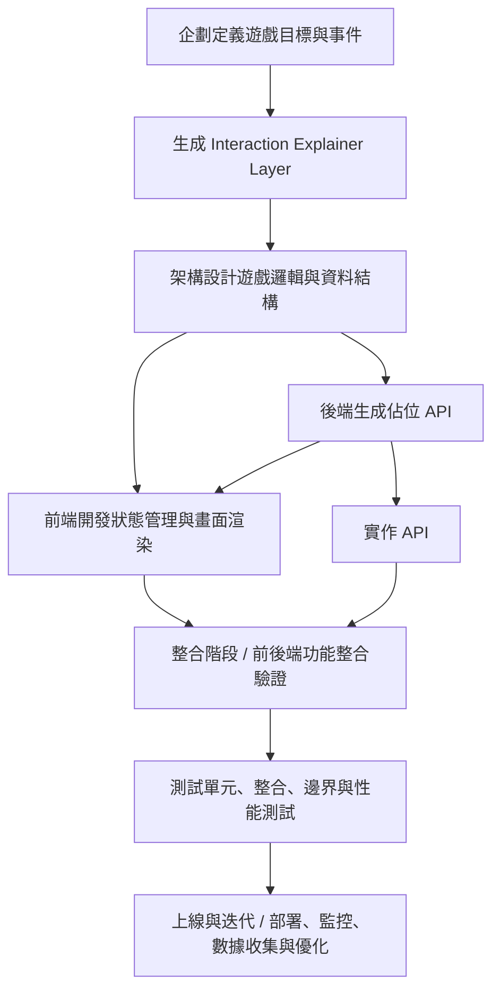

# 機制開發流程

## 企劃階段

1. **定義遊戲核心目標與玩法**

   - 玩家操控角色收集道具並避開敵人
   - 計分與排行榜挑戰
   - 核心行為事件

2. **確認邊界條件**

   - 分數上傳失敗
   - WebSocket 斷線
   - 遊戲中途退出

## 架構階段

1. **遊戲邏輯設計**

   - 用戶操作 → 前端渲染 → 事件判斷 → 更新

2. **資料結構設計**

   - 前端狀態樹
   - 後端 DB schema
   - ER Model

3. **互動流程設計**

   - 用戶 ↔ 前端 ↔ 後端 ↔ 資料庫
   - 記錄事件觸發、資料流與非同步節點

## 前端階段

1. **狀態管理**

2. **畫面渲染**

3. **互動事件處理**

4. **前後端互動**

5. **異常處理**

## 後端階段

0. **生成佔位 API**

1. **API 實作**

2. **資料庫設計**

3. **錯誤與邊界處理**

4. **性能優化**

## 整合階段

1. **後端提供正式 API**

   - 將佔位 API 替換為正式 API

2. **測試整合**

   - 確認前端狀態與後端資料同步
   - 即時更新正常
   - 事件邏輯正確

## 測試階段

1. **單元測試**

   - 前端狀態管理、碰撞判斷、計時器
   - 後端 API 與資料庫 CRUD

2. **整合測試**

   - 即時同步
   - 整體流程

3. **邊界條件測試**

   - 斷線重連
   - 中途退出
   - 操作異常

4. **性能測試**

   - 多玩家同時使用
   - 即時更新延遲
