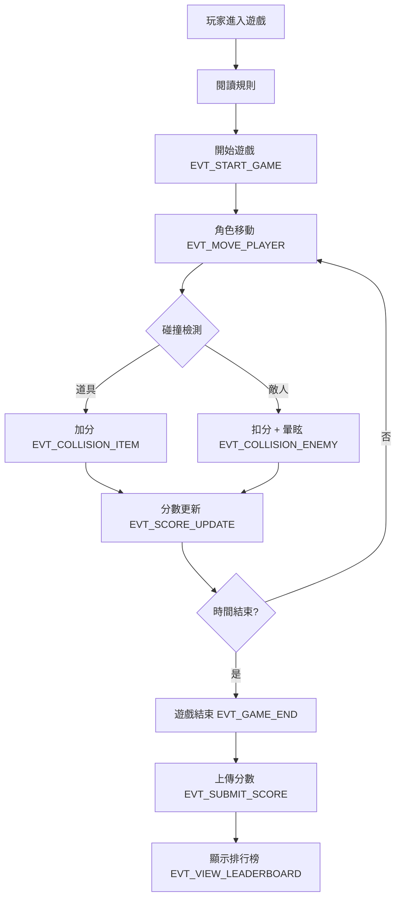

# 遊戲事件規範 - 企劃

本文件將遊戲理念轉化為具體遊戲目標與事件規範，僅供企劃使用，不包含工程與美術細節。

## 文件用途

- 可依事件層與循環邏輯實作架構
- 根據事件表製作測試腳本

## 遊戲核心理念

- **目標**：玩家操控角色收集道具並避開敵人，累積分數，挑戰排行榜。
- **核心行為**：
  1. 查看簡單規則 → 理解操作
  2. 開始遊戲 → 角色互動與分數累計
  3. 分數即時更新 → 提供即時回饋
  4. 暫停 / 靜音 / 重玩 → 控制遊戲節奏
  5. 排行榜 → 提升重玩動機

## 遊戲流程（Game Flow）

## 遊戲規則層（Business Rule Layer）

| 項目         | 說明                                                           |
| ------------ | -------------------------------------------------------------- |
| **遊戲目標** | 玩家操控角色在時間內收集道具並避開敵人，累積分數，挑戰排行榜。 |
| **回合時間** | 每局 90 秒，自動結算。                                         |
| **得分機制** | 普通道具 +10 分，特殊道具 +50 分。                             |
| **失分機制** | 被敵人碰觸：-20 分，角色暈眩 1.5 秒。                          |
| **控制方式** | 鍵盤方向鍵（↑ ↓ ← →）或觸控滑動移動角色。                      |
| **排行榜**   | 遊戲結束後上傳分數，伺服器即時更新。                           |

## 互動事件層（Interaction Logic Layer）

| 事件代碼             | 觸發來源     | 條件       | 系統回應               | 前端回饋         |
| -------------------- | ------------ | ---------- | ---------------------- | ---------------- |
| EVT_START_GAME       | 點擊「開始」 | 狀態 idle  | 初始化遊戲、啟動計時   | 顯示遊戲畫面     |
| EVT_MOVE_PLAYER      | 鍵盤輸入     | 遊戲中     | 更新位置               | 角色移動動畫     |
| EVT_COLLISION_ITEM   | 系統判斷     | 與道具重疊 | 加分、移除道具         | +10 / +50 分特效 |
| EVT_COLLISION_ENEMY  | 系統判斷     | 與敵人重疊 | 扣分、暈眩             | 閃爍特效         |
| EVT_SCORE_UPDATE     | 系統事件     | 分數變化   | 更新狀態樹             | 分數即時更新     |
| EVT_PAUSE_GAME       | 點擊暫停     | 進行中     | 停止更新與倒數         | 顯示暫停畫面     |
| EVT_RESUME_GAME      | 點擊繼續     | 暫停中     | 恢復遊戲               | 回到主畫面       |
| EVT_GAME_END         | 倒數歸零     | none       | 停止遊戲、送分         | 顯示結算         |
| EVT_SUBMIT_SCORE     | 結算後       | 登入狀態   | POST `/api/score`      | 顯示成功提示     |
| EVT_VIEW_LEADERBOARD | 點擊排行榜   | none       | GET `/api/leaderboard` | 顯示排行清單     |

## 錯誤與邊界層（Edge Case & Error Layer）

| 編號    | 狀況           | 預期行為                     |
| ------- | -------------- | ---------------------------- |
| ERR_001 | 同時多按鍵     | 限制 50ms 輸入節流           |
| ERR_002 | 分數上傳失敗   | 顯示重試並本地快取           |
| ERR_003 | WebSocket 斷線 | 切換離線模式，暫存分數       |
| ERR_004 | 重開遊戲       | 所有狀態歸零                 |
| ERR_005 | 多物件重疊     | 事件順序：道具優先，敵人其次 |

## 測試與 QA 指引

| 測試項目 | 驗證重點                                    |
| -------- | ------------------------------------------- |
| 撞擊道具 | 是否觸發 EVT_COLLISION_ITEM、+10/+50 正確   |
| 撞擊敵人 | 是否觸發 EVT_COLLISION_ENEMY、暈眩持續 1.5s |
| 分數更新 | EVT_SCORE_UPDATE 即時顯示                   |
| 遊戲結束 | EVT_GAME_END 正確觸發並送出分數             |
| 排行榜   | API 回傳資料正確渲染                        |
