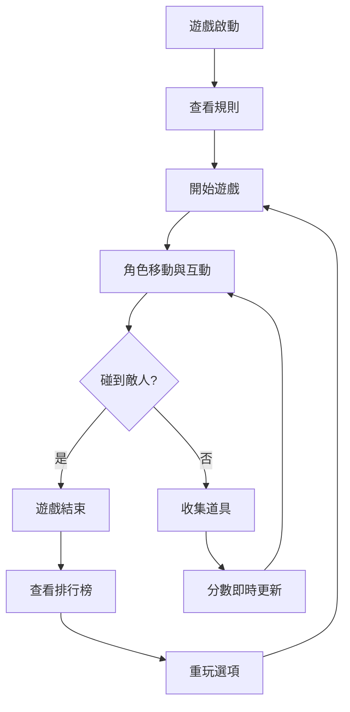

# 遊戲藍圖

## 基本資訊

- 遊戲名稱：收集大冒險
- 遊戲類型：休閒街機
- 目標平台：iOS / Android
- 目標受眾：8~30 歲休閒玩家
- 單局遊戲時長：2~5 分鐘
- 核心賣點：操作簡單、上手快、即時排行榜刺激重玩

## 核心玩法設計

- **遊戲核心循環**：玩家收集道具 → 避開敵人 → 分數累計 → 排行榜挑戰 → 重玩。
- **互動機制創新**：道具特性多樣化（加速、暫停敵人、分數倍增）
- **操作方式優化**：單指滑動控制角色，雙擊使用特殊技能
- **回饋系統設計**：分數即時更新、音效與動畫反饋、排行榜進度提示
- **控制感營造**：操作延遲最小化，角色動作對應直觀手感

## 遊戲平衡調整

- **數值系統建立**：道具分數、敵人速度、生命值系統
- **難度曲線規劃**：逐步增加敵人密度與移動速度
- **進度節奏控制**：每 3~5 分鐘一個遊戲循環完成
- **資源經濟設計**：道具生成率、分數倍率、技能冷卻
- **玩家能力平衡**：高分玩家與新手均可感受到挑戰

## 關卡設計原則

- **學習曲線設計**：前兩個關卡提供操作教學
- **挑戰多樣化**：障礙類型、敵人 AI 模式多變
- **空間規劃**：道具、敵人分布合理，避免單一路線單調
- **引導方式**：視覺指示、提示動畫
- **風險與獎勵平衡**：高風險區域道具獎勵更高

## 敘事與遊戲整合

- **故事與玩法融合**：角色在異世界收集魔法寶石
- **環境敘事**：背景變化暗示遊戲進程
- **角色與機制連結**：角色技能與故事角色特性一致
- **分支情節設計**：收集特定道具解鎖額外關卡
- **敘事節奏控制**：短劇情段落穿插遊戲循環

## 玩家心理分析

- **動機驅動**：分數挑戰、收集成就、排行榜競爭
- **心流體驗**：操作簡單、挑戰適中、即時回饋
- **成就感設計**：獎勵動畫、解鎖道具、排行榜排名
- **社交需求**：排行榜與好友對比
- **玩家類型考量**：休閒玩家、競技型玩家、收集愛好者

## 遊戲系統設計

- **系統互動**：角色 → 道具 → 分數 → 排行榜
- **玩法深度**：道具技能組合、敵人動態生成
- **決策空間**：路線選擇、技能使用時機
- **隨機元素控制**：道具掉落率、敵人出現位置
- **長期參與機制**：每日任務、成就系統、排名激勵

## 系統功能模組

- **功能模組劃分**：角色控制、道具系統、敵人 AI、排行榜、UI 模組
- **模組間互動**：角色觸發道具 → 分數更新 → 排行榜刷新
- **可擴展性**：新增敵人、道具或關卡不影響核心循環
- **模組化開發**：功能獨立，便於多人協作
- **維護與更新便利性**：易於新增活動與調整數值

## 系統參數設計

- **遊戲內可調整參數**：敵人速度、道具掉落率、分數倍率
- **活動管理**：節日活動、限時挑戰
- **數據監控指標**：玩家留存、分數分佈、掉落效率
- **系統權限與操作日誌**：運營可控權限，記錄操作
- **運營效率與風險控制**：可快速調整數值防止失衡

## 事件追蹤設計

- **玩家行為追蹤**：操作路線、道具收集、死亡位置
- **核心事件標記**：每次遊戲結束、特殊道具獲得
- **數據收集策略**：匿名化追蹤，確保資料完整
- **事件頻率與層級設計**：核心事件高頻、次要事件低頻
- **分析與報表輸出**：自動生成每日與每週報表

## 錯誤處理與回朔

- **系統異常處理**：遊戲崩潰自動存檔
- **資料回朔策略**：伺服器端存檔備份
- **錯誤預防與提示**：操作錯誤提示、非法行為封鎖
- **玩家操作錯誤修復**：撤銷操作、重置關卡
- **遊戲進度保護**：防止資料丟失與作弊

## 用戶界面規劃

- **資訊層級**：分數與生命最顯眼，道具狀態次顯
- **操作便利性**：單手操作、直覺滑動
- **視覺反饋清晰**：動態動畫、色彩提示
- **學習成本降低**：操作教學簡短、圖示直觀
- **美學與功能平衡**：可愛風格，與遊戲氛圍一致

## 多平台適應性

- **控制方式轉換**：觸控、滑鼠、鍵盤適配
- **畫面比例調整**：16:9、18:9 支援
- **性能限制考量**：低階手機保持 60FPS
- **跨平台體驗一致**：遊戲規則、操作邏輯保持一致

## 數據分析應用

- **玩家行為理解**：分析關卡完成率、技能使用偏好
- **遊戲指標設定**：日活、留存、分數分布
- **測試方法設計**：AB 測試、封閉測試
- **迭代優化策略**：根據數據調整道具掉落、難度曲線
- **用戶留存分析**：長期追蹤玩家回流率

## 運營風控策略

- **遊戲內風險控制**：防作弊、偵測惡意行為
- **資金與經濟監控**：活動道具獲取限制
- **玩家投訴與客服流程**：快速回應、問題追蹤
- **數據異常監測**：異常分數、異常掉落
- **活動與獎勵濫用防範**：限制每日上限、驗證獎勵發放

## 團隊合作流程

- **設計文檔標準**：統一模板、版本控制
- **溝通有效方法**：週會、即時訊息、文檔追蹤
- **跨部門協作**：程式、策劃、美術、運營同步
- **創意保護與妥協**：功能原型測試 → 評估 → 調整
- **原型驗證流程**：快速原型 → 測試 → 調整 → 確認落地

## 遊戲流程圖

