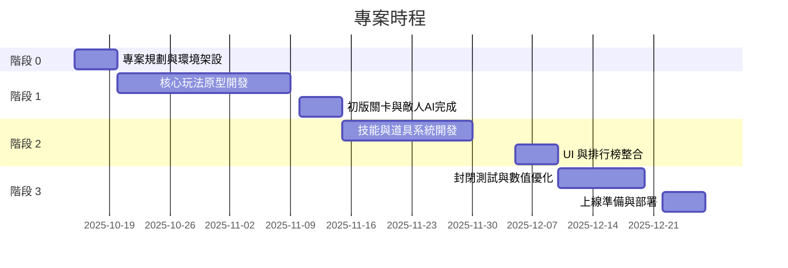

# 專案計畫書

## 基本資料

- 版本：v0.1
- 代號：SN-GD-2025Q4
- 文件更新日期：2025/10/12
- 專案期間：2025/10/15 – 2025/12/31
- 負責單位：遊戲研發部
- 專案經理：
- 文件撰寫：

## 專案背景

目前遊戲市場中，休閒街機類型遊戲玩家數量龐大，但多數產品缺乏即時排行榜與社交互動，玩家留存率不理想。現有產品在操作流暢度、關卡多樣性、數值平衡及回饋系統上均存在不足。為提升玩家黏著度與遊戲體驗，本專案將開發《收集大冒險》，提供簡單操作、即時分數反饋、排行榜競爭及多樣關卡設計。為降低開發成本與快速上線，本次專案將採用 **RWD Web** 開發方式。

## 目標概要

- 提供直覺操作與即時分數反饋的休閒遊戲體驗。
- 透過排行榜與成就系統提升玩家重玩動機。
- 使用 RWD Web 技術快速上線，支援多種行動裝置。
- 建立數據追蹤與分析系統，優化遊戲平衡與關卡設計。

## 方案分析

本次專案將以 **RWD Web** 為核心開發方案，透過 HTML5 / CSS3 / JavaScript 實現跨平台遊戲功能，並搭配模組化架構方便維護與後續迭代。

| 技術方案     | 優點                             | 缺點                           | 適用性                     |
| ------------ | -------------------------------- | ------------------------------ | -------------------------- |
| RWD Web      | 開發成本低、跨平台一致、快速上線 | 遊戲效能略低、部分原生功能受限 | 適合資訊展示及輕量遊戲互動 |
| 原生開發     | 高效能、完整原生功能             | 開發成本高、維護難度大         | 適合高度互動遊戲           |
| Unity 跨平台 | 跨平台、支援 2D/3D、快速迭代     | 學習曲線略高、需維護模組化結構 | 適合重互動休閒遊戲         |

## 核心策略

- 採用 RWD Web 開發，快速支援多種行動裝置與瀏覽器。
- 模組化架構：角色控制、敵人 AI、道具系統、UI、排行榜模組獨立開發。
- 每階段產出可運行、可測試版本，確保快速迭代。
- 建立數據追蹤與分析流程，輔助遊戲平衡與後續活動設計。

## 範圍限制

- **包含項目**

  - 遊戲核心玩法開發（角色移動、道具收集、敵人 AI）
  - 關卡設計、技能系統、排行榜與成就系統
  - UI/UX 設計與整合
  - 數據追蹤與分析模組
  - 測試、上線與部署文件產出

- **不包含項目**
  - 新增非既有遊戲模式
  - 後端資料庫大幅重構
  - 行動裝置原生功能整合（如推播、定位、相機）

## 主要利害關係人

| 角色          | 單位 / 姓名 | 職責說明                   |
| ------------- | ----------- | -------------------------- |
| 專案贊助人    |             | 負責專案決策與資源核定     |
| 專案經理      |             | 專案時程、進度與溝通協調   |
| UI/UX 設計師  |             | 設計介面、動畫與互動       |
| 系統架構師    |             | 技術架構規範、模組設計     |
| 後端工程師    |             | 資料處理、排行榜、成就系統 |
| 前端工程師    |             | 遊戲邏輯與功能開發         |
| 測試工程師    |             | QA、性能測試與玩家體驗驗證 |
| DevOps 工程師 |             | 部署、CI/CD 與維護支援     |

## 預期成效

| 成效項目               | 具體指標或描述                                                         |
| ---------------------- | ---------------------------------------------------------------------- |
| 玩家操作流暢度         | 角色移動、道具收集與技能使用均無明顯延遲，啟動時間 < 3 秒              |
| 遊戲留存率與重玩動機   | 玩家次日留存率 > 40%，排行榜活躍率 > 50%                               |
| 玩家滿意度             | 內部測試問卷達 80% 以上                                                |
| 系統穩定性             | Crash 率 < 2%，跨瀏覽器兼容性良好                                      |
| 開發與部署效率         | 模組化架構實現快速迭代與維護，30% Buffer 時間有效應對意外問題          |
| 遊戲數據分析與運營支援 | 完整追蹤玩家行為與核心事件，提供數據支援後續關卡與活動調整             |
| 成本效益               | 採用 RWD Web 技術降低開發與維護成本，專案總成本控制在 606,200 NTD 以內 |

## 實施計畫

每階段皆為 **4 週（約 20 個工作日）**，產出 **可運行、可測試版本**，並保留 **30% Buffer 時間** 處理意外問題。

**計畫期間**：2025/10/15 – 2025/12/31（共 11 週）

**固定休假**：每週六、週日

**國定連假**：

- 光復節：2025/10/24（五）～ 10/26（日）
- 國慶日：2025/10/10（五）～ 10/12（日）

**總工作日數（含假期調整後）**

- 十月：14 天
- 十一月：22 天
- 十二月：22 天

**合計：58 天（實際可用約 40 天，含 30% Buffer）**

## 風險管理

| 風險項目           | 影響範圍                 | 應對策略                                    |
| ------------------ | ------------------------ | ------------------------------------------- |
| 核心玩法難以平衡   | 玩家體驗下降，留存率低   | 原型測試 + AB 測試，快速迭代數值與關卡設計  |
| 開發進度延遲       | 專案時程延誤             | 定期進度檢查，調整人力與優先順序            |
| 系統效能受限       | 遊戲卡頓，操作延遲       | 前端優化 JS 與資源載入，減少 DOM 與動畫消耗 |
| 活動與經濟系統濫用 | 玩家不滿、遊戲平衡受影響 | 設計限制、數據異常監控、快速調整            |
| 運營與客服問題     | 玩家流失                 | 建立快速回應流程、監控玩家反饋              |

## 里程碑

| 里程碑項目          | 驗收標準                                   | 預計完成日期 |
| ------------------- | ------------------------------------------ | ------------ |
| 核心玩法原型完成    | 角色移動、道具收集、敵人互動可運行         | 2025-11-10   |
| 技能與道具系統完成  | 技能效果正常、道具掉落率合理、分數計算正確 | 2025-11-30   |
| UI 與排行榜整合完成 | 分數、生命、排行榜顯示正確、操作流暢       | 2025-12-10   |
| 封閉測試與數值優化  | 無重大缺陷，數值平衡                       | 2025-12-22   |
| 上線準備與部署      | 測試完成，跨瀏覽器兼容性良好               | 2025-12-31   |

## 成功指標

| 指標項目         | 成功標準 / 目標 |
| ---------------- | --------------- |
| 核心功能可運行率 | 100%            |
| 玩家次日留存率   | > 40%           |
| 排行榜活躍率     | > 50%           |
| 玩家滿意度       | ≥ 80%           |
| 啟動時間         | < 3 秒          |
| Crash 率         | < 2%            |
