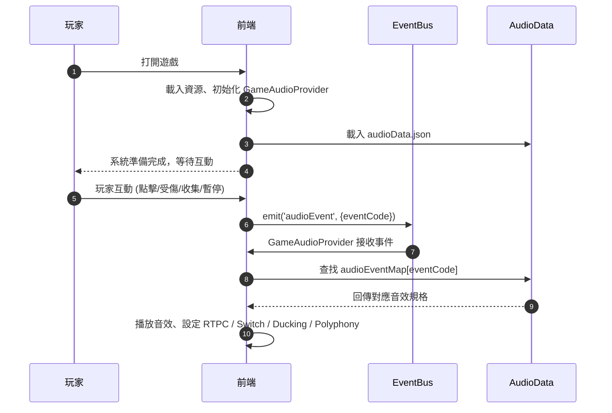
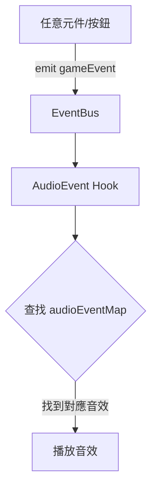

# 音效設計規範 - 工程

本文件將產品互動意圖（UX/Game intent）轉化為遊戲音效規格，僅供工程使用，不包含音效細節。
文件涵蓋所有遊戲互動事件，包括倒數、道具收集、閃避、受傷、分數更新、暫停、排行榜等。

## 文件用途

- 將遊戲事件映射至音效事件及中間件實作規格
- 定義事件觸發的音效屬性、RTPC/Switch、Bus、Ducking、Polyphony、Timeline、Mix 建議
- 確保整體聲音層級、空間感和體驗一致

## 系統架構



## 互動事件層

| 事件代碼             | 觸發來源   | 條件           | 系統回應                |
| -------------------- | ---------- | -------------- | ----------------------- |
| EVT_RULES_VIEW       | 開場       | 狀態 idle      | 顯示教學提示            |
| EVT_COLLISION_ITEM   | 系統判斷   | 與道具重疊     | 分數+10，移除道具       |
| EVT_COLLISION_ENEMY  | 系統判斷   | 與敵人重疊     | 扣分、暈眩              |
| EVT_PLAYER_HIT       | 系統判斷   | 遭受傷害       | 扣血、更新分數          |
| EVT_STATE_RECOVER    | 系統判斷   | 回復事件       | 回復血量或狀態          |
| EVT_SCORE_UPDATE     | 系統事件   | 分數變化       | 更新分數、觸發特效      |
| EVT_PAUSE_GAME       | 點擊暫停   | 遊戲進行中     | 停止遊戲更新、保存狀態  |
| EVT_MUTE_AUDIO       | 點擊靜音   | 遊戲進行中     | 靜音音效                |
| EVT_REPLAY_GAME      | 點擊重玩   | 遊戲結束或暫停 | 重置遊戲狀態（分數/HP） |
| EVT_VIEW_LEADERBOARD | 點擊排行榜 | none           | 顯示排行榜              |

## 互動音效層

| 事件代碼                 | 音效檔名 / Clips                                     | Timeline (s)    | Bus    | RTPC / Switch     |
| ------------------------ | ---------------------------------------------------- | --------------- | ------ | ----------------- |
| EVT_GAME_PLAYER_HIT_HIGH | hit_high.wav                                         | [0]             | SFX    | RTPC_DamageAmount |
| EVT_UI_START_COUNTDOWN   | count_3.wav, count_2.wav, count_1.wav, start_cue.wav | [0,0.4,0.8,1.2] | SFX    | RTPC_GameSpeed    |
| EVT_GAME_COLLECT_ITEM    | collect_item.wav                                     | [0]             | SFX    | RTPC_ComboCount   |
| EVT_GAME_DODGE_SUCCESS   | dodge.wav                                            | [0]             | SFX    | RTPC_DangerLevel  |
| EVT_GAME_SCORE_TICK      | score_tick.wav                                       | [0]             | SFX    | RTPC_ScoreStep    |
| EVT_GAME_SCORE_MILESTONE | milestone.wav                                        | [0]             | SFX    | RTPC_ScoreStep    |
| EVT_UI_PAUSE             | pause_cue.wav                                        | [0]             | Master | RTPC_IsPaused     |
| EVT_UI_RESUME            | resume_cue.wav                                       | [0]             | Master | RTPC_IsPaused     |
| EVT_GAME_RESULT_FLOURISH | result_flourish.wav                                  | [0]             | Result | RTPC_RankPosition |

## 資料結構層

```json
{
  "audioEvents": [
    {
      "eventCode": "EVT_UI_START_COUNTDOWN",
      "description": "玩家按下開始 → 倒數動畫 → Start Cue",
      "clips": [
        { "name": "count_3", "duration": 0.12 },
        { "name": "count_2", "duration": 0.12 },
        { "name": "count_1", "duration": 0.12 },
        { "name": "start_cue", "duration": 0.35 }
      ],
      "rtpc": { "RTPC_GameSpeed": "可選 (Pitch)" },
      "switch": null,
      "bus": "SFX",
      "duck": { "targetBus": "BGM", "db": -6, "fade": 0.2 },
      "timeline": [0.0, 0.4, 0.8, 1.2]
    },
    {
      "eventCode": "EVT_GAME_COLLECT_ITEM_NORMAL",
      "description": "玩家收集道具 → 播放普通音效",
      "clips": [{ "name": "collect_normal", "duration": 0.18 }],
      "rtpc": { "RTPC_ComboCount": "控制 Pitch / Filter" },
      "switch": { "ComboLayer": "若 Combo > 0" },
      "bus": "SFX",
      "reverbSend": 0.2,
      "polyphony": 4,
      "voiceStealing": true,
      "timeline": [0.05]
    },
    {
      "eventCode": "EVT_GAME_COLLECT_ITEM_COMBO",
      "description": "玩家連續收集道具 → Combo 音效",
      "clips": [{ "name": "collect_combo", "duration": 0.25 }],
      "rtpc": { "RTPC_ComboCount": "控制 Pitch / Filter" },
      "switch": { "ComboLayer": "Combo > 0" },
      "bus": "SFX",
      "reverbSend": 0.2,
      "polyphony": 4,
      "voiceStealing": true,
      "mix": "Pitch 每次 +2 semitones，最大 +8",
      "timeline": [0.05]
    },
    {
      "eventCode": "EVT_GAME_DODGE_SUCCESS",
      "description": "玩家閃避敵人 → 播放 dodge 成功音",
      "clips": [{ "name": "dodge_success", "duration": 0.18 }],
      "rtpc": { "RTPC_DangerLevel": "控制 LowShelf + Reverb" },
      "bus": "SFX",
      "duck": { "targetBus": "BGM", "db": -4, "fade": 0.15 },
      "mix": "高 DangerLevel 時低頻 +3dB，Reverb dry ratio -20%",
      "timeline": []
    },
    {
      "eventCode": "EVT_GAME_NEAR_MISS",
      "description": "玩家接近敵人 → 播放 NearMiss 音效",
      "clips": [{ "name": "near_miss", "duration": 0.2 }],
      "rtpc": { "RTPC_DangerLevel": "控制 LowShelf + Reverb" },
      "bus": "SFX",
      "duck": { "targetBus": "BGM", "db": -4, "fade": 0.15 },
      "timeline": []
    },
    {
      "eventCode": "EVT_GAME_PLAYER_HIT_LOW",
      "description": "敵人命中玩家 → 播放低傷害 Hit 音",
      "clips": [{ "name": "hit_low", "duration": 0.12 }],
      "rtpc": {
        "RTPC_DamageAmount": "控制 hit 音強度",
        "RTPC_HP": "控制 heartbeat"
      },
      "switch": { "DamageLevel": ["Low", "Mid", "High"] },
      "bus": "SFX+LowRumble",
      "duck": { "targetBus": "BGM", "db": -6, "fade": 0.25 },
      "heartbeatLoop": { "activateBelowHP": 30, "fadeIn": 0.8, "fadeOut": 1.0 },
      "timeline": [0.03]
    },
    {
      "eventCode": "EVT_GAME_PLAYER_HIT_HIGH",
      "description": "敵人命中玩家 → 播放高傷害 Hit 音 + 心跳",
      "clips": [{ "name": "hit_high", "duration": 0.6 }],
      "rtpc": {
        "RTPC_DamageAmount": "控制 hit 音強度",
        "RTPC_HP": "控制 heartbeat"
      },
      "switch": { "DamageLevel": ["Low", "Mid", "High"] },
      "bus": "SFX+LowRumble",
      "duck": { "targetBus": "BGM", "db": -6, "fade": 0.25 },
      "heartbeatLoop": { "activateBelowHP": 30, "fadeIn": 0.8, "fadeOut": 1.0 },
      "timeline": [0.03]
    },
    {
      "eventCode": "EVT_GAME_SCORE_TICK",
      "description": "分數更新 → Tick 音效",
      "clips": [{ "name": "score_tick", "duration": 0.08 }],
      "rtpc": { "RTPC_ScoreStep": "控制 Pitch 上升" },
      "bus": "SFX",
      "polyphony": 6,
      "voiceStealing": true,
      "timeline": []
    },
    {
      "eventCode": "EVT_GAME_SCORE_MILESTONE",
      "description": "達成分數里程碑 → 播放 Milestone 音效",
      "clips": [{ "name": "score_milestone", "duration": 0.8 }],
      "rtpc": { "RTPC_ScoreStep": "控制 Pitch 上升" },
      "bus": "SFX",
      "reverbSend": 0.2,
      "mix": "使用 major chord layer",
      "timeline": []
    },
    {
      "eventCode": "EVT_UI_PAUSE",
      "description": "玩家暫停 → 播放 Pause Cue，淡出音量",
      "clips": [{ "name": "pause_cue", "duration": 0.25 }],
      "rtpc": { "RTPC_IsPaused": 1 },
      "bus": "Master",
      "duck": { "targetBus": "Master", "db": -12, "fade": 0.5 },
      "mix": "Pause: downward tone",
      "timeline": []
    },
    {
      "eventCode": "EVT_UI_RESUME",
      "description": "玩家恢復遊戲 → 播放 Resume Cue，淡入音量",
      "clips": [{ "name": "resume_cue", "duration": 0.35 }],
      "rtpc": { "RTPC_IsPaused": 0 },
      "bus": "Master",
      "mix": "Resume: rising tone",
      "timeline": []
    },
    {
      "eventCode": "EVT_UI_MUTE_TOGGLE",
      "description": "切換靜音 → 播放 Mute Cue",
      "clips": [{ "name": "mute_cue", "duration": 0.1 }],
      "bus": "Master",
      "timeline": []
    },
    {
      "eventCode": "EVT_UI_REPLAY_CONFIRM",
      "description": "重玩遊戲 → Reset Cue，重置音效參數",
      "clips": [{ "name": "reset_cue", "duration": 0.25 }],
      "bus": "Master",
      "timeline": []
    },
    {
      "eventCode": "EVT_GAME_RESULT_FLOURISH",
      "description": "遊戲結束 → 播放 Result Flourish 音效",
      "clips": [{ "name": "result_flourish", "duration": 1.5 }],
      "rtpc": { "RTPC_RankPosition": "控制音色強度" },
      "bus": "Result",
      "duck": { "targetBus": "UI", "db": -3, "fade": 0.3 },
      "mix": "高 Rank（1–10）→ Harmonic layer + 2 semitones",
      "timeline": [0.0]
    },
    {
      "eventCode": "EVT_UI_LEADER_ROW_HIGHLIGHT",
      "description": "排行榜逐列高亮音效",
      "clips": [{ "name": "row_highlight", "duration": 0.1 }],
      "rtpc": { "RTPC_RankPosition": "控制音色強度" },
      "bus": "Result",
      "timeline": []
    },
    {
      "eventCode": "EVT_GAME_CROWN",
      "description": "玩家取得冠軍 → 播放特殊音效",
      "clips": [{ "name": "crown", "duration": 0.3 }],
      "rtpc": { "RTPC_RankPosition": "控制音色強度" },
      "bus": "Result",
      "timeline": []
    }
  ],
  "busStructure": {
    "Master": 0,
    "BGM": -12,
    "SFX": -8,
    "SFX_Highlight": -8,
    "LowRumble": -6,
    "UI": -10,
    "Result": -9
  }
}
```

## 邏輯層



### 架構樹

```sh
src/
├── audio/
│ ├── audioData.json # JSON 音效資料
│ ├── playAudio.js # 播放音效工具函式
│ └── audioBus.js # RTPC / Switch / Ducking 控制
├── components/
│ └── GameAudioProvider.jsx # 綁定 EventBus & 播放音效
├── App.jsx
└── App.css
```

### 邏輯

```js
const audioEventMap = audioData.audioEvents.reduce((acc, item) => {
  acc[item.eventCode] = item;
  return acc;
}, {});

export function useHowlerAudioEvents() {
  useEffect(() => {
    const handleAudioEvent = ({ eventCode }) => {
      const audioEvent = audioEventMap[eventCode];
      if (!audioEvent) return;

      audioEvent.clips.forEach((clip, idx) => {
        const delay = (audioEvent.timeline[idx] || 0) * 1000;
        setTimeout(() => {
          const sound = new Howl({
            src: [clip.name],
            volume: clip.volume || 1,
          });
          sound.play();
        }, delay);
      });
    };

    eventBus.on("audioEvent", handleAudioEvent);
    return () => eventBus.off("audioEvent", handleAudioEvent);
  }, []);
}
```
