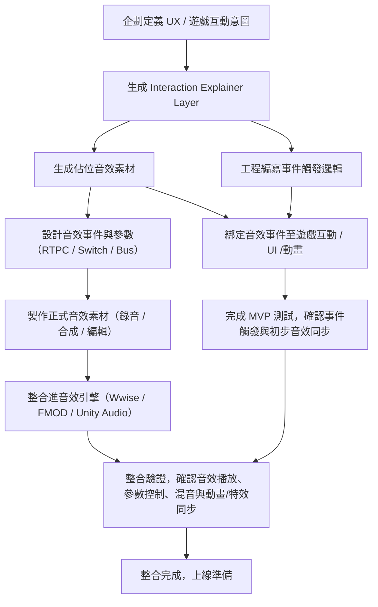

# 音效設計流程

## 企劃階段

1. **定義遊戲互動意圖**

   - 角色 / UI 事件目的（攻擊、技能、收集、受擊、倒數、分數更新等）
   - 玩家操作或系統事件觸發條件
   - 聲音節奏、情緒感受與遊戲體驗重點

2. **製作 UX Prototype 或概念圖**

   - 流程示意（事件 → 音效 → 動畫 / VFX）
   - 可標註音效強度、持續時間、連擊或回饋層次
   - 提供初步時間概念（秒數或百分比）

3. **生成 Interaction Explainer Layer**

   - 將互動事件表格化，指定音效類型、檔名、觸發條件、RTPC / Switch / Bus
   - 作為音效師、工程師與設計師共同語言

## 音效階段

0. **生成佔位音效（Mock Sound）**

   - 先使用簡單音效或占位素材標註事件名稱、Timeline、強度與長度
   - 確保事件可識別，便於後續製作正式音效

1. **設計音效事件與參數**

   - 確認每個事件觸發時間點、持續長度與音色語意
   - 設置 RTPC、Switch 或 Bus 參數控制音量、Pitch、混響、空間感
   - 標註與動畫 / UI / 特效同步的時間軸

2. **製作正式音效素材**

   - 錄音、合成、編輯與調整音色
   - 生成多版本素材（強度、連擊、Combo、環境變化）
   - 編輯 Loop / Fade / Polyphony，確保遊戲可即時播放

3. **整合進音效引擎**

   - 導入 Wwise / FMOD / Unity Audio
   - 設置 Event、RTPC、Switch、Bus 與混音策略
   - 調整與動畫、UI、VFX 的時間軸同步

## 工程階段

1. **編寫事件觸發邏輯**

   - 依照 Interaction Explainer Layer 建立事件接口
   - 綁定事件至玩家操作或系統事件
   - 控制事件觸發、混音、RTPC / Switch 參數變化

2. **接口與事件保留**

   - Timeline 標註的事件名稱、觸發時間保持一致
   - 後續替換正式音效素材時，事件邏輯無需修改

## 整合階段

1. **音效提供正式素材**

   - 將佔位檔案替換為正式動畫檔案
   - 名稱與資料夾結構保持一致

2. **測試整合**

   - 確認事件觸發、音效播放、參數控制與動畫 / UI / VFX 同步
   - 檢查音效層次、混音、音場與連續事件的辨識度
