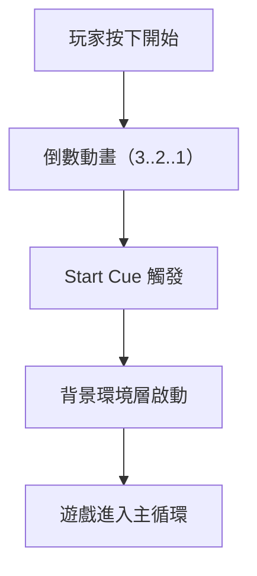
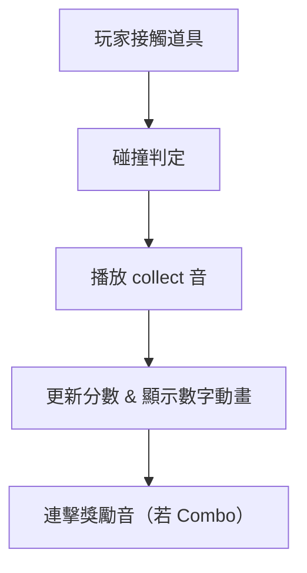
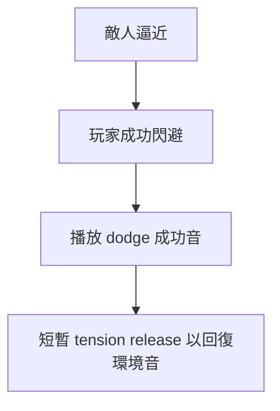
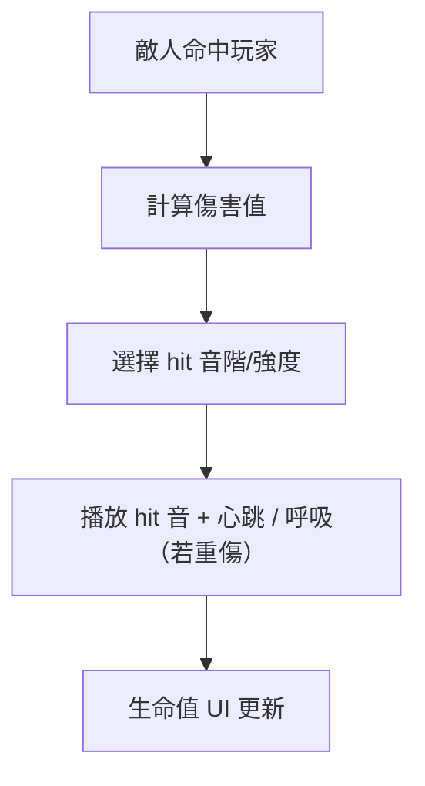
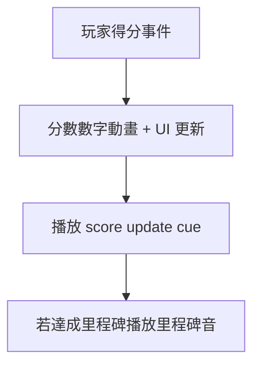
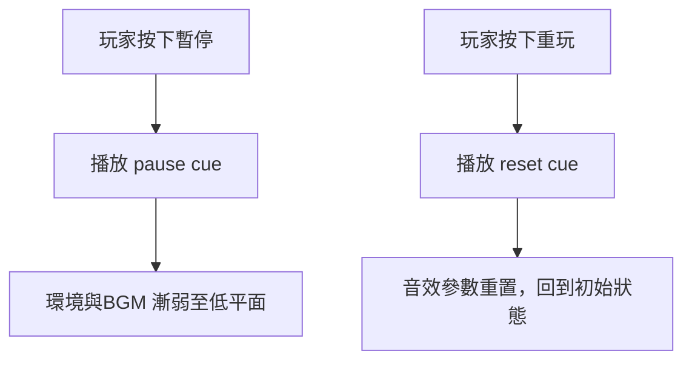
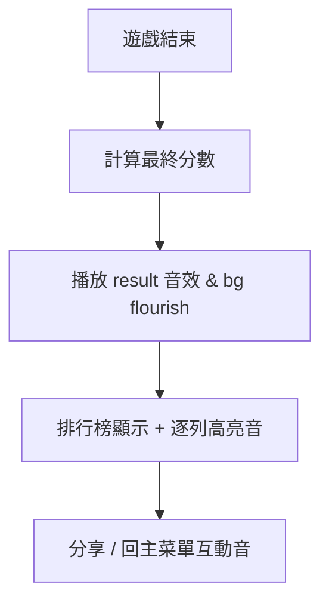

# 音效設計規範 - 企劃

本文件將產品互動意圖（UX/Game intent）轉化為遊戲音效規格，僅供企劃使用，不包含工程與音效細節。

## 文件用途

- 將玩家互動或系統事件映射至音效事件（Sound Event）
- 規範音效檔名、參數（RTPC / Switch / Bus）與觸發時機
- 提供 Timeline / Flow 對齊示意，方便與動畫／UI／VFX 同步

### 遊戲開始（Start Game）

玩家按下開始或倒數結束進入遊戲，需建立起動感與專注。

| 欄位          | 說明                                                                                                       | 音效師提示 / 技術實作                                                   |
| ------------- | ---------------------------------------------------------------------------------------------------------- | ----------------------------------------------------------------------- |
| 事件名稱      | Start Game / Countdown                                                                                     | 同步倒數動畫 3、2、1 的短音與最後的啟動音                               |
| 觸發方式      | 玩家點擊「開始」或倒數結束                                                                                 | 發送 `EVT_UI_START_COUNTDOWN` 在 Timecode 0、1、2 秒標記                |
| 音效意圖      | 喚起專注、建立節奏感                                                                                       | 3 個短促音（Pitch 逐步上升），最後一個為強烈起始擊（短衝擊 + 環境推進） |
| 檔名          | `EVT_UI_COUNT_3_v01.wav`，`EVT_UI_COUNT_2_v01.wav`，`EVT_UI_COUNT_1_v01.wav`，`EVT_GAME_START_CUE_v01.wav` | 每檔案標註版本與來源（sfx / synth）                                     |
| 長度 / Timing | count: 0.12s each；start_cue: 0.35s                                                                        | Timeline：0.00s（3），0.40s（2），0.80s（1），1.20s（start cue）        |
| 是否循環      | 否                                                                                                         | start cue 觸發一次後啟動 bgm loop                                       |
| 參數控制      | 無或 `RTPC_GameSpeed`（若需動態倒數速度）                                                                  | 於 Wwise 設為 Event Trigger，若需要可透過 RTPC 改變 Pitch/PlaybackRate  |
| Bus / Mix     | SFX Bus → Master                                                                                           | start_cue 可短暫 sidechain 降低 BGM（ducking）                          |

### 收集道具（Collect Item）

核心正向回饋，具成就感；連續收集時需音高或層數遞增。

| 欄位          | 說明                                                                          | 音效師提示 / 技術實作                                            |
| ------------- | ----------------------------------------------------------------------------- | ---------------------------------------------------------------- |
| 事件名稱      | Collect Item                                                                  | 單次收集與 Combo（連續）區別化                                   |
| 觸發方式      | 碰撞觸發（OnTriggerEnter）                                                    | Game 傳遞 `Combo_Count` 參數                                     |
| 音效意圖      | 正向回饋、鼓勵玩家繼續收集                                                    | 基本 collect 為明亮短音；Combo 時以半音階上升或疊加 harmonics    |
| 檔名          | `EVT_GAME_COLLECT_ITEM_NORMAL_v01.wav`，`EVT_GAME_COLLECT_ITEM_COMBO_v01.wav` | Combo 可拆成 base + pitch_variant assets                         |
| 長度 / Timing | normal: 0.18s；combo: 0.25-0.40s（依等級）                                    | collect 音應在碰撞判定 0~0.05s 內觸發，分數數字動畫與音效對齊    |
| 是否循環      | 否                                                                            | 若持續收集，避免蓋掉彼此，使用 Voice Limit 或 polyphony 控制     |
| 參數控制      | `RTPC_ComboCount` → 控制 Pitch Shift / Filter                                 | Wwise：使用 RTPC 連動 Pitch 和 Volume；FMOD：使用 Parameter 變更 |
| Bus / Mix     | SFX Bus，若為高 Combo 可建立 SFX_Highlight Bus                                | 高 Combo 時提高 Send 到 Reverb Bus（適度）以增大空間感           |

### 避開敵人成功（Dodge / Miss Enemy）

釋放緊張、給予肯定回饋。

| 欄位          | 說明                                                           | 音效師提示 / 技術實作                              |
| ------------- | -------------------------------------------------------------- | -------------------------------------------------- |
| 事件名稱      | Dodge Success / Near Miss                                      | 區分「成功閃避」與「極近未被撞」的音色強度         |
| 觸發方式      | 判定避開成功（Collision 判定）                                 | 傳入 `Danger_Level` 參數以決定音色深淺             |
| 音效意圖      | 釋放張力並肯定玩家操作                                         | 使用短滑音或快速低頻衝擊後快速淡出，表現驚險轉平靜 |
| 檔名          | `EVT_GAME_DODGE_SUCCESS_v01.wav`，`EVT_GAME_NEAR_MISS_v01.wav` | near_miss 音色更尖銳；dodge 成功較暖               |
| 長度 / Timing | 0.18–0.30s                                                     | 需在避開判定 0~0.05s 內觸發                        |
| 是否循環      | 否                                                             | 若 Danger_Level 高，背景低頻短暫提升再回落         |
| 參數控制      | `RTPC_DangerLevel` → 控制 LowShelf & Reverb                    | DangerLevel ↑ → 增加低頻能量與混響乾度，製造壓迫感 |
| Bus / Mix     | SFX Bus，使用 Ducking 對 BGM 做短暫處理                        | 確保音效在混音中可辨識但不刺耳                     |

### 受擊 / 失敗（Hit / Damage）

負向回饋，明確提示玩家錯誤或受傷程度。

| 欄位          | 說明                                                                  | 音效師提示 / 技術實作                                               |
| ------------- | --------------------------------------------------------------------- | ------------------------------------------------------------------- |
| 事件名稱      | Player Hit / Damage                                                   | 按傷害等級 Low / Mid / High 分層                                    |
| 觸發方式      | 受擊事件（Hit 判定）                                                  | 傳入 `Damage_Amount` / `HP_Percent`                                 |
| 音效意圖      | 讓玩家立刻感知被擊與緊迫程度                                          | Low 為短促噪音；Mid 為痛覺呼吸；High 加入低頻衝擊與延伸混響尾       |
| 檔名          | `EVT_GAME_PLAYER_HIT_LOW_v01.wav`、`EVT_GAME_PLAYER_HIT_HIGH_v01.wav` | 高傷害可疊加環境 low rumble asset                                   |
| 長度 / Timing | low: 0.12s；high: 0.6–1.2s (含呼吸/heartbeat)                         | hit 音在判定 0~0.05s 內播放；若 HP<30% 加入持續 heartbeat loop      |
| 是否循環      | hit 音否；heartbeat loop（條件）                                      | heartbeat 控制於 `RTPC_HP`，HP 降低 → heartbeat 音量/低頻提升       |
| 參數控制      | `RTPC_HP`、`RTPC_DamageAmount`                                        | Wwise：Switch Container 切換 hit 等級；FMOD：Parameter 控制播放分支 |
| Bus / Mix     | SFX Bus + LowRumble Bus（重傷）                                       | 重傷時把低頻送至專用 Bus，並與 BGM 互動（ducking）                  |

### 分數即時更新（Score Update）

視覺化分數動畫配合響亮、簡潔的提示音，讓玩家感受成長。

| 欄位          | 說明                                                              | 音效師提示 / 技術實作                                          |
| ------------- | ----------------------------------------------------------------- | -------------------------------------------------------------- |
| 事件名稱      | Score Update / Milestone                                          | 區分一般得分與里程碑（例如每 100 分）                          |
| 觸發方式      | 分數變動事件                                                      | 傳入 `Score_Delta` 與 `Total_Score`                            |
| 音效意圖      | 明確、簡潔、不可累贅                                              | 單音短促，里程碑使用豐富和弦或短旋律                           |
| 檔名          | `EVT_GAME_SCORE_TICK_v01.wav`，`EVT_GAME_SCORE_MILESTONE_v01.wav` | tick 可用作快速重複 sequence                                   |
| 長度 / Timing | tick: 0.06–0.10s；milestone: 0.8–1.5s                             | tick 與畫面數字每次 increment 同步；milestone 在更新完畢後播放 |
| 是否循環      | tick 可於 UI animation loop 中重複                                | 控制最大 polyphony，避免數量多時造成雜音                       |
| 參數控制      | `RTPC_ScoreStep`（數值步進影響 pitch）                            | 可在連續加分時 pitch 微調以產生「上升感」                      |
| Bus / Mix     | SFX Bus → Master，milestone 可加入 Reverb Send                    | 不宜過度混響，保持清晰度                                       |

### 暫停 / 靜音 / 重玩（Pause / Mute / Replay）

控制遊戲節奏與狀態重設的聲音反饋。

| 欄位          | 說明                                                                          | 音效師提示 / 技術實作                                                       |
| ------------- | ----------------------------------------------------------------------------- | --------------------------------------------------------------------------- |
| 事件名稱      | Pause / Resume / Mute / Replay                                                | Pause 與 Resume 需有相對應的淡入淡出處理                                    |
| 觸發方式      | UI 控制按鈕                                                                   | Mute 為全域靜音開關（UI 回饋），Pause 為暫停狀態（遊戲 loop 暫停）          |
| 音效意圖      | 清晰傳達狀態切換並維持 UX 流暢                                                | Pause：柔和下落音 + 環境淡出；Resume：上升音 + 環境恢復；Mute：切換音（短） |
| 檔名          | `EVT_UI_PAUSE_v01.wav`、`EVT_UI_RESUME_v01.wav`、`EVT_UI_MUTE_TOGGLE_v01.wav` | Replay: `EVT_UI_REPLAY_CONFIRM_v01.wav`                                     |
| 長度 / Timing | pause/resume: 0.25–0.45s；mute: 0.10s                                         | Pause 時與 UI 動畫（overlay）對齊                                           |
| 是否循環      | 否                                                                            | Replay 會觸發聲音資源重置（stop / restart events）                          |
| 參數控制      | `RTPC_IsPaused`（0/1）                                                        | Engine：Pause → 將 BGMs & SFX Bus volume fade 至低值；Resume → 反向 fade    |
| Bus / Mix     | 所有音效可透過 Master Bus 動態控制                                            | Mute 可用 Master Bus mute flag 或 SetBusVolume(0)                           |

### 排行榜（Leaderboard / Results Screen）

顯示成績與排行，強化成就感與分享動機。

| 欄位          | 說明                                                                      | 音效師提示 / 技術實作                                            |
| ------------- | ------------------------------------------------------------------------- | ---------------------------------------------------------------- |
| 事件名稱      | Game Over / Result / Leaderboard                                          | Result 為主音景，排行榜逐列高亮有小提示音                        |
| 觸發方式      | 遊戲結束或進入排行榜畫面                                                  | 傳入 `TotalScore` 與 `RankPosition`                              |
| 音效意圖      | 突顯成就感；若名次高則更具層次                                            | Result: 以暖色系和弦或短旋律；RowHighlight: 連貫的 click/step 音 |
| 檔名          | `EVT_GAME_RESULT_FLOURISH_v01.wav`、`EVT_UI_LEADER_ROW_HIGHLIGHT_v01.wav` | 若達 Top10 可播放專屬冠軍音 `EVT_GAME_CROWN_v01.wav`             |
| 長度 / Timing | flourish: 1.2–2.5s；row highlight: 0.08–0.12s each                        | Row highlight 與列切換動畫同步（每列 0.25s 間隔）                |
| 是否循環      | 否                                                                        | flourish 後回到主 UI loop 音景                                   |
| 參數控制      | `RTPC_RankPosition` → 調整小特效強度                                      | 高排名時增加 harmonic content 或延長尾音                         |
| Bus / Mix     | Result Bus → Reverb / Stereo Spread                                       | 避免過長 Reverb 影響 UI 互動音清晰度                             |
