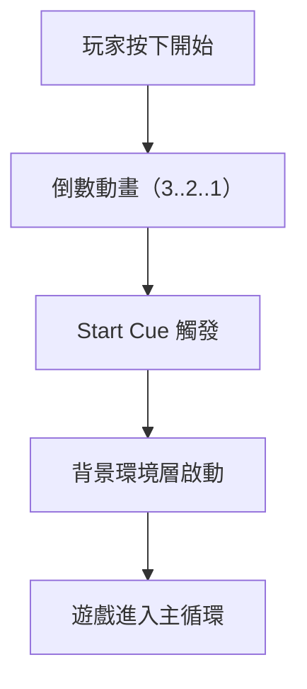
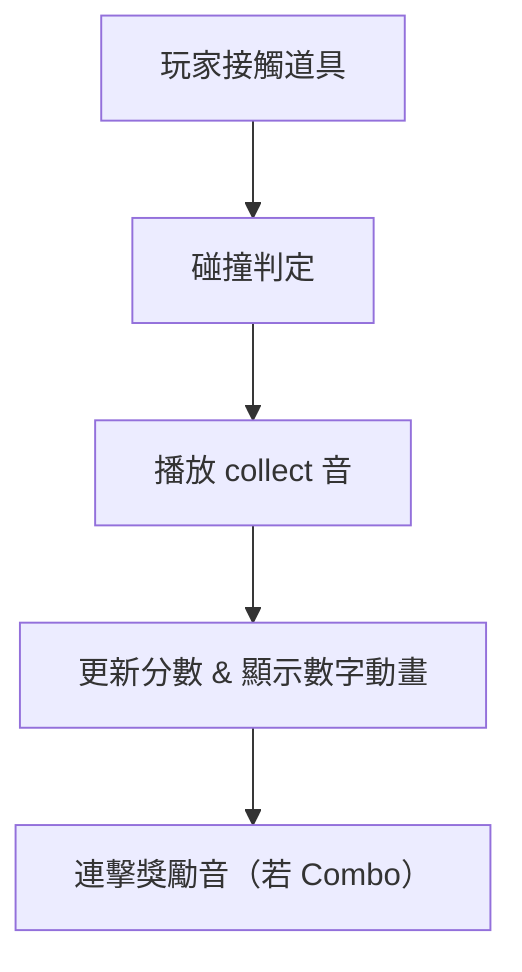
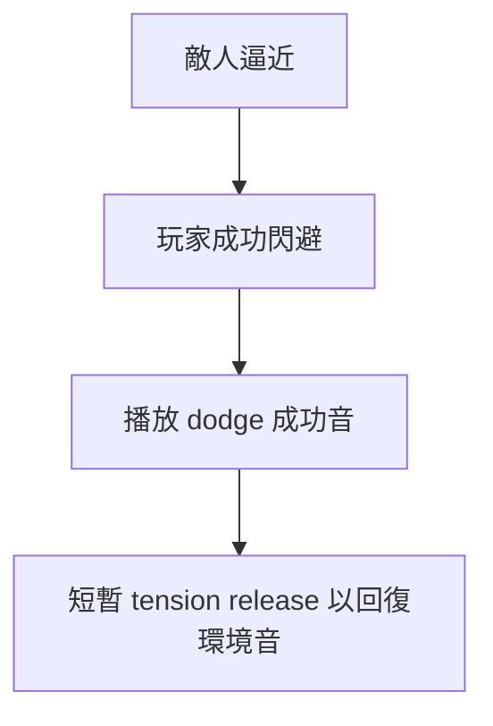
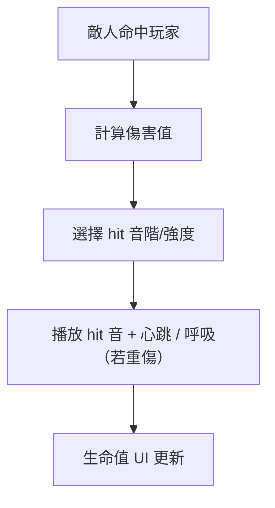
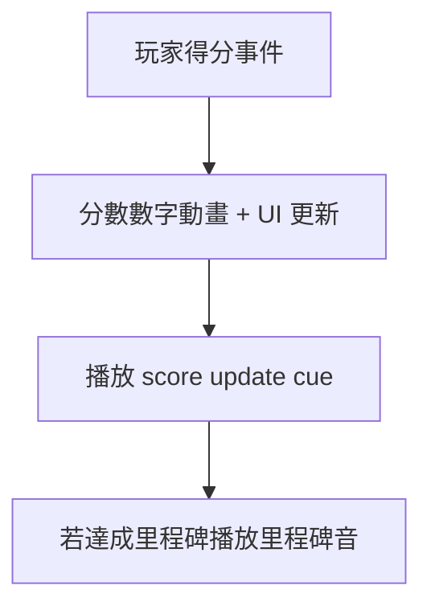
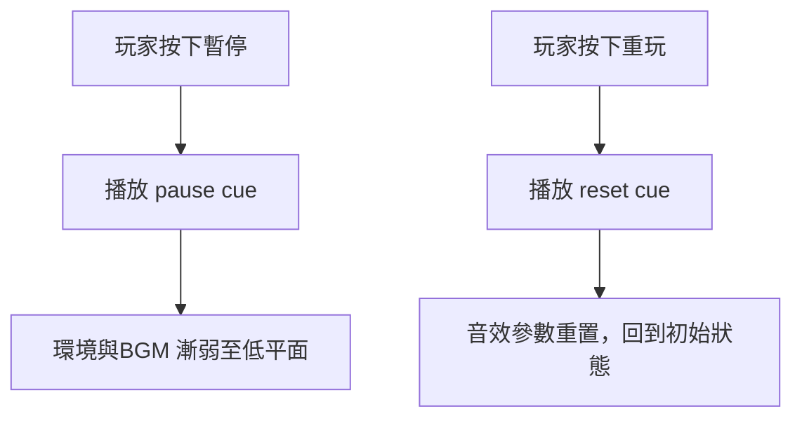
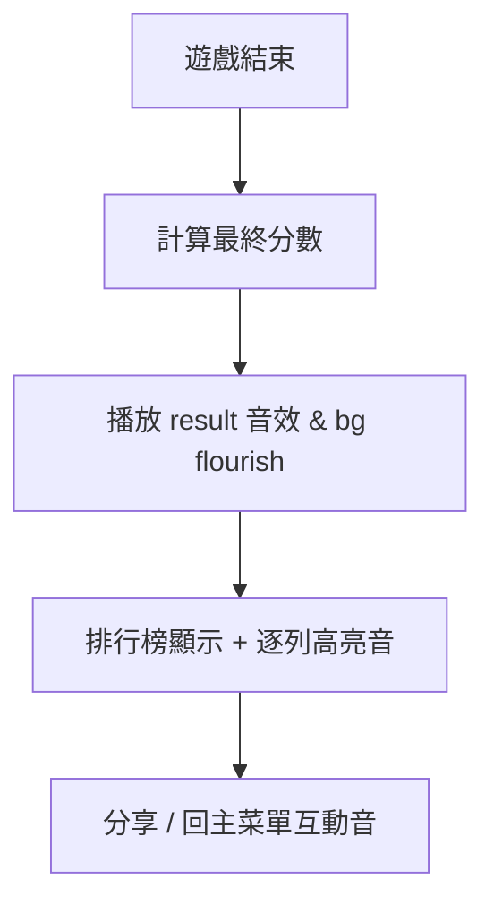

# 音效互動意圖規範 - 音效

本文件將遊戲互動意圖（UX/Game intent）轉化為可落地執行的音效設計與實作規範，僅供音效師使用，不包含企劃或美術層細節。  
文件適用於遊戲內所有互動事件（UI、角色、環境、系統）之音效製作與中間件設定，並提供 RTPC、Bus、Ducking、混音及命名標準，確保整體體驗一致。

## 文件用途

- 將玩家互動或系統事件映射至音效事件（Sound Event）與中間件實作規格
- 規範各互動對應之音效屬性、RTPC/Switch 參數、Bus 路由及混音邏輯
- 提供事件觸發時機、時間碼（Timecode）及 Timeline 同步參考，協助與動畫/UI 對齊
- 維持整體聲音層級（Loudness）與空間感一致性，確保聽覺體驗穩定

## Bus 結構與混音層級

```
Master (-0 dB)
├── BGM (-12 LUFS)
├── SFX (-8 LUFS)
│ ├── SFX_Highlight (-8 LUFS, 高 Combo / 特效)
│ ├── LowRumble (-6 LUFS, 僅峰值)
├── UI (-10 LUFS)
└── Result (-9 LUFS)
```

**Ducking 建議：**

- SFX (StartCue / HitHigh)：Duck BGM -6 dB，Fade 0.2s
- Result Flourish：Duck UI -3 dB，Fade 0.3s
- Pause：Master 全域 -12 dB Fade Out / Resume 反向 Fade

## RTPC / Switch 定義表

| 名稱              | 範圍    | 用途                         | 備註                         |
| ----------------- | ------- | ---------------------------- | ---------------------------- |
| RTPC_GameSpeed    | 0.5–2.0 | 倒數 / 遊戲節奏變化          | 控制 Pitch / PlaybackRate    |
| RTPC_ComboCount   | 0–5     | 連續收集時控制 Pitch         | 超過 5 重設為 0              |
| RTPC_DangerLevel  | 0–1     | 閃避張力控制                 | ↑ 增加低頻能量 / 混響乾度    |
| RTPC_HP           | 0–100   | 控制 heartbeat 音量 / Filter | HP < 30% 啟動 heartbeat loop |
| RTPC_DamageAmount | 0–100   | 控制 hit 音強度              | 自動切換 Switch Container    |
| RTPC_ScoreStep    | 0–10    | 每次加分 pitch 微升          | 產生上升感                   |
| RTPC_RankPosition | 1–100   | 結果畫面音色強度             | Rank 1~10 提升 harmonic      |
| RTPC_IsPaused     | 0 / 1   | 遊戲暫停狀態                 | 控制 Bus Volume Fade         |

## Start Game / Countdown



| 項目     | 規格                                            |
| -------- | ----------------------------------------------- |
| 事件     | EVT_UI_START_COUNTDOWN / EVT_GAME_START_CUE     |
| 音效長度 | count: 0.12s each；start cue: 0.35s             |
| Timeline | 0.00s(3)，0.40s(2)，0.80s(1)，1.20s(start cue)  |
| Trigger  | 玩家點擊開始 / 倒數結束                         |
| RTPC     | 可選 RTPC_GameSpeed (控制 Pitch)                |
| Bus      | SFX → Master；start cue duck BGM (-6dB, 0.2s)   |
| Stop     | 自動結束後啟動 BGM loop                         |
| Mix 建議 | 3 倒數音 Pitch↑；Start Cue 加 transient booster |

## Collect Item



| 項目    | 規格                                                       |
| ------- | ---------------------------------------------------------- |
| 事件    | EVT_GAME_COLLECT_ITEM_NORMAL / EVT_GAME_COLLECT_ITEM_COMBO |
| 音長    | normal: 0.18s；combo: 0.25–0.40s                           |
| Trigger | 碰撞後 0~0.05s 內觸發                                      |
| RTPC    | RTPC_ComboCount (控制 Pitch / Filter)                      |
| Switch  | Combo > 0 時切換至 Combo Layer                             |
| Bus     | SFX → Master；Combo 時可送 Reverb Bus                      |
| Voice   | 最大 Polyphony: 4；採用 Voice Stealing                     |
| Stop    | Combo reset 時 RTPC 回歸 0                                 |
| Mix     | Combo Pitch 上升每次 +2 semitones，最大 +8                 |

## Dodge / Miss Enemy



| 項目     | 規格                                              |
| -------- | ------------------------------------------------- |
| 事件     | EVT_GAME_DODGE_SUCCESS / EVT_GAME_NEAR_MISS       |
| 音長     | 0.18–0.30s                                        |
| RTPC     | RTPC_DangerLevel 控制 LowShelf + Reverb           |
| Bus      | SFX；Duck BGM -4 dB（0.15s）                      |
| 音色差異 | NearMiss：尖銳滑音；Dodge：低滑音帶暖調           |
| Stop     | 自動結束；無 Loop                                 |
| Mix      | 高 DangerLevel 時低頻 +3dB，Reverb dry ratio -20% |

## Hit / Damage



| 項目      | 規格                                               |
| --------- | -------------------------------------------------- |
| 事件      | EVT_GAME_PLAYER_HIT_LOW / EVT_GAME_PLAYER_HIT_HIGH |
| 音長      | low: 0.12s；high: 0.6–1.2s                         |
| RTPC      | RTPC_DamageAmount、RTPC_HP                         |
| Switch    | 依 DamageAmount 分層（Low/Mid/High）               |
| Heartbeat | HP < 30% → 啟動 loop（Fade In 0.8s / Out 1.0s）    |
| Bus       | SFX + LowRumble；重傷時低頻 Bus 增量 +4dB          |
| Mix       | HitHigh duck BGM -6 dB（0.25s）                    |
| Stop      | HP > 30% → 停止 heartbeat loop                     |

## Score Update / Milestone



| 項目    | 規格                                                     |
| ------- | -------------------------------------------------------- |
| 事件    | EVT_GAME_SCORE_TICK / EVT_GAME_SCORE_MILESTONE           |
| 音長    | tick: 0.06–0.10s；milestone: 0.8–1.5s                    |
| RTPC    | RTPC_ScoreStep 控制 Pitch ↑                              |
| Trigger | 分數變動事件／達里程碑                                   |
| Bus     | SFX → Master；Milestone 加 Reverb Send（20%）            |
| Voice   | tick 最大 Polyphony 6；超過則 steal oldest               |
| Mix     | Pitch 每步 +1 semitone；Milestone 使用 major chord layer |
| Stop    | 自動結束；無 Loop                                        |

## Pause / Resume / Mute / Replay



| 項目        | 規格                                                                      |
| ----------- | ------------------------------------------------------------------------- |
| 事件        | EVT_UI_PAUSE / EVT_UI_RESUME / EVT_UI_MUTE_TOGGLE / EVT_UI_REPLAY_CONFIRM |
| 音長        | pause/resume: 0.25–0.45s；mute: 0.10s                                     |
| RTPC        | RTPC_IsPaused（0/1）                                                      |
| Bus         | 全域控制：Master Volume Fade Out -12 dB (0.5s)                            |
| Stop        | Resume 時淡入 0.5s                                                        |
| Mix         | Pause: downward tone；Resume: rising tone                                 |
| Engineering | FMOD → SetBusVolume；Wwise → Bus Volume RTPC                              |

## Leaderboard / Results Screen



| 項目    | 規格                                                                    |
| ------- | ----------------------------------------------------------------------- |
| 事件    | EVT_GAME_RESULT_FLOURISH / EVT_UI_LEADER_ROW_HIGHLIGHT / EVT_GAME_CROWN |
| 音長    | flourish: 1.2–2.5s；row highlight: 0.08–0.12s                           |
| RTPC    | RTPC_RankPosition（1–100）                                              |
| Bus     | Result → Reverb / Stereo Spread                                         |
| Mix     | 高 Rank（1–10）→ Harmonic layer + 2 semitones；延長 tail 0.5s           |
| Trigger | 遊戲結束 → 計算分數 → 顯示排行榜                                        |
| Stop    | 自動結束後回主 UI Loop                                                  |
| Ducking | Result Flourish Duck UI -3dB (0.3s)                                     |

## 時間軸與同步規範

| 模組      | 動畫檔名            | 聲音事件                     | 時間碼 (s)            | 備註             |
| --------- | ------------------- | ---------------------------- | --------------------- | ---------------- |
| Countdown | UI_Countdown.anim   | EVT_UI_START_COUNTDOWN       | 0.0 / 0.4 / 0.8 / 1.2 | 與數字顯示同步   |
| Collect   | Item_Collect.anim   | EVT_GAME_COLLECT_ITEM_NORMAL | 0.05                  | 觸碰後 0.05s     |
| Hit       | Player_Hit.anim     | EVT_GAME_PLAYER_HIT_HIGH     | 0.03                  | 命中瞬間         |
| Result    | UI_Result_Show.anim | EVT_GAME_RESULT_FLOURISH     | 0.0                   | 結果畫面出現瞬間 |
