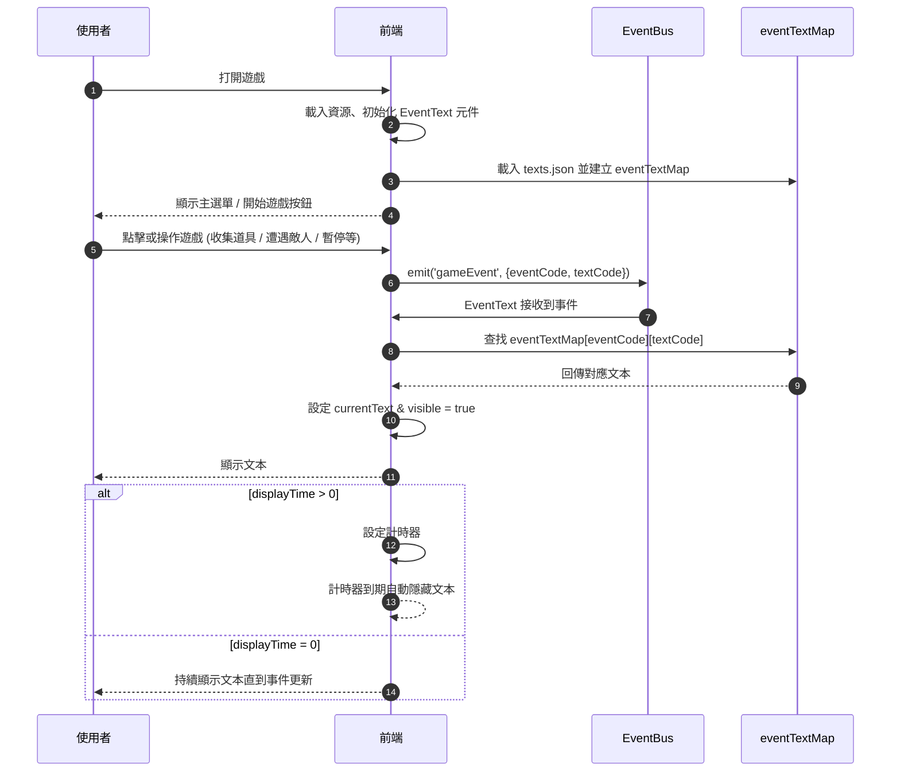

# 互動文本規範 - 工程

本文件將遊戲互動設計轉譯為可敘事化的行為脈絡，僅供工程使用，不包含編劇細節。
文件適用於 React 設計，支援前端的互動設計，方便工程師理解架構。

## 文件用途

- 定義遊戲事件對應的文本顯示規則
- 提供事件驅動架構，方便前端元件訂閱與顯示

## 系統架構



## 互動事件層

| 事件代碼             | 觸發來源   | 條件           | 系統回應                |
| -------------------- | ---------- | -------------- | ----------------------- |
| EVT_RULES_VIEW       | 開場       | 狀態 idle      | 顯示教學提示            |
| EVT_COLLISION_ITEM   | 系統判斷   | 與道具重疊     | 分數+10，移除道具       |
| EVT_COLLISION_ENEMY  | 系統判斷   | 與敵人重疊     | 扣分、暈眩              |
| EVT_PLAYER_HIT       | 系統判斷   | 遭受傷害       | 扣血、更新分數          |
| EVT_STATE_RECOVER    | 系統判斷   | 回復事件       | 回復血量或狀態          |
| EVT_SCORE_UPDATE     | 系統事件   | 分數變化       | 更新分數、觸發特效      |
| EVT_PAUSE_GAME       | 點擊暫停   | 遊戲進行中     | 停止遊戲更新、保存狀態  |
| EVT_MUTE_AUDIO       | 點擊靜音   | 遊戲進行中     | 靜音音效                |
| EVT_REPLAY_GAME      | 點擊重玩   | 遊戲結束或暫停 | 重置遊戲狀態（分數/HP） |
| EVT_VIEW_LEADERBOARD | 點擊排行榜 | none           | 顯示排行榜              |

## 互動文本層

| 文本代碼        | 事件代碼             | 字數  | 語音長度 | 顯示時間   | 前端對應                  |
| --------------- | -------------------- | ----- | -------- | ---------- | ------------------------- |
| TXT_RULES_001   | EVT_RULES_VIEW       | 13    | 1.2      | 3–5        | 顯示文字提示 / 教學 UI    |
| TXT_RULES_002   | EVT_RULES_VIEW       | 12    | 1.1      | 3–5        | 顯示文字提示 / 教學 UI    |
| TXT_ITEM_001    | EVT_COLLISION_ITEM   | 5     | 0.8      | 1–2        | 分數特效 + 飛字動畫       |
| TXT_ITEM_002    | EVT_COLLISION_ITEM   | 5     | 0.8      | 1–2        | 分數特效 + 飛字動畫       |
| TXT_ENEMY_001   | EVT_COLLISION_ENEMY  | 8     | 1.0      | 1–2        | 警示動畫 + 閃爍特效       |
| TXT_HIT_001     | EVT_PLAYER_HIT       | 6     | 0.9      | 1–2        | 扣血動畫 + 閃爍特效       |
| TXT_RECOVER_001 | EVT_STATE_RECOVER    | 6     | 0.9      | 1–2        | 狀態恢復動畫              |
| TXT_SCORE_001   | EVT_SCORE_UPDATE     | 8     | 1.0      | 即時       | 分數變化動畫 + 飛字動畫   |
| TXT_SCORE_002   | EVT_SCORE_UPDATE     | 10    | 1.1      | 即時       | 分數變化動畫 + 飛字動畫   |
| TXT_SCORE_003   | EVT_SCORE_UPDATE     | 10    | 1.2      | 即時       | 分數變化動畫 + 飛字動畫   |
| TXT_PAUSE_001   | EVT_PAUSE_GAME       | 11    | 1.2      | 持續至解除 | 暫停畫面 UI               |
| TXT_MUTE_001    | EVT_MUTE_AUDIO       | 10    | 1.2      | 持續至解除 | 音效靜音狀態切換          |
| TXT_REPLAY_001  | EVT_REPLAY_GAME      | 8     | 0.9      | 3          | 重玩畫面初始化 / 分數重置 |
| TXT_RANK_001    | EVT_VIEW_LEADERBOARD | 16–18 | 1.5      | 顯示至退出 | 排行榜 UI + 高亮特效      |

## 資料結構層

### 文本狀態

```json
{
  "texts": [
    {
      "textCode": "TXT_RULES_001",
      "eventCode": "EVT_RULES_VIEW",
      "content": ["這個世界中，道具是力量的源泉！"],
      "charCount": 13,
      "voiceLength": 1.2,
      "displayTime": 4
    },
    {
      "textCode": "TXT_RULES_002",
      "eventCode": "EVT_RULES_VIEW",
      "content": ["準備好了嗎？那就開始吧！"],
      "charCount": 12,
      "voiceLength": 1.1,
      "displayTime": 4
    },
    {
      "textCode": "TXT_ITEM_001",
      "eventCode": "EVT_COLLISION_ITEM",
      "content": ["能量充盈！"],
      "charCount": 5,
      "voiceLength": 0.8,
      "displayTime": 1
    },
    {
      "textCode": "TXT_ITEM_002",
      "eventCode": "EVT_COLLISION_ITEM",
      "content": ["完美節奏！"],
      "charCount": 5,
      "voiceLength": 0.8,
      "displayTime": 1
    },
    {
      "textCode": "TXT_ENEMY_001",
      "eventCode": "EVT_COLLISION_ENEMY",
      "content": ["快閃，敵影逼近！"],
      "charCount": 8,
      "voiceLength": 1.0,
      "displayTime": 2
    },
    {
      "textCode": "TXT_HIT_001",
      "eventCode": "EVT_PLAYER_HIT",
      "content": ["可惡，失誤了！"],
      "charCount": 6,
      "voiceLength": 0.9,
      "displayTime": 2
    },
    {
      "textCode": "TXT_RECOVER_001",
      "eventCode": "EVT_STATE_RECOVER",
      "content": ["我還撐得住！"],
      "charCount": 6,
      "voiceLength": 0.9,
      "displayTime": 2
    },
    {
      "textCode": "TXT_SCORE_001",
      "eventCode": "EVT_SCORE_UPDATE",
      "content": ["太好了！繼續保持！"],
      "charCount": 8,
      "voiceLength": 1.0,
      "displayTime": 0
    },
    {
      "textCode": "TXT_SCORE_002",
      "eventCode": "EVT_SCORE_UPDATE",
      "content": ["狀態正好，不可停下！"],
      "charCount": 10,
      "voiceLength": 1.1,
      "displayTime": 0
    },
    {
      "textCode": "TXT_SCORE_003",
      "eventCode": "EVT_SCORE_UPDATE",
      "content": ["我感覺自己燃起來了！"],
      "charCount": 10,
      "voiceLength": 1.2,
      "displayTime": 0
    },
    {
      "textCode": "TXT_PAUSE_001",
      "eventCode": "EVT_PAUSE_GAME",
      "content": ["稍作喘息，也是一種戰術。"],
      "charCount": 11,
      "voiceLength": 1.2,
      "displayTime": 999
    },
    {
      "textCode": "TXT_MUTE_001",
      "eventCode": "EVT_MUTE_AUDIO",
      "content": ["寧靜也是節奏的一部分。"],
      "charCount": 10,
      "voiceLength": 1.2,
      "displayTime": 999
    },
    {
      "textCode": "TXT_REPLAY_001",
      "eventCode": "EVT_REPLAY_GAME",
      "content": ["這次，絕不再失誤！"],
      "charCount": 8,
      "voiceLength": 0.9,
      "displayTime": 3
    },
    {
      "textCode": "TXT_RANK_001",
      "eventCode": "EVT_VIEW_LEADERBOARD",
      "content": [
        "你的名字，將被刻在榮耀之牆上。",
        "差一點，再來一次就行！",
        "前方還有高手在等我！"
      ],
      "charCount": 16,
      "voiceLength": 1.5,
      "displayTime": 5
    }
  ]
}
```

## 邏輯層

```mermaid
flowchart TD
    A[任意元件/按鈕] -->|emit('gameEvent', {eventCode, textCode})| B[EventBus (EventEmitter)]
    B --> C[EventText 元件]
    C --> D{查找 eventTextMap[eventCode][textCode]}
    D -->|找到對應文本| E[設定 currentText & visible = true]
    E --> F[顯示文本]
    F --> G{displayTime > 0 ?}
    G -->|是| H[設定計時器, 超時自動隱藏]
    G -->|否| I[保持顯示]
```

### 架構樹

```sh
src/
 ├── components/
 │     └── EventText.jsx          # 顯示事件文本的元件
 ├── assets/
 │     └── tests/                # 文本資料
 ├── App.jsx                      # 主元件，整合 EventText + GameButtons
 └── App.css                      # 全域樣式
```

### 互動邏輯

```js
const eventTextMap = textsData.texts.reduce((acc, item) => {
  if (!acc[item.eventCode]) acc[item.eventCode] = {};
  acc[item.eventCode][item.textCode] = item;
  return acc;
}, {});

function EventText() {
  const [currentText, setCurrentText] = useState();
  const [visible, setVisible] = useState(false);

  useEffect(() => {
    const handleEvent = ({ eventCode, textCode }) => {
      if (!eventTextMap[eventCode]) return;
      const textItem = eventTextMap[eventCode][textCode];
      if (!textItem) return;

      const text = textItem.content[Math.floor(Math.random() * texts.length)];
      setCurrentText(text);
      setVisible(true);

      if (textItem.displayTime > 0 && textItem.displayTime < 999) {
        const timer = setTimeout(
          () => setVisible(false),
          textItem.displayTime * 1000
        );
        return () => clearTimeout(timer);
      }
    };

    eventBus.on("gameEvent", handleEvent);

    return () => eventBus.off("gameEvent", handleEvent);
  }, []);

  if (!visible) return null;

  return <div className="event-text">{currentText}</div>;
}
```
