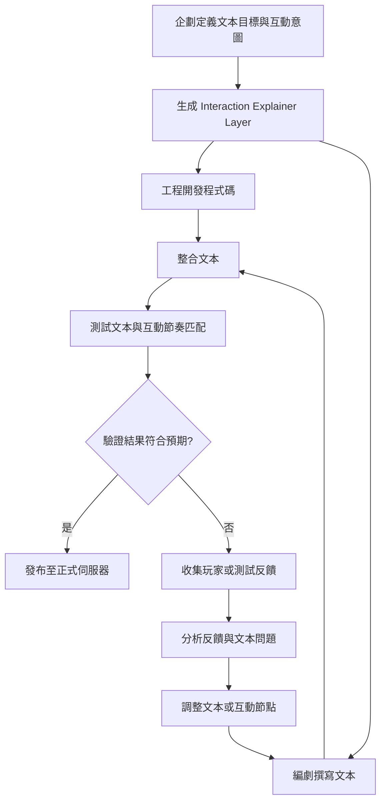

# 文本設計流程

## 企劃階段

1. **定義文本設計目標**

   - 明確遊戲核心玩法與玩家體驗需求
   - 標註每個互動節點的文本目的（理解操作、成就感、挑戰感、情緒引導）
   - 確認文本觸發條件與事件節奏

2. **生成初步文本需求表**

   - 記錄互動節點、文本類型、觸發條件
   - 提供編劇與設計師可直接引用的表格模板或 JSON

3. **設計文本節奏與風格**

   - 定義文本語氣、長度、節奏
   - 與遊戲世界觀、角色語氣保持一致
   - 預估玩家閱讀時間與操作流程匹配

## 編劇階段

1. **拆解互動節點**

   - 將遊戲流程拆解為每個操作節點
   - 標註系統回饋、角色行為與文本插入點

2. **文本需求分析**

   - 分析每個節點對文本的需求
   - 確認文本是否能有效傳達玩家心理回饋與情緒

3. **撰寫文本**

   - 根據每個節點核心目的撰寫提示、對白、內心獨白或敘事文字
   - 保持語氣、風格與遊戲世界觀一致
   - 強調節奏與玩家心理回饋匹配

4. **整理文本**

   - 建立節點對應文本清單
   - 標註文本長度、語氣、觸發條件

## 工程階段

1. **使用文本開發遊戲邏輯**

   - 渲染文本於遊戲界面
   - 配合互動事件、音效與動畫

2. **測試文本與互動節奏匹配**

   - 確認文本顯示時間、長度與玩家操作節奏一致
   - 調整冗長或不自然文字

## 整合階段

1. **整合文本**

   - 確保互動、節奏與情感回饋完整

2. **收集測試反饋**

   - 玩家是否理解操作
   - 成就感與挑戰感傳遞是否正確
   - 角色語氣與世界觀一致性

3. **生成報告與回饋**

   - 提供給企劃 / 編劇調整的依據
