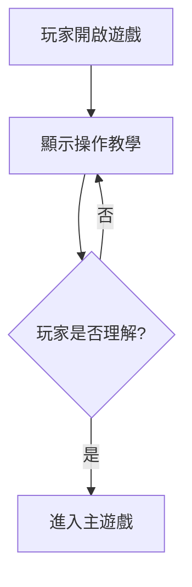
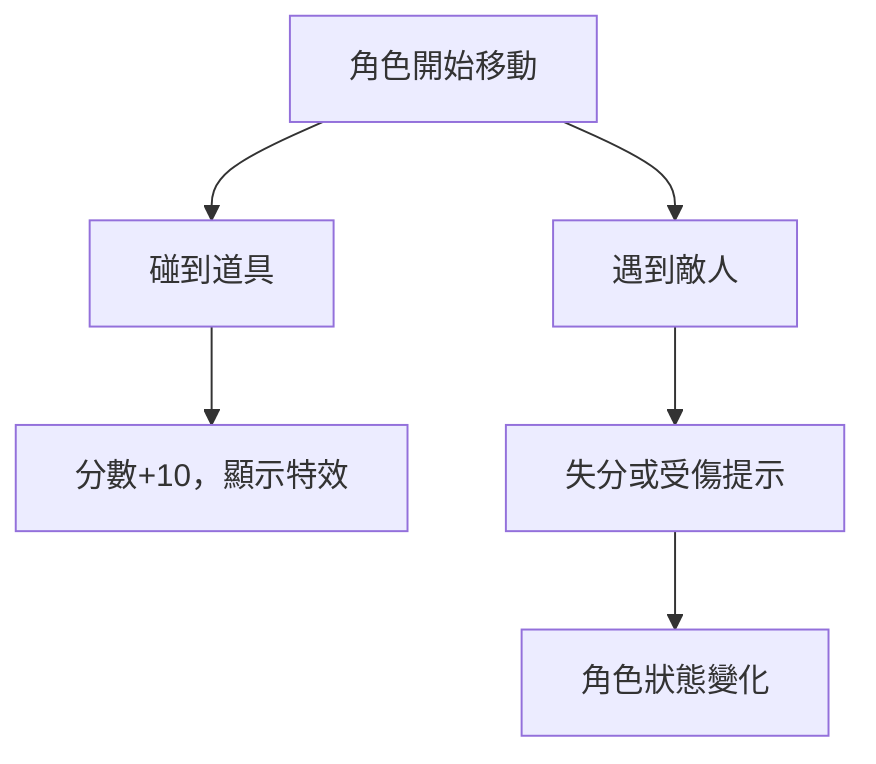
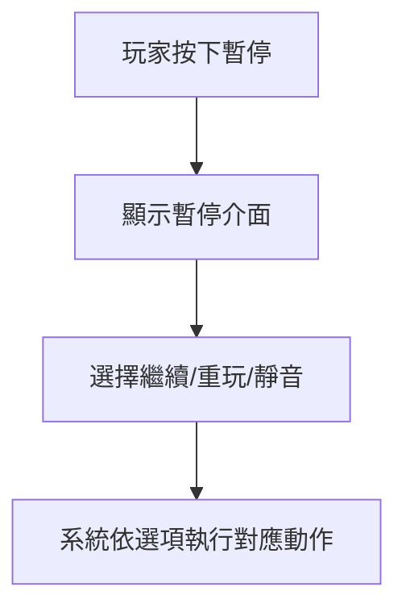
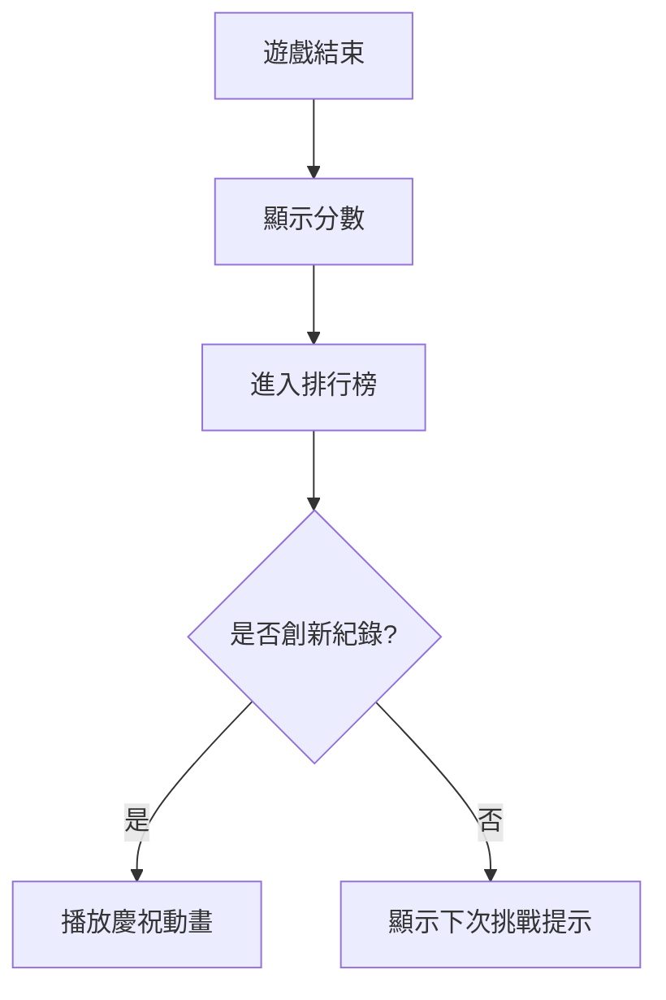

# 文本目標與互動 - 企劃

本文件將遊戲互動設計轉譯為可敘事化的行為脈絡，僅供企劃使用，不包含編劇或美術細節。

## 文件用途

- 明確標註玩家行為意圖與系統回饋，便於編劇撰寫對應的文字反應
- 建立介面文字、事件語句與角色語音之間的邏輯對應關係
- 支援後續版本迭代時的文本維護與更新，確保劇情節奏與互動體驗一致

## 遊戲核心理念

- **目標**：玩家操控角色收集道具並避開敵人，累積分數，挑戰排行榜。
- **核心行為**：
  1. 查看簡單規則 → 理解操作
  2. 開始遊戲 → 角色互動與分數累計
  3. 分數即時更新 → 提供即時回饋
  4. 暫停 / 靜音 / 重玩 → 控制遊戲節奏
  5. 排行榜 → 提升重玩動機

## 遊戲行為邏輯

### 查看規則

**核心目的**：理解操作  
**玩家意圖**：了解遊戲的目標與操作方式  
**系統反應**：顯示簡短教學提示（含圖示與動作說明）  
**敘事機會點**：

- 可加入輕度世界觀引導（如「這個世界中，道具是力量的源泉。」）。
- 提示語應保持簡潔、節奏明快，讓玩家在 10 秒內理解目標。
- 可使用角色語氣作為導入（如「準備好了嗎？那就開始吧！」）。

### 遊戲操作

**核心目的**：建立操作節奏與挑戰感  
**玩家意圖**：在行動中獲得成就感  
**系統反應**：角色移動、道具收集、敵人出現等動態互動  
**敘事機會點**：

- 收集道具時可透過短語反映角色情緒（如「能量充盈！」）。
- 敵人出現時可用即時語句營造壓迫感（如「快閃，敵影逼近！」）。
- 節奏可透過語音、特效及文本同步表現角色狀態變化。

### 分數即時更新

**核心目的**：建立成就反饋迴圈  
**玩家意圖**：確認行為成果並持續挑戰  
**系統反應**：分數與畫面特效即時更新  
**敘事機會點**：

- 分數提升時可附帶激勵性語句（如「太好了！繼續保持！」）。
- 若達高分或連續成功，可觸發角色語音（如「我感覺狀態正好！」）。

### 暫停 / 靜音 / 重玩

**核心目的**：賦予玩家節奏掌控權  
**玩家意圖**：暫停、調整或重新開始  
**系統反應**：中斷、靜音或重啟遊戲  
**敘事機會點**：

- 暫停畫面可結合角色內心語句（如「稍作喘息，也是一種戰術。」）。
- 重玩時可透過強化語句傳遞挑戰意志（如「這次，絕不再失誤！」）。

### 排行榜

**核心目的**：創造比較與榮譽驅動  
**玩家意圖**：挑戰紀錄、追求更高排名  
**系統反應**：顯示排行榜與玩家分數  
**敘事機會點**：

- 成功刷新紀錄時的語句應充滿榮譽感（如「你的名字，將被刻在榮耀之牆上。」）。
- 若未達目標，可用鼓勵性語句激發再挑戰（如「差一點，再來一次就行！」）。

