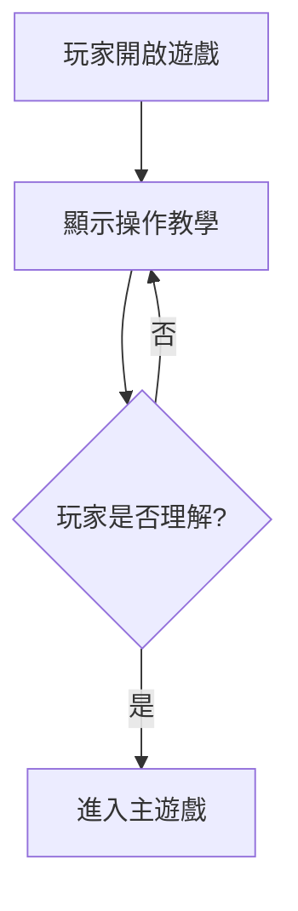
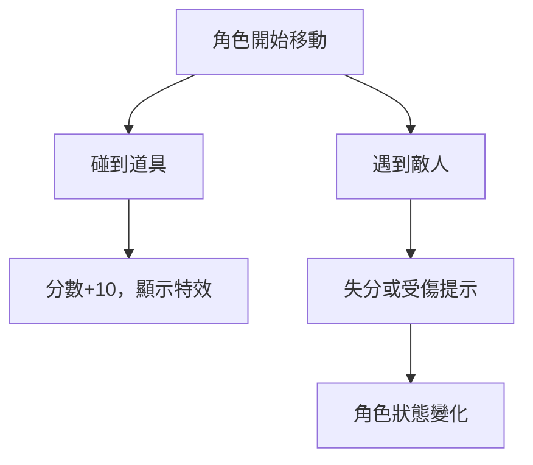
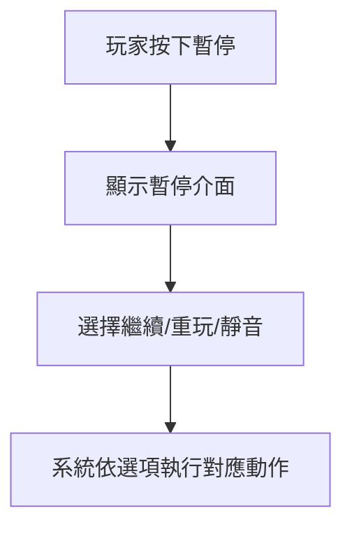
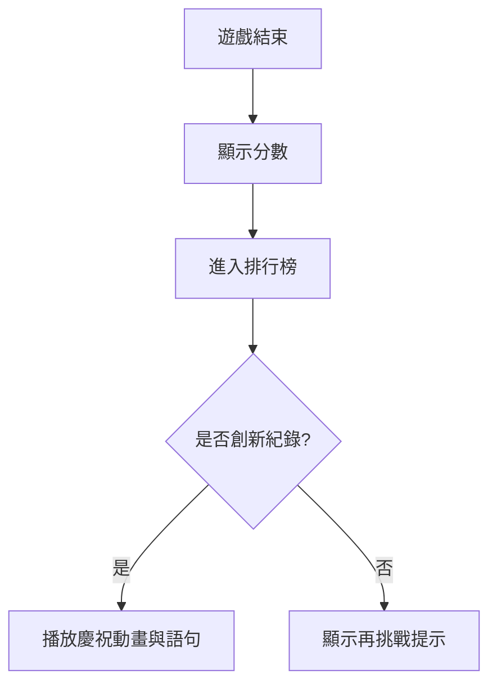

# 互動文本規範 - 編劇

本文件將遊戲互動設計轉譯為可敘事化的行為脈絡，僅供編劇使用，不包含美術細節。

## 文件用途

- 明確標註玩家行為意圖與系統回饋，方便編劇撰寫對應文本。
- 提供每個互動節點的「敘事語者」、「語氣風格」、「情緒節奏」與「文本規格」。

## 遊戲核心概念

- **玩法重點**：操控角色進行收集與閃避挑戰。
- **核心體驗循環**：「操作 → 反饋 → 成就」。
- **設計關鍵詞**：即時感、節奏感、重玩性。
- **世界觀概要**：
  > 在這個能量流動的世界中，道具象徵意志的延伸，挑戰是力量的試煉。

## 互動節點設計

### 查看規則

| 項目         | 說明                                   |
| ------------ | -------------------------------------- |
| **核心目的** | 幫助玩家理解操作方式與目標。           |
| **玩家意圖** | 想快速了解遊戲規則、上手操作。         |
| **系統反應** | 顯示簡短教學提示（含圖示與動作說明）。 |

**敘事語者**：角色本人（熱血型、外向）  
**語氣導向**：鼓勵、節奏感強、有引導力  
**情緒節奏**：好奇 → 信心建立  
**文本規格**：

- 單句不超過 15 字
- 語音時長 ≤ 1.2 秒
- 提示顯示時間：3–5 秒內結束  
  **觸發頻率**：開場一次（可於重玩時略過）

**敘事語句：**

| 狀況     | 台詞                               | 備註       |
| -------- | ---------------------------------- | ---------- |
| 教學開場 | 「這個世界中，道具是力量的源泉！」 | 世界觀導入 |
| 教學結束 | 「準備好了嗎？那就開始吧！」       | 節奏開啟感 |

### 遊戲操作

| 項目         | 說明                             |
| ------------ | -------------------------------- |
| **核心目的** | 建立操作節奏與挑戰感。           |
| **玩家意圖** | 在行動中獲得爽感與成就感。       |
| **系統反應** | 角色移動、收集道具、遭遇敵人等。 |

**敘事語者**：角色本人（熱血型）  
**語氣導向**：動態、有臨場感、帶呼吸節奏  
**情緒節奏**：專注 → 緊張 → 爽感 → 輕鬆  
**文本規格**：

- 每句 8–12 字
- 語音 0.8–1.2 秒
- 根據事件頻率設定隨機播放語句池  
  **觸發頻率**：事件型（收集成功 / 敵人出現 / 受傷）

**敘事語句：**

| 狀況     | 台詞                           | 備註         |
| -------- | ------------------------------ | ------------ |
| 收集道具 | 「能量充盈！」、「完美節奏！」 | 爽感反饋     |
| 遭遇敵人 | 「快閃，敵影逼近！」           | 製造緊張瞬間 |
| 受傷失分 | 「可惡，失誤了！」             | 提醒節奏失誤 |
| 狀態回復 | 「我還撐得住！」               | 激勵狀態語   |

### 分數即時更新

| 項目         | 說明                     |
| ------------ | ------------------------ |
| **核心目的** | 建立成就感與即時反饋。   |
| **玩家意圖** | 想確認成果並持續挑戰。   |
| **系統反應** | 分數與畫面特效同步更新。 |

**敘事語者**：角色本人或系統旁白  
**語氣導向**：興奮、鼓勵、節奏感強  
**情緒節奏**：集中 → 爽感爆發  
**文本規格**：

- 單句 8–14 字
- 高頻事件建議設多語句池
- 高分語句建議語音優先級中高

**敘事語句：**

| 狀況     | 台詞                     | 備註       |
| -------- | ------------------------ | ---------- |
| 分數上升 | 「太好了！繼續保持！」   | 標準鼓勵   |
| 連續成功 | 「狀態正好，不可停下！」 | 強化動能感 |
| 高分紀錄 | 「我感覺自己燃起來了！」 | 高昂語氣   |

### 暫停 / 靜音 / 重玩

| 項目         | 說明                   |
| ------------ | ---------------------- |
| **核心目的** | 讓玩家掌握節奏控制權。 |
| **玩家意圖** | 暫停、休息或重新挑戰。 |
| **系統反應** | 中斷、靜音或重啟遊戲。 |

**敘事語者**：角色本人  
**語氣導向**：輕鬆、內省、帶呼吸感  
**情緒節奏**：緊張 → 放鬆 → 重整意志  
**文本規格**：

- 暫停語句 10–15 字
- 重玩語句節奏明快、有挑戰感  
  **觸發頻率**：暫停一次 / 重玩開始時

**敘事語句：**

| 狀況 | 台詞                         | 備註       |
| ---- | ---------------------------- | ---------- |
| 暫停 | 「稍作喘息，也是一種戰術。」 | 角色內心語 |
| 靜音 | 「寧靜也是節奏的一部分。」   | 氣氛語句   |
| 重玩 | 「這次，絕不再失誤！」       | 激勵挑戰語 |

### 排行榜

| 項目         | 說明                 |
| ------------ | -------------------- |
| **核心目的** | 建立榮譽與比較動機。 |
| **玩家意圖** | 檢視紀錄、挑戰高分。 |
| **系統反應** | 顯示分數與排名榜單。 |

**敘事語者**：角色本人或系統旁白  
**語氣導向**：自豪、榮譽感、激勵再挑戰  
**情緒節奏**：期待 → 成就 / 失落 → 重燃意志  
**文本規格**：

- 榮耀語句 12–18 字
- 鼓勵語句 10–14 字
- 可設定語音優先級：中

**敘事語句：**

| 狀況     | 台詞                               | 備註       |
| -------- | ---------------------------------- | ---------- |
| 創新紀錄 | 「你的名字，將被刻在榮耀之牆上。」 | 榮譽感強   |
| 未達目標 | 「差一點，再來一次就行！」         | 鼓勵再挑戰 |
| 排名檢視 | 「前方還有高手在等我！」           | 動力引導   |

